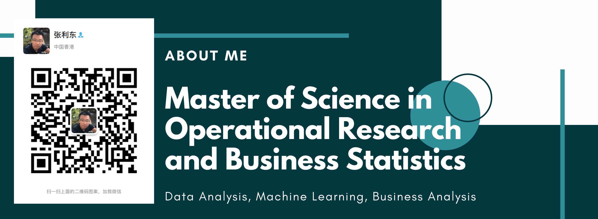

# 1. About Me

My undergraduate school is Tongji University, and my major is Civil Engineering, which is Top 1 in China. Then I worked as a senior civil engineer in one of the 6-Best power design institute in China before 2018.

This excellent platform provided me the chance to manage many large international projects, such as projects in Russia, Bangladesh and so on. The complexity of large-scale international projects reinforced me with multicultural cooperation capability, project management capability and communication capability.

After working for so long a time, I decided to continue studying to improve myself. So I came to Hong Kong to read Master in Mathematics. After one year rigorous training in Mathematics, I feel that I am even better than before.

# 2. Work Experience

Senior Civil Engineer with advanced experience in full design process and highly complex projects. Profound knowledge in civil structure design and project management, including concept design, detail design, cost control, risk management, communication and cooperating with different functional teams and stakeholders.

## 2.1. 2011 – 2018

SENIOR CIVIL ENGINEER, NORTHEAST POWER DESIGN INSTITUTE (NEPDI)

- Perform conceptual layout work and principle design
- Responsible for assessing effectiveness of working practices and systems with a view to continuously improving systems, personal and team performance
- Coordinate the work of draftspersons and senior draftspersons in the preparation of contract drawing, record keeping and other statistical work
- Check and approve the design of structural designer and junior structural designer
- Execute design and draft activities (Concept, Front End Engineering Development, Technical Study and Detailed Deign)

**Typical Projects**

- 2015-2018, Extension of Barapukuria Coal Fired Thermal Power Station, Bangladesh. Largest coal-fired thermal power project in Bangladesh.
- 2011-2016, Troitsk Gres 1x660MW Coal Fired Power Units. One of the largest coal-fired thermal power projects in Russia.

## 2.2. 2008 – 2011

CIVIL ENGINEER, NEPDI

- Performs design/drafting assignments, requiring advanced working knowledge of design/drafting standards, practices and techniques
- Prepare bills of material, schedules and assist engineering personnel with formal drawing transmittals and construction issues.
- Assist in coordination between engineering disciplines, participate in project planning actives and support cost and schedule updates
- Responsible for 3D modelling for buildings. Preparing 2D drawings of structural steel and concrete for main power house, petrochemical and industrial plants with PKPM/STAAD Pro and AutoCAD
- Responsible for adhering to all health and safety policies and guidelines

## 2.3. 2006 - 2008

SITE REPRESENTATIVE OF DESIGN INSTITUTE, NEPDI

- Onsite service for construction. Fully responsible for design related affairs onsite
- Solve construction problems, provide technical consultation service
- Onsite detail design for better construction or reduce cost for stakeholders

## 2.4. 2004 – 2006

JUNIOR STRUCTURAL DESIGNER, NEPDI

- Responsible for 2D drawing and calculation for auxiliary plants and structures.
- Creating and maintaining 3D project models using PDMS
- Producing structural drawings using PKPM and AutoCAD based on principle sketches

# 3. Education

## 3.1. Mathematics

- Master of Science in Operational Research and Business Statistics, Double Master Degree, Hong Kong Baptist University.
- Master of Science in Business Analytics, Double Master Degree, University of Kent

Being loving data science for a long time, I finally made the decision, which is going to Hong Kong to learn Master of Science in Operational Research and Business Statistics. Now I am good at Data analysis, data mining, machine learning and business analysis.

Courses learned:

- Simulation Modelling
- Managing Organisational Performance
- Actuarial Statistics
- Risk and Portfolio Management
- Applied Multivariate Analysis
- Prescriptive Analytics for Decision Making
- Business Statistics with R
- Machine Learning and Forecasting
- Big Data Analytics and Visualization
- Applied Time Series

## 3.2. Civil Engineering

Bachelor of Engineering in Civil Engineer, Tongji University. Top 1 in China.

- Advanced Mathematics
- Basic Chemistry
- Physical Education
- Engineering Drawing
- Probability
- Linear Algebra
- Introduction to Civil Engineering
- Theorectical Mechanics
- Mechanics of Materials
- Theory of Elasticity
- Fluid Mechanics
- Structural Mechanics
- Fortran
- Visual Basic
- C++
- Numerical Methods and Computer Algorithms
- Computer Aided Multidimensional Modeling Design
- Engineering Geology
- Urban road and Interhange Planning
- Elementray Surveying
- Building Materials
- Soil Mechanics
- Concrete Struture Design
- Architecture Building
- Principles of Load and Structural Design
- Steel Structure Design
- Foundation Engineering Design
- Construction Management in Civil Engineering
- Masonary Structure
- Earthquake Resistance of Building Structure
- Building Construction
- Budget Estimates and Bidding in Construction
- Timber Structure
- Earthquake and Wind Resistance of Bridge Structure

# 4. Skills

## 4.1. Civil

- STAAD Pro
- Midas Gen
- SAP2000
- PKPM
- TSSD
- AutoCAD
- PDMS
- Excel and its Advanced Functions
  - Office Suit
- Mathcad 
- Concept Design
- Concrete Structure Design
- Steel Structure Design
- Underground Structure Design
- Industry Plant Design
- Project Management
- Risk Management
- Cost Control
- Time Management 
- Operational Research Optimization

## 4.2. Data

- Python
  - scipy
  - numpy
  - pandas
  - matplotlib
- Excel
  - Advanced Functions
  - Solver and other analysis toolpak
  - VBA
- R
- SPSS
- MATLAB
- Git
- SQL
- Machine Learning
- Data Analysis
- Data Mining
- Text Mining
- Data Processing
- Statistical Analysis
- Outlier Identification
- Data Visualization

## 4.3. Operational Research

- Linear Programming
- Optimization Analysis
- Integer Programming
- Queueing Models
- Simulation
- Lingo

# 5. Certificate

- [Machine Learning by Stanford University](https://www.coursera.org/account/accomplishments/verify/T7UH2NE74MRJ)

Machine Learning Model familiar:

- Linear regression;
- Logistic Regression;
- Neural Network;
- Support Vector Machine (SVM);
- k-Nearest Neighbours(k-NN);
- Recommend System;

# 6. AWARDS

- Award of Excellent Academic Thesis, Northeast Power Design Institute 
- Excellent Quality Individual Award, Northeast Power Design Institute 
- Elite Staff Award, Northeast Power Design Institute 

Other awards can be found in my LinkedIn account.

# 7. Contact Me

- [jetorz@GitHub](https://github.com/jetorz)
- [ZHANG Lidong@Blog](https://jetorz.github.io/)
- [ZHANG Lidong@LinkedIn](https://www.linkedin.com/in/zhanglidong/)
- 张利东@微信：jetorz
- WeChat Official: DongTalks

*****

