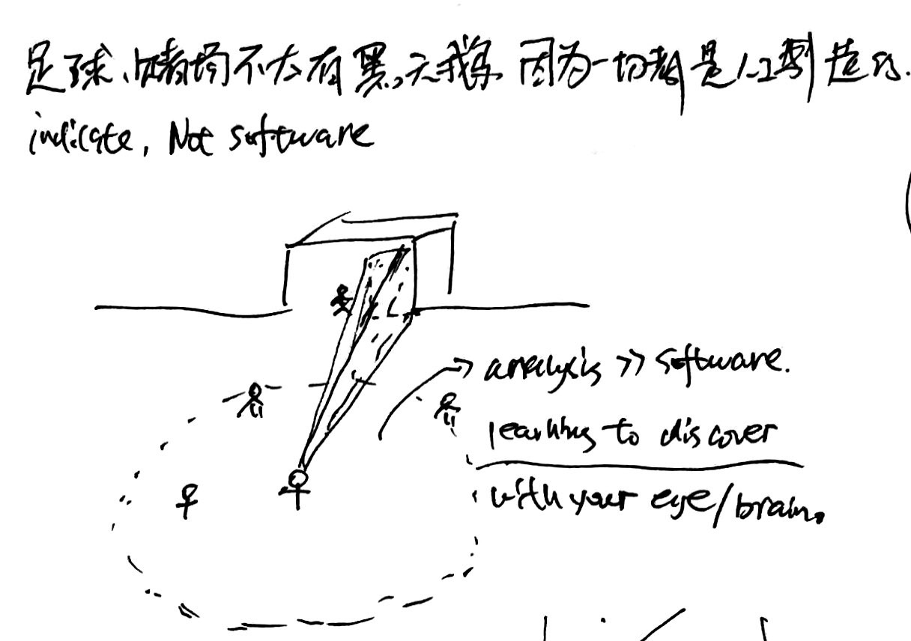
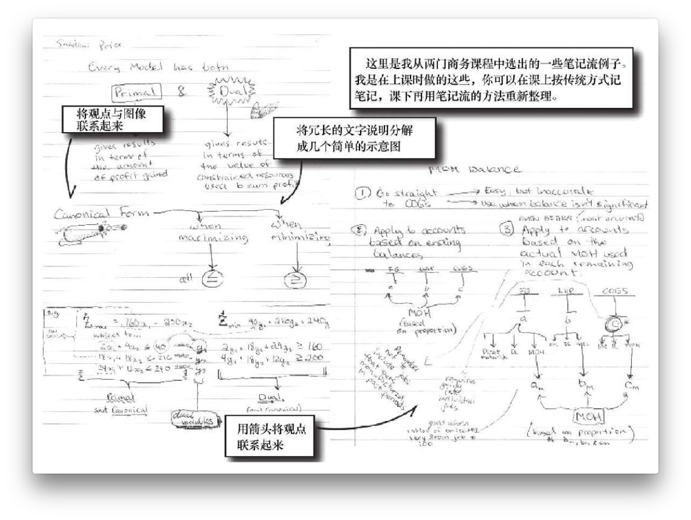
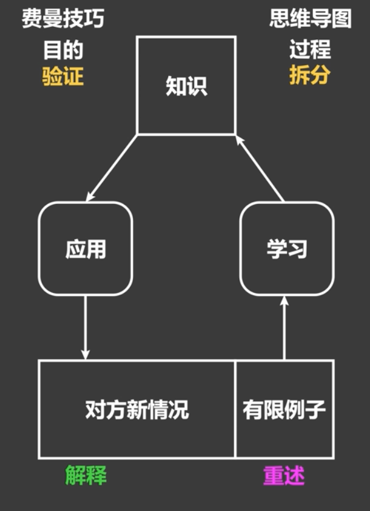
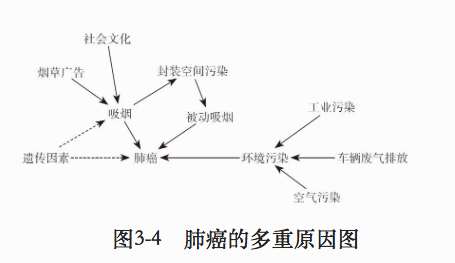
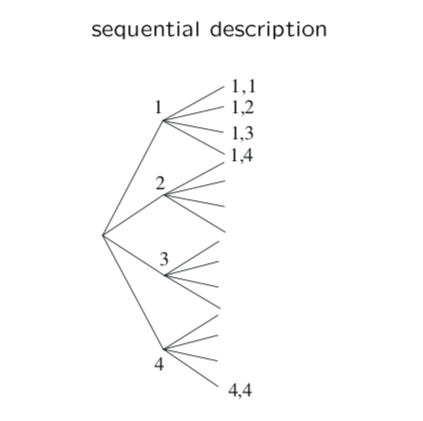
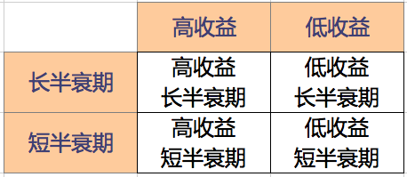
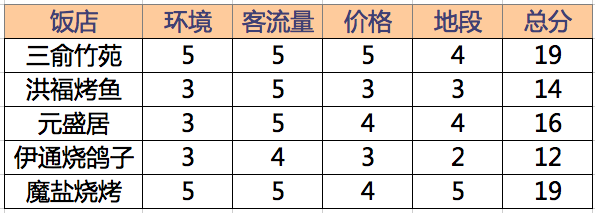
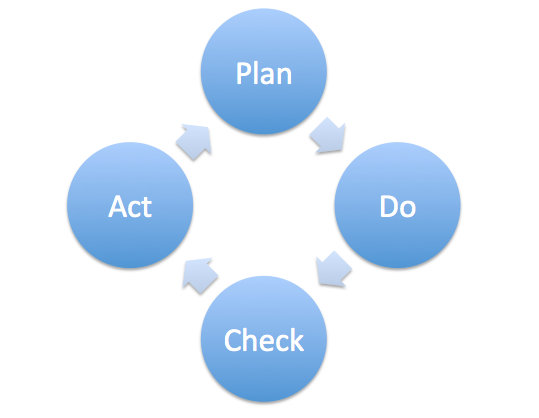
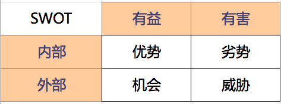

# 1. 关于原则的思考

## 1.1. 高价值区域

让自己处于高价值区域，是借势成长的不二法门。

### 1.1.1. 十倍赋能

凡事多往大想，是在看[《重新定义公司》](https://book.douban.com/subject/26582822/)里提到的谷歌思考问题的方法，觉得可以借鉴到我们个人生活里。做什么都有成本，其中尤其以机会成本为大。所以但凡做事都要事先想想，这件事情到底值不值得做。两个问题可以用来理清思路

1. 这件事放在10年的长期上考虑，值得做吗？
2. 这件事能否增强10倍效果？

如果答案是否定的，那不如不做。真正有价值的事情，值得以10倍来衡量。

#### 1.1.1.1. 减少在切换工具上浪费浪费时间

比如各种工具软件层出不穷，但如果手头现有工具用的挺好、新工具不能比它强10倍以上，就不要轻易切换。为了一点优势换来换去，太浪费时间。

现在我们的问题不是选择少，而是选择太多。所以要克制自己频繁选择。

#### 1.1.1.2. 如何让收入增加十倍？

想要增加收入，加班是最直接的办法。通过加班，一来可以增加直接收入，二来可以获得晋升的机会，实现薪酬跳跃。但如果升职无望，或者只是做一些简单的事情获取更多收入，就不是上选。因为这样最多能多收获1.1~1.2倍收入，无法达到十倍收益。

那什么办法能实现十倍收入呢？比如进一步学习新的知识、新的技能、甚至新的专业，再通过把它们凑成一个矩阵。但不管怎么说，都比靠多花时间更有效。

十倍赋能和慢慢赚钱的思路是不是冲突？不冲突。十倍赋能是让凡事儿往大想，通过扩大思维的方法提升收入；慢慢赚钱指的是尊重经济规律、修炼基本功，最后实现十倍收益。可以说十倍收益是目标，慢慢赚钱是方法，一个关注程度，一个关注速度，两者相辅相成，并无矛盾。

### 1.1.2. 用概率的思维思考生活

《黑天鹅》里面给出两种世界模型，一种是平均斯坦，一种是极端斯坦。我们的大脑更容易理解平均斯坦，而现实生活中很多事情都属于极端斯坦。思考世界及生活的时候，应该注意自己考虑的问题是属于哪个斯坦里的

- 身高、体重，平均斯坦；
- 饭量、腰围，平均斯坦；
- 财富、知识，极端斯坦；
- 声望、影响力，极端斯坦；

尤其需要注意的是，极端斯坦里面有些事情，一旦发生会极具破坏力，也即所谓黑天鹅事件。考虑任何问题都需要注意这类黑天鹅事件，若有发生的可能，无论多小，都要尽可能回避。

通过用概率的方式思考，我们可以得出以下推论

#### 1.1.2.1. 把自己暴露在更可能发生好事的环境里

去年搬家到佛山后，就时常去香港、澳门、广州、深圳这些地方溜达。看得多了，感觉思路就比在长春的时候开阔了一些。最近正在筹划的一些事情，也是来这边以后才了解到的。

所以说，一个好的、开放的、更具活力的环境，对人的塑造是巨大的。之前在东北，想听什么讲座也没地方，大家聊的话题，无非是吃喝玩乐。一方面是城市落后没有什么商业机会，另一方面人的思维固化呆板。而在更发达的地方，不仅机会更多，强人也更多。强者如云的环境会逼着你不断提升自己。每次去深圳都有这种感觉，这是一座让人睡觉都会进步的城市。

来到佛山是前进的第一步，但绝不应该是最后一步。我们要不断的去更好的环境里面，发现一个更好的自己。

#### 1.1.2.2. 接触高质量人群等于给自己创造好运

高质量人群的圈子，发生好事的概率会远大于低质量人群的圈子。想创造好运，就要尽量多的让自己与他们发生接触。

所以，是留佛山还是去香港，根本不应该是个问题。

### 1.1.3. 知识黑洞

知识黑洞为阳志平先生在公众号里面提出的概念。具体可解释为

> 一个时代最聪明的那一批人都在里面了，这些都会构成知识黑洞。尽早进入这种知识黑洞，天天浸泡在里面，会不知不觉习得更多内隐知识。你会自然而然地知道很多新东西。

这种牛人扎堆的现象并不罕见。往近了说，比如在非典期间，李笑来在新东方同事中有个小圈子，天天闲着没事儿只好打麻将，其中包括现在做手机的罗永浩，现在的央视节目主持人张晓楠，现在的 Cobuild 基金创始人铁岭，FreeS 基金创始人李丰……各个都是江湖大腕。

往远了说，比如早期的亚里士多德 & 柏拉图的雅典学院、瓦特 & 达尔文加入的月光社、近代中国的张之洞学圈、 维特根斯坦拒绝加入的维也纳小组、二战期间爱因斯坦他们那批人，一个时代最聪明的那一批人都在里面了，这些都会构成知识黑洞。

为什么会有这种情况？答案是**见识决定命运**。和牛人在一起，自己就会吸收很多内隐的知识，进步远不是单打独斗闭门读书可比。近一年在经济学社群中的收获，就非常大。

所以，每个人都应该努力，在力所能及的范围里，尽量的加入到知识黑洞里。

### 1.1.4. 用大力胜巧的方法构建自己的核心竞争力

我们喜欢凡事都讲究方法策略。这事本来没毛病，事半功倍谁都想。但问题是，这些技巧大多只能锦上添花，却没法雪中送炭。真正起决定性作用的，往往不是这些技巧层面的东西，而是实打实的硬功夫。

比如学英语肯定有好的方法。网上到处都是讨论到底怎样正确学习英语的文章。但真正的情况是，决定英语水平的，是背了多少单词、句子甚至文章，这些东西，都是硬功夫，只能用最笨的办法，花时间一点点啃下来。词根词缀之类花哨的方法不是没用，但它们只能在你花了足够多时间的前提下，让你记得更容易一点，却没有办法让你不花时间精力就搞定词汇。

舞蹈，打球，象棋，写作……每一件事情想要做好，都是需要大量时间的投入。任何花哨的方法、策略、技巧、感悟，在这种粗笨的方法面前，都不值一提。

所以，琢磨投资，也要从这些硬功夫上下辛苦。投资股票，就找到市面上评价最高的十本关于股票的书，一本一本开始啃；投资房产，就找中介开始看房，先看够200套。到时候自然手中无剑却心中有剑。

蔡文胜说过的研究项目的方法，和这个也有类似之处。做域名时，就把全世界的域名信息做了一个数据库，跟踪每一个可能过期的域名，并且查询域名的价值。做个人网站，就把中国前1000名流量的网站全部查询，了解谁做的、如何做的、为什么流量大。进入微博，就把微博前100名博主每一个微博都浏览了，去发现为什么他的微博受欢迎，为什么他的粉丝多。这是硬功夫，也是真正的护城河。

世间是有天才，但天才这种事情，绝大多数时候和我们是没有关系的。所以平凡如你我，想凭借天分吃饭的可能性微乎其微，每一个个体的可替代性都太强了。那么通过结硬寨打呆仗的方法，一点点构建自己的核心竞争力，就成了最佳的选择。这也是古语说的「故不积跬步，无以至千里；不积小流，无以成江海。骐骥一跃，不能十步；驽马十驾，功在不舍。锲而舍之，朽木不折；锲而不舍，金石可镂」的真正含义。

等真的积累够了，别人就很难替代了。丝毫没有积累，还整天想着如何才能有不可替代的竞争力，无异于痴人说梦。

接受大力胜巧，是开始接受现实的第一步。

## 1.2. 要事第一

再次，要事第一，知道轻重缓急，知道什么时候应该做什么事情。

## 1.3. 选择

### 1.3.1. 选择大于努力

选择大于努力，可以从以下几个方面考虑

#### 1.3.1.1. 边际效用最大化

人们总是在边际上做选择。任何选择的时候，都要从边际产出的角度思考，做边际效用最大的事情。

比如加班的边际效用就不大，不如多读本书；如果一天到晚读书，就可以拿出一些时间写作，边际效用会更大。

TODO：如何考虑其与突出优势之间的冲突？

#### 1.3.1.2. 点线面体——掌握大趋势

个人不过是一个个的点，个人再努力也只能达到「点」的成功。把自己附着在一个上升的线上、上升的面上、甚至上升的体上，更容易获得成功。

- 高学历 > 低学历
- 大城市 > 小城市
- 朝阳行业 > 传统行业

#### 1.3.1.3. 什么更重要——懂得聚焦

技术流的人物容易陷入技术细节及技巧性的东西，而忽视真正重要的东西。如果我们相信「选择>努力」，就应该明白，那些起决定性作用的选择，都是需要从大局观出发思考，而不可能是由技术细节决定的。

孙子兵法谈到战争时，讲究「道、天、地、将、法」。前面三个是基本面，和技巧没什么关系；后面的将和法关系打仗，有技巧性的东西，但绝不是这些技巧性的东西决定胜负，而应该是平日训练、后勤保障等这些硬功夫更起决定性作用。

所以，时常应该关注一下生活中，真正重要的东西。比如

- 时代的风口是什么？
- 业界会如何演化？
- 我在时代大势里面能做什么？
- ……

这些问题，比把某个技术细节弄得更清楚一些，要关键的多。

不断逼问自己什么更重要，然后把重心放在那些真正重要的事情上面。

懂得取舍，是人生的最高智慧。

#### 1.3.1.4. 关注内在驱动

不符合自己内在驱动的事情难以长久去做，每个人都应该努力找到属于自己的内在驱动力，然后将有限的时间和精力集中的放在上面，用最猛的火力，打最硬的仗。

尤其在面临机会可以重新选择的时候。

#### 1.3.1.5. 人群聚集

#### 1.3.1.6. 技术演变

### 1.3.2. 选择足够大的市场

### 1.3.3. 提升选择能力

网上流传一个说法，人一辈子关键选择有7次，选好了飞黄腾达不可限量，选不好一生落魄居无定所。

这个说法其实有个很严重的问题，就是容易让人觉得，一辈子做好了选择，就可以过得既轻松又惬意。其实生活不是这样的。

一方面，选择本身就是个技术活。选择可能的确大于努力，问题是不努力的话又怎么会有能力做出正确的选择。任何的选择背后，都有无数过往的积累。不读书、不学习，见识窄，结果可能是让选也不知道应该怎么选。

比如现在都知道，十年前应该买房。但在当时，没有关于房地产对经济驱动的认识，就不一定能做出买房的选择。比如，你觉得现在是不是买房的好时机？

再比如，现在都知道大城市的集聚效应，人应该往东南沿海发达地区去。但十几年前，在国家开发大西北、振兴东北老工业区等口号的影响下，如果没有城市化的认识，很可能就会稀里糊涂的跑到东北或西北。

所以说，选择的确很关键，但学会选择更关键。这必然牵扯到大量阅读、广泛涉猎有关政治、经济、历史等方面的知识。

难怪说全人教育。光学会数理化，是没有什么大用的。

#### 1.3.3.1. 概率思维

#### 1.3.3.2. 期望思维

#### 1.3.3.3. 风险控制

#### 1.3.3.4. 系统思维

#### 1.3.3.5. 大势思维

#### 1.3.3.6. 长期思维

#### 1.3.3.7. 抓住关键参数

我们需要锻炼一个很重要的能力，就是抓住关键参数的能力。每件事情都有很多参数、很多考量，但不是所有参数都同等重要。把关键参数抓住了，事情基本就解决一半了。

比如玩互联网，很多人会说什么「内容为王」、「社区为王」等概念。而实际上，互联网从根本上就是在玩流量，应该是流量为王。有了流量，什么就都有了。

再比如买房子，有人会考虑户型、朝向、楼层等多种因素。不是说这些因素不重要，但真正重要的，其实是位置。好位置才是一个房子最重要的属性，否则其他再好都没什么价值。

具体做法，可以是把能想到的参数都列出来，然后找数据、找支撑，确定到底什么参数是关键参数。Coursera在线课程[Effective Problem-Solving and Decision-Making](https://www.coursera.org/learn/problem-solving/home/welcome)里面餐馆的例子就是典型案例。

#### 1.3.3.8. 关注参数的连接互动

互为因果。

#### 1.3.3.9. 关注系统

见「系统思维」部分。

### 1.3.4. 做长期正确的事

有些事情，短期看是对的，长期看却是错的；短期看是对的，长期来看却可能是错的。

我们总希望以后的生活能比现在更好一些，所以凡是应该尽量想的长远一些，尽量多做那些长期正确的事情。比如说，短期来看，加班可以提高收入，值得付出；长期来看，其收益必然低于用这些时间学习新技能。所以，下班以后应该尽早离开单位，回家看书学习。

再比如，投资中低买高卖短期看是赚了，长期看却总有失手的时候，一次失手就可能把以前的所有利润吐出去。握住好标的不动，却可以坐享其成长收益，显然更合算。所以，不用羡慕别人成功的投机。

#### 1.3.4.1. 设定正确的目标是成功的前提条件

凡事在目标确定以后就很简单了，无非是动手执行，真正困难的是设定目标本身。一不小心目标设置错误，可能事倍功半，甚至导致失败。

比如跑步时，目标可以是每个月至少跑10次，也可以是一共月至少跑60公里。这也是众多跑者最常见的目标，但其实它们都不是好目标。跑步的目的应该是健康，健康的指标有很多，比如耐力增加，体质改善。以次数为目标容易陷入「每天跑5公里就行了」的心态，结果跑来跑去没有提高；以距离为目标可能这次多下次少，月底一周追个40公里，直接把身体搞废。

更好的目标，应该是对自己想要达成的目的有帮助的目标。比如单次距离的增加可以作为耐力增强的指标，那么可以给自己设定一个「每月10次，每次至少比上次多跑100米~500米」的目标。一个月后，单次跑量就可以较上个月提升约2公里。如果目标达成，也标志着体能自然得到了增强。

再比如读书，最常见的目标是设定月阅读量，比如每个月三本。而实际上，读书的目的是要吸收和消化书里的知识，并把它们融入到自己的日常生活中，进而改善生活。所以好书需要慢慢读，反复读，反复思考，并为之制定行动策略，以及在行动中反思及改善。要求每个月至少三本书，更可能的情况是匆匆忙忙读完一本，就赶着开始读下一步。没有思考，没有反思，更没有行动。读来读去，就像猴子捞月，直到最后也不过手里一捧湖水罢了。

那么这个思路和赚钱有什么直接关系么？这是个值得思考的问题。

#### 1.3.4.2. 没有「持续」及「长期」价值不大

短期利益、追涨杀跌、追风口，没有持续性，难以获得复利效应。

### 1.3.5. 聚焦--懂得取舍

对应于大局观，就是在生活中要懂得取舍。什么东西重要，什么东西不重要；什么东西是当下最重要的事情，什么东西是现在可以放一放的。想清楚了这些问题，就要集中火力在最关键的事情上，把其他所有需要丢弃的都抛开。

生活需要断舍离。

比如当时报考读研，雅思就是最重要的事情，所以玩命学英语，把其他东西都放下。现在Offer已经拿到，英语虽然也重要，但已经不是罪重要的事情了，就可以一边继续学英语，一边补新专业需要的基础课，诸如线性代数之类。这就是在不同阶段要有不同的焦点。

再比如设计院当年的一个很大问题，就是不懂取舍。市场恶化的时候，什么活都接，导致一些根本没有利润甚至可能导致亏损的项目也要承接，而且浪费了大量人力资源。一个投资1000万的项目和投资100亿的项目，放在同样重要的地位，导致生产部门疲于奔命，就是不懂取舍。

于人生而言，懂的聚焦，就是要在某个点上形成自己的突出优势，对他的了解要大于绝大多数人。在这个基础上再开展知识面广博方面的拓展，才会更有意义。一个各方面都很平庸的广博，毫无价值。

#### 1.3.5.1. 克制--成功的必备品质

克制还是一切成功的必备条件。打仗需要等待时机，时机不到的时候要克制自己想要一战的冲动；锻炼身体需要休息，要克制自己总想活动的冲动；充分利用时间更是需要理性，克制自己在没有价值的玩乐上浪费时间。可以说，没有克制，就没有成功的人生。

考虑到时间的机会成本，克制就更显重要了。我们可以把需要克制的东西列出来，时常检查更新，警示自己。

#### 1.3.5.2. 二八原则

凡事分出什么重要，什么关键，然后集中火力把这些事情搞定，可以极大的简化生活中的各种问题。

虽然二八这个数字肯定不精确，但道理没有问题。绝大多数问题，必然是由没有处理好的很多重要事情引起。比如健康，比如家庭。

关键问题在于，怎样区分到底什么事情是这重要的百分之二十，以及这些问题应该怎样解决。比如我现在知道我的很多问题都是因为钱少，然后呢？

但提出关键问题，本身就是成功的开始。

#### 1.3.5.3. 专注于自己的核心竞争力

华杉讲的几个企业案例挺有启发。华为不进房地产，阿里巴巴不做游戏，一点一点打磨自己的核心竞争力。等厚积薄发的时候，别人已经没有办法与它抗衡了。怎样能有真正的核心竞争力？用时间一点点磨，磨得别人想和你竞争需要坐时光机回到十年前，这就等于拥有了自己的护城河，打磨出了自己的核心竞争力。

这里关键有两点

1. 选择正确。坚守最怕的是坚守了错误的东西，到最后都成了沉默成本。比如当年有一个网站，用户填写农历后可以在设定时间发短信提醒，算是填补了国内用户用农历的麻烦。但移动互联网一来，几乎没人用短信了，再打磨也没有什么竞争力了。所以首先需要选对大势；
2. 专注。一旦选定目标，就要一直专注的做下去，不要轻易被其他潮流吸引。这需要放弃很多东西，非大智慧大魄力不能为。得到因为搞投资来钱太容易，所以不搞投资，专心做知识服务，就是专注的大智慧，值得学习；
3. 专长>广博。人人都想博学，但在自己尚未有专长之前，应该先打磨自己的专长，让其成为自己安身立命的根本，然后再进行横向扩展。否则最后只能落个事事通事事松。这个亏当年已经吃过了，不要再犯了；

#### 1.3.5.4. 律师法则

生活中难免有各种奇怪的事情，会让我们烦心。比如无良商家缺斤少两，出租车司机绕路之类。遇到这种事情，最好的办法不是自己去PK，因为很可能别人有的是时间；不如干脆找个律师，把专业的事情交给专业的人去做，往往能收到更好的效果。

有人说律师费可是很贵的，常常是维权成本比收益都高。其实这也可以考虑成一条法则，如果损失连律师费都不值，那也不值得我们花费太多时间和精力在上面。总为这些小事费心，就没有精力在真正重要的事情上了，那才是最大的损失。

#### 1.3.5.5. 远离任何不值得交往的人

不值得交往的人有各种特点，一旦识别出来，尽早远离，千万不要在其身上浪费时间。他们就像泥潭，会让你也深陷进去。这样的人的特点有

- 负能量太重。什么事情都是坏的，到处抱怨；
- 素质低下。虽然人的素质可能有成长环境的原因，但抱歉我没有兴趣对你的成长环境负责；
- 阴谋论者。阴谋论者心理大多阴暗，待人看事无不如此。虽然我没有证据证明阴谋论者是错的，但抱歉我们三观不合；
- 迷恋权势者。世界上最不可靠的就是权势，所以迷恋权势的人注定是反复无常的小人；

心里始终要有根弦，不是所有人的值得交往，不是所有观点都值得欣赏，不是所有选择都值得歌颂。去高价值的地方，远离泥潭。

#### 1.3.5.6. 多元思维

查理芒格所说的lollapalooza效应，指的是不断进行跨学科学习，最后这些知识会交互作用产生极大的效果。

每掌握一个学科的技能，就相当于自己又增加了一个武器；做成清单并应用，就相当于把武器库整理的井井有条，什么时候需要什么武器，一清二楚随时调用。而 lollapalooza 效应，就相当于这些武器组合成一个核武器发挥了作用。这样的作战力，该是多么彪悍。

#### 1.3.5.7. 利用二八原则避免聚焦带来的封闭

聚焦可以让我们专注在真正有价值的事情上面，但也可能带来封闭。可以用二八定律解决这个问题，把80%的时间用在重要的事情上面聚焦，同时留下20%的时间随意的发散，漫无目的的吸收一些知识，从而扩展自己知识面。

这样既保证了聚焦，又避免了封闭。

### 1.3.6. 起点尽可能高

刚工作的时候，被老同志谆谆告诫，年轻人不要把自己看的太高，要把基础打扎实了，从基层做起。

当时还真信了。因为当时的社会思潮就是这样，说什么大学生好高骛远眼高手低之类，想着要在工作中把自己身上这股子书生气洗涤干净。现在回头来看，简直蠢得要死；而那些老同志，也可恶的要死。怕多是因为自己没本事怕被替代，就先把年轻人压到尘土里再说。

可能的情况下，起点一定要高，尽可能的高，高到自己在提升不了、甚至做起来吃力为止。一来取法于上，仅得为中，取法于中，故为其下。给自己的定位高了，能做到最好，做不到至少也能做个不错；而一开始定位就很低的话，是绝壁做不到什么好的程度的。

二来起点这个东西，很可能决定你的终点。起步在下级企业，除非做的非常杰出，否则很难提升到上级企业；而起点在上级企业的，干的再差也往往不会被撵到下级企业。这是企业的弊病，因为企业要保持一个基本稳定的人才结构，上下轮动则可能导致动荡。

三来，起点往往会决定你见识的高下。虽然互联网可以改善周围环境，但身边的人对我们的影响依然是最大的。进入到一个较低的层次，只会接触到层次很低的人，在一起聊的话题无非吃喝玩乐，难有成长。这一年在广东的收获，远大于之前在东北数年的收获，就是这个道理。

所以，不要听那些所谓「要放低姿态从基础做起」之类的鬼话。任何时候，起点都是越高越好。成不了凤头，也要努力当上凤尾，再慢慢蜕变，而不要让自己沦落成一只鸡。

### 1.3.7. 以正合，以奇胜

那么对于芸芸众生，致富之路到底是什么？我也在寻找。近几天读孙子兵法，讲作战要「以正合，以奇胜」，颇有认同。正即为主业，靠以安身立命；奇为副业，诸如投资、写作。想致胜，应先攻正业，立于不败之地，然后再出奇，谋求更高的收益。所以对于我们普通人，可能最好的办法，是先走正道，同时找方向。

### 1.3.8. 正确的方法可以事半功倍

李笑来先生提到学习方法时说

> 所有学习上的成功，都只依靠两件事——策略和坚持，而坚持本身就是最重要的策略。坚持，其实就是重复；而重复，说到底就是时间的投入，准确地说，是大量时间的投入。  
> 相对于坚持，方法有多重要呢？很多时候，哪怕说“方法不重要到几乎可以忽略不计的地步”，其实也不是特别过分。

这里他主要在强调应该「坚持」，所以对方法有所贬低。其实这是个虚假两难的问题，尽量找好的方法和长期坚持之间，并不冲突。尽量找的好方法实现事半功倍，是每个人都应该做的功课。

我这段时间在学英语。扩充词汇量离不开背单词，先后尝试了扇贝词典、百词斩、欧路词典，最后发现通过欧陆词典过滤，把不太熟悉或不认识的单词连例句一起输入到Anki里面，利用Anki来背效果最好。一周内熟悉的单词，比之前一个月都多。

这就是事半功倍吧。

### 1.3.9. 正确比成功更重要

当初稀里糊涂买币，早期也颇赚了一点钱，于是得出结论，买到就是赚到。结果熊市一来，亏得要死。

做任意一件事，都会强化我们的思维和行动模式。成功可能是偶然，而万一用错误的方法成功了，就可能得出错误的结论，结果继续用错误的方法做事，下次很可能就没这么走运了。所以正确是比成功还要重要的事情。

凡事无论成败，都要多思考一下「正确与否」，而不要把焦点放在「成功与否」上。多做正确的事情，积累多了，成功就是水到渠成；否则盲人瞎马，早晚完蛋。

## 1.4. 成长才是最关键的事情

吴军在《见识》里面提到的干点私货赚外快的事情，自己之前也遇到过。当时还挺羡慕的，每天下班后加加班，几天下来好几千到手。但看了他的分析却觉得自己的境界毕竟还是太低了。其实，时间利用的好不好，关键要看自己在做这些事情的过程中，有没有学到新东西，自己有没有成长。如果没有成长，能推还是推掉的好，哪怕会损失点钱。毕竟，从起来看，没人能靠这些私货、加班加点的东西发家致富，但不断提升自己水平，积累到量以后却可能发生质变。

所以，上班的八小时时间里玩命工作，下班后争取不加班，而是回家学习新东西、新技能，甚至读个在职研究生，边际收益比那些差事要大多了。

### 1.4.1. 痛苦 + 反思 = 进步

事情办完以后，不要急急忙忙冲向下一个任务，而是要停下来思考一下，自己可以刚才这件事情里学到什么？有没有什么地方需要改进的？勤于反思，勤于总结，争取让每一件事都成为自己成长的契机，是自我提升的不二法门。

尤其对于一些需要多次重复的事务性工作，一旦完成，尽量总结成清单，甚至做成自动化脚本，可以为以后节约大量时间，而且可以把事情做得更好。

### 1.4.2. 尽早离开不能让人继续成长的地方

很多人在考虑工作时，都会担心选择离开或改变会有风险，但他们却没考虑到不离开不改变的风险。其实职场中最大的风险就是呆在在一个无法让你继续成长或发展的环境，而市场中的其他人却在不断提升。

不久之后，你就会发现，自己的竞争力已大大减少。所以，哪怕这个地方暂时有很好的待遇、安逸且得心应手的生活，也不要贪恋。需要走时，应尽早。

### 1.4.3. 寻找人生教练

《重新定义公司》和《重新定义团队》里面都提到了商业教练的事情。世界上最顶级的运动员依然需要教练，谷歌的CEO也需要商业教练。教练的好处，不在于他水平比你高，而是可以从旁观察，常能旁观者清。

所以我们的人生也需要教练。教练的意义，就是通过观察，指出自己那些地方需要改进。人生的伴侣朝夕相处，其实可以作为最佳教练。以后要注意和丫头多沟通，指出对方需要改进的地方，充当彼此的人生教练，实现共同进步。

### 1.4.4. 修炼品格

查理芒格说，想要得到一件东西，最好的办法就是让自己配得上它。那么就修养自己品格而言，有什么好的品格是我们注重的呢？

- 坚持；
- 自控；
- 好奇心；
- 自省；
- 自信；
- 热心；
- 认真；
- 专注；
- 公平；
- 诚信；
- 诚实；
- 耐心；
- 勤勉；
- 热爱学习；
- 谦逊；
- 尽责；
- 感恩；
- 积极主动；
- 豁达；

长期思考，不断补充。

#### 1.4.4.1. 回应之前先停一下

遇事的本能反应很难是最佳反应。面对任何事情，做出反应之前不妨给自己个缓冲，先暂停一下，思考以后再给反馈，会比直接本能反应好很多。无非三五秒，却是另一个世界。

#### 1.4.4.2. 避免人云亦云

除非自己的确明白和理解一个话题，否则不要轻易发表意见，避免人云亦云。一个很好的判断就是，如果一个话题自己不能举出更多例子，其实等于没有理解。这时候应该把重点放在理解话题本身上，而不是拿已知案例说事儿。

比如说，你真的理解「幸存者偏差」和「黑天鹅事件」么？

#### 1.4.4.3. 保持怀疑

任何一个观点、论点、对未来的预期等，除非检视后可以确定正确，否则都要持怀疑态度。任何未经过检验的说法，均不得进入自己操作系统。

在投资和认知上，尤其如此。投资上除非白纸黑字签下的合同，否则所有人的说法都不可相信；认知上，除非确定作者可靠，否则都要持怀疑态度。

在投资上吃的亏，已经够大了。

#### 1.4.4.4. 面对现实

鲁迅当年的

> 真的猛士，敢于直面惨淡的人生，敢于正视淋漓的鲜血。

一直被我奉为座右铭。这是每个人成长过程中都必须面对的事情，学着真正的接受真相，接受现实，哪怕再惨淡、再无奈。虚情假意骗不了人，没根据的自信、鼓励骗不了人。面对生活，我们真正应该采取的态度是像《尼布尔的祈祷文》里面说的

> God grant me the serenity to accept the things I cannot change  
> the courage to change the things I can  
> and the wisdom to know the difference.  
> 上帝啊，请赐予我从容去接受我不能改变的  
> 赐予我勇气去改变我能够改变的  
> 并赐予我智慧去分辨这之间的区别。

面对不能改变的，接受之；而能改变的，全力以赴之。这边是勇士的生活之道了。

#### 1.4.4.5. 自己承担责任

生活中少不了有人会给我们提意见或建议。这些意见或建议，无论善意恶意，都需要注意，我们自己才是最后那个承担所有后果的人，所以要自己把相关责任也承担起来。别人有提意见或建议的自由，但最终选择权却是在我们自己的手里。自己可以选择听，也可以选择不听，而无论听与不听，在做决定的一刹那，事情就和别人没有关系了。获利是自己的事，万一发生损失也是需要自己承担，而不能也不应责怪那个给你建议的人。

有这样一种心态，做决定的时候就会慎重很多。尤其在做重大决策的时候，更是要把最终责任人这个事情落实清楚了。无论别人怎么拍着胸脯承诺或保证都没用，凡事仔细，前思后想，最后做自己的决定。有人会听别人的建议买入某个投资品，或者选择某个职业，最后发生亏损或遭遇困境的时候又责怪别人当初给的错误意见，其实就是在把本该自己承担的责任推卸给别人，还是没有长大。

成年人的世界，一切都需要自己扛起来。

#### 1.4.4.6. 避免第一反应的影响

虽然日常生活中应该努力给别人留一个好的第一映像，独立思考却需要避免第一映像。因为**世界对我们的影响远远超出了我们大多数人的认识**，所以第一反应很可能只是社会对我们施加的影响。

所以在遇到认真思考一个问题的时候，应该注意，**自己不可能逃脱他人和环境的影响**，所以需要慎重思考以下问题

1. 对任何人、议题或情势的第一反应看做是尝试性的。无论它多么吸引人，在未考察之前，都不要接受他。_东哥，比如当年罗振宇说的什么「优盘化生存」_。
2. 判断自己为什么会做出这种反应，思考是否借鉴自他人；
3. 考虑其他反应；
4. 询问自己是否还有其他比第一反应更恰当的反应；

#### 1.4.4.7. 永不抱怨

抱怨是最消极的力量。能改变的就改变，不能改变的就接受，不要抱怨，不要自卑自怜。生活需要的是强者，不是抱怨的弱者。

### 1.4.5. 积极主动

《重新定义团队》里面讲谷歌招聘的时候讲过这样一件事，就是他们从来不去招聘网站刊登广告，因为他们认为，动机强烈的求职者会主动到谷歌网站申请工作，只有动机相对较弱的求职者才会依赖于招聘网站。从这里可以看出，凡事主动一些往往会有意想不到的收获。

再比如以前和同事一起出去活动，有些同事自己没有车，又不主动联系有车的同事，最后就可能别人都走了，把他一个人丢那里了。自己的事情，必须自己上心。职场中，生活中，甚至恋爱中，婚姻中，无不应如此。

#### 1.4.5.1. 主动选择

有一段话说的挺好

> 大部分情况是，穷人吃不了奋斗的苦，富人吃不了生活的苦。  
> 比如富人可以为了一个渺茫的机会四处打听消息，硬着头皮学习，起早贪黑的准备，穷人吃不了这个苦。  
> 穷人可以在冬天冷风里等公交，下车再提着大行李走很远的路，富人吃不了这个苦。

当时觉得这段话说的挺好，把穷人富人之间一个微妙的差异点说的非常清楚。今天又琢磨了一下，感觉好像也不是这么回事儿。穷人富人的差异不在于能吃什么类型的苦，而在于是主动选择去吃苦，还是无奈之下被动接受不得不吃苦。

富人打听消息、学习、起早贪黑的准备，是自己主动选择的；而如果有个很好的商机在一个偏远地区，只能在冬天冷风里坐公交过去，下车还需要提着大行李走很远的路，他也完全能吃得下这个苦，而且也会很乐意去遭这个罪。就像欧成效说的，一堆千万富翁为了一个合适楼盘的名额，会就着冷风吃着盒饭打地铺排队。谁敢说富人就吃不了这些苦。

而穷人，能不吃苦的时候就会选择不吃苦。硬着头皮学习太辛苦，起早贪黑准备辛苦，所以不去吃这个苦；而如果可能，他们也会很乐意不坐公交、不拎行李，离生活的苦也远远的。只是资金有限，没有选择，不得不如此而已。

主动选择，是生活极重要的一个点。一切都是随波逐流，或者任人安排，水平再高，生活也好不到哪儿去。眼界范围里的，无论是商界精英还是企业高管，无不是通过各种主动选择，甚至放弃很多利益，最后才成功突围的。甚至可以说，没有主动选择，就没有真正的生活。

因为不过是被动的接受生活打过来的巴掌罢了。

那么时机到了就可以主动选择抓住机会，时机没到怎么办？很简单，继续积累。主动选择不是随机做布朗运动，机会成本是最大的成本，乱动会耗光好资源。所以时机不到的时候，等待和积累才是最佳策略。

要能等，要会等。要耐得住寂寞，要知得了天命。这方面，司马懿是高手中的高手，堪称三国第一人。

#### 1.4.5.2. 主动学习

#### 1.4.5.3. 主动交往

### 1.4.6. 知行合一

### 1.4.7. 突出优势

现在的世界是合作共赢的世界。想要合作，就需要有自己的突出优势。所以，注意要把自己的长处充分挖掘出来。

至于自己的劣势，其实不用太关注。当优势足够强的时候，劣势是可以接受的。比如自己一直为自己不擅交际的性格苦恼，但想想腾讯、Google这类的大公司里面，什么性格的人都有，性格并没有妨碍人家做出非常大的事业。

所以，关键还是在于自己的强项是不是足够的强，而不是自己在某一方面的弱项。只盯着自己的弱项给自己找借口，是懦弱的表现。

### 1.4.8. 对事情的解释>客观事实

我们常说要尊重客观事实。但实际情况是，虽然世界是客观的，但我们每个人其实是生活在自己的主观里面。一样的事情，不一样的解释和看法，就会得出完全不一样的结论，生活也会因此而不同。

比如之前听讲座，老师提到他们孩子在粤语学校不能充分发挥自己普通话家庭的优势。其实在香港不会粤语这事，本可以看做是劣势；但全普通话家庭，又可以把普通话当成优势。到底是优势还是劣势，解释其实>客观事实。

再比如，我现在失业，家庭计划总要顾虑这点，可以看成是劣势；但丫头说这样我们全家人做什么都可以在一起，不用为了各自工作而分开，又成了优势。到底是优势还是劣势，解释其实>客观事实。

再比如，自己性格木讷不善言辞，可以看做劣势；但与人相处反而轻松让人不用提防，所以能结交到真正知心的朋友，又成了优势。到底是优势还是劣势，解释其实>客观事实。

解释不能完全解决现实生活中的困难，比如一个残疾人很难解释自己的残疾为一种真正的优势。但生活中的绝大多数事情，都可以用这样的方式解释。一转念间，全新世界。

## 1.5. 时间

### 1.5.1. 慢慢赚钱的心态

屌丝逆袭，弯道超车，有太多的人想一下子咸鱼翻身了。但实际上，这些都不是世间常态。更多的情况是，富人有更多的学习时间，更好的资源，更强大的人脉，而且抗风险能力也更强，所以最后更成功的也是他们。屌丝上蹿下跳，结果还是在原地瞎折腾。

这事儿吧，我觉得首先得把心态摆正了。要知道，这世上逆袭是小概率事件。对于每一个平凡的人来说，更大概率的成功路径，其实应该是认真工作、好好学习，在现有阶层一点一点往上爬。这样看起来慢，但时间久了，复利的效果就出来了，日子总会一天好过一天。

总想逆袭，总想意外的抓住一些机会，更可能因为自己没那个储备，反而抓了一地鸡毛。手头有10w的时候，别想着怎么一下子把它变成100w，不如参考一下社会平均收益率，琢磨能不能比这个稍微高一点。比如A股的平均收益率大概是年化7%，那么自己最后能拿到个8%，就是不错的成绩了。而别总想着拿到80%。

这怎么能暴富？当然不能。前面说了，暴富可遇不可求，天上掉馅饼的事情，本就没法计划。接受现实世界真正的规律，一步一步的往前走，才是一个成熟的人的标识。你看到了别人的光鲜，却没看到他为了那一刻流了多少汗、准备了多少年。只想吃肉，不想养猪，老天凭啥想着你？

孙子兵法，主要讲的也是这个道理。世人皆以为孙子兵法讲究以弱胜强、兵不厌诈，其实人家讲究的是以强胜弱，先胜后战。在开篇的「计篇」里面就讲

> 故经之以五事，校之以计，而索其情。一曰道，二曰天，三曰地，四曰将，五曰法。

只有庙算能胜，方可出击。讲白了，就是要讲究基本面。基本面到了，仗就容易打赢；基本面不到，就回去慢慢修炼。对于我们个人，水平到了，就可以创业、投资赚大钱；水平不到，最好的办法是先回去修炼内功，等水平足够高了再来办大事儿。而不是揣着一颗悸动的心，先干了再说。那样十有八九会死的很难看。

这个「慢」的心态，需要修炼。不急不躁，是种境界。不过光这么说没啥用，还是得回到方法论上来。有一个很好的办法就是，享受在路上的感觉。人生的意义，并不仅仅是实现了自己的目标，为自己目标努力的过程，以及一天比一天有进步的状态，都是生活的意义。有了这种态度，自然就会慢一些下来。

只要每天有进步就可以，积跬步以致千里。

所以说，赚钱，首先要摆正心态。没有这种淡然的心态，多得是赌徒。而赌徒，十赌十输。

### 1.5.2. 关注十年为周期的收益

这两天看《曾国藩传》，常常感慨他的定力。曾国藩有一个特点，就是抓大放小，知道到底什么重要，集中火力搞定真正重要的事情。

比如攻打太平天国时围攻安庆，恰值第二次鸦片战争清廷节节败退，咸丰皇帝仓皇出逃承德，发文命曾国藩火速派鲍超带三千人赴京勤王。虽然曾国藩以忠诚自命，这次却硬是抗命未尊。因为如果调兵北上，安庆势必撤围，功亏一篑。同时第二次鸦片战争形势明朗，英法联军攻下北京是早晚的事，未来只有议和一途。派几千人北上，根本改变不了这个大局。所以虽是皇帝圣旨亲传，曾国藩也不为所动。

这就是大智慧，识大局，知道什么重要。那么对于赚钱来说，什么最重要？我觉得当属**长期收益**。长期利润指的是至少从3~5年的周期来看，大概率盈利。有人愿意做短线，捕捉各种机会，其实这些机会大多短线，不可持续，即使赚到钱，也需要尽早退出好锁定收益，所以不符合长期收益。

为什么说长期比短期重要？一个原因是短期风险较大。就算再判断正确，一次亏损就可能把之前的利润全部退回，而短期涨跌谁也看不准；二是短期利润不可持续，就算锁定收益了，也需要为回笼的资金找下一个机会，这个等待期就是机会成本。好的投资机会不多，所以等待期就会很长，导致之前短期利润率再高，最后也被拉平，得不偿失。

所以，不妨也效仿曾国藩，结硬寨打呆仗，哪怕收益率不够高，也要能长期有收益且低风险，耐心的和时间做朋友赢收益。

### 1.5.3. 大时间周期积累

很多事情，当下可能有些许价值，但放在十年、三十年、五十年的角度看，又毫无价值。这些没有长期价值的事情，做的越少越好。我们更应该把时间和精力，用在那些具有大时间周期积累的事情上面。

哪些事情具备大时间周期价值？比如

- 帮助自己更深刻更真实的认识这个世界的事情；
- 帮助自己更好的创造或改造这个世界的事情；
- 符合自己最终目标的事情。

认识世界比如学习经济学，创造世界比如学习编程，最终目标要求我们以始为终。

### 1.5.4. 复利效应

复利效应可以考虑做十倍赋能的一个工具。复利效应在长期积累下会产生十倍赋能。那么有哪些事情具有复利效应呢？

#### 1.5.4.1. 梳理原则

当下正在做的事情。

#### 1.5.4.2. 指数基金

反复投入，长期盈利。

#### 1.5.4.3. NULS

NULS目前发展商量好，只是币价一直下跌，sigh。

#### 1.5.4.4. Python

等运筹学学习之后琢磨一下可以如何提高Python。

#### 1.5.4.5. 阅读

无读书，不成长。不过读书也分高下，可参考阳志平先生的分类，将其分为坏书、可用的书、力作、杰作与神作五类。

- 如何提高自己的阅读水平？

#### 1.5.4.6. 维护个人信誉

个人信誉需要积累。长年累月的言必行行必果，会积累出良好的个人信誉，在关键时候往往会有奇效。

维护信誉需要注意的有

- 不胡乱推荐。尤其在移动互联网时代，随便看到什么消息就转发，只会降低自己的信誉。要知道，给人推荐东西的时候，其实是在拿自己的信誉背书产品的质量；
- 言出必行。不轻易承诺，一旦承诺就要尽全力做到。承诺却不做到，一次就足够把过去多年积累的信誉毁掉；一旦事情的难度超过自己预期、当初承诺的事情没能做到，要尽早尽快通知对方，避免误事；
- 形成闭环。遇事一定要有明确结论，甚至在当前没有明确结论的时候，也要形成闭环，给别人一个清楚的预期；

#### 1.5.4.7. 营造良好的个人形象

良好的个人形象会在与人交往中得到额外加持。哪些事情是我们需要注意的呢？

- 及时回复。无论是邮件还是短信，别人有消息过来，尽早给个回复，哪怕只是告诉别人自己收到了，稍晚点答复；
- 礼貌。想要独来独往的性格没有问题，但遇人礼貌是修养；
- 稳定情绪。任何时候都能沉得住气，慢慢商量而不是爆发；

#### 1.5.4.8. 灵感涂鸦

记笔记分为工整的正式笔记，和随意的灵感笔记。正式笔记常有专门格式，根据要求进行即可。灵感笔记最好用纸笔，涂写随意，激发创意。

每天休息或无聊时，可以随便在笔记本上写写画画。这其实是激发灵感、进入发散模式的极佳方式。而且这种行为适应性极强，连等公交车等碎片时间都可以充分利用起来。

### 1.5.5. 穿越生死线

烟火红尘，容易消磨的英雄气短。穿越生死线的思路是，今天要打一场硬仗，胜则生，败则死。这种危机感，会让我们最大程度的把时间利用在真正重要的事情上。

就像李笑来提到的几个用来梳理价值观的问题

1. 这事对么？
2. 有更重要的事么？
3. 什么最重要，甚至没有就会死？
4. 什么是绝对不能做的？
5. 什么事一定要坚持？

办啥事儿前都应该问问自己这些问题。

## 1.6. 执行

### 1.6.1. 从选择正确的事到让正确的事发生

选对谁都想，但是选择时既然需要面对未知，就自然难以达到理想状态。所以事后回想，我们都可能犯错。与其纠结于选择，我们还有一个方案，就是让正确的事情发生。

比如选择了经商，有成功的商人，也是破产的商人。选择了做自媒体，有百万粉丝的大号，也有门庭冷落的失败者。在当下已经选出的道路里，用正确的方法努力做事，让事情往好的方向转变，对我们需要面对的每一天，才是更正确的方式与态度。

所以996怎么了？想要更好的生活，这点付出还不应该是基础中的基础。

### 1.6.2. 把准备工作做足

任何一件重要的事情，都一定要把准备工作做足。事情成败因素很多，未必是我们能控制的，但至少准备工作是我们可以控制的。因为准备工作不足导致失败，是最不可原谅的。

人在算计的时候，可能会想万一白准备了怎么办。这种思想千万要不得。世间万事，在结果出来之前都是薛定谔的猫，可成可败。别人准备了，自己也准备了，结果尚未可知；别人准备了，自己没准备，基本上注定是要失败了。所以多准备了一万次都不嫌多，不努力留着青春干什么；而没准备，错过一次，就可能是很大的遗憾。所以做好准备的收益付出比，可不要太高。

### 1.6.3. 善于利用成熟方案

考虑到人类已经在这个星球上存在了20万年，现在人口已经膨胀到了70亿，我们在日常生活中遇到的问题，偏偏是从来没有人遇到过、没有任何现成的解决方案、需要我们从头开始原创的可能性，怕是小于0.001%。剩下的99.999%的事情，通常来说已经有很好的解决方案，我们需要的，不过是把这些方案翻出来，直接用即可。

总有人觉得自己很牛逼的不走寻常路，凡事儿都要搞原创，还美其名曰独立思考。那不是独立思考，那是蠢，那是浪费时间，或者就是根本不知道应该去哪儿、怎么找好的解决办法。换句话说，就是基础太差。

比如说，想要赚钱，可能的办法有哪些？先列个单子。然后每件事情成功概率多大？需要的前期条件自己是否具备？如果不具备是否可以弥补？具体应该怎样操作？然后上网搜、找人问、书里查，不外乎如是。

偏偏什么工作都不做，就坐在那里呆想，最后只会一事无成。你的思考，一文不值。

### 1.6.4. 项目思维

任何复杂的事情，都可以当做一个项目来实行，这就是项目管理的意义。其实项目管理应该是每个人都学习的基本技能，大一时候应该列为必修课。

具体可参考edx.org上的课程

> [Introduction to Project Management](https://courses.edx.org/courses/course-v1:AdelaideX+Project101x+1T2017/course/)

#### 1.6.4.1. 有输出成果

无论做什么，应该想办法做出最终的成果。所谓成果，可以是

- 公认的注册考试类；
- 学历类认证；
- 可对外发布的成果；
- ……

不管怎样，都需要有个结果性的东西。光说自己强没什么用，口头谁都能白活，而且在乌比冈湖效应下，很可能所谓的强不过是自己的意淫。最终拿出真凭实据的成果，才最牛逼。

#### 1.6.4.2. 产品思维

阳志平先生有一个很推崇的理念便是用产品说话。不管学什么，不要仅仅停留在学习的层面，而是直接想着用它做点什么产品出来。这便是产品思维。

产品思维的好处很多。比如可以通过学以致用把学习的东西在应用中巩固。学而不思则罔，其实学而不用，则会又罔又殆。而且做一个真正的作品，还可以把自己逼到直面用户、直面市场、快速迭代的地方，这种战斗的最前线最锻炼人，也就能让人在真实的反馈中得到最快的成长。

最近在《认知尺度》里面读到的「时间晶体」的说法挺有意思。其实每个产品都是把时间浓缩了起来，形成一个时间晶体。时间晶体浓缩了我们的付出、创造力、心智等。

### 1.6.5. 获取反馈

获得反馈是成长不可或缺的一环。但获得反馈需要别人的注意，在注意力稀缺的时代，这不是一件容易的事情。从自己的角度，可以想办法利用一些不用别人就能拥有的反馈，比如

- 做练习题；
- 备考；
- Anki答题；

但更多的地方，我们需要人的反馈。反馈本质上也是一种交流，而从双赢的角度说，只有我们给别人提供了价值，才能获取别人的关注。所以我们可以通过给别人提供价值来进行交流，从而获得反馈。比如在论坛上写文章、回答问题之类。以下这些地方可以常去逛逛

- 知乎；
- 天涯；
- 微博；

## 1.7. 赚钱之道——创造别人需要的东西进行交换

致富需要有钱，那么我们需要先考虑「怎样赚钱」，然后再思考「怎样赚很多钱从而致富」。关于赚钱，我的结论是：

- 赚钱需要交换，所以首先我们需要有能拿来交换的东西。也就是说，**首先要有值得交换的产品**；
- 值得交换的产品，必须是别人需要的东西。也就是说，我们需要**创作别人需要的东西**；
- 别人需要的东西，通常来说是可以给他们创造价值的东西，或者至少需要是他们以为可以给他们创造价值的东西；

那么结论就很明显，我们可以通过**创造一些别人需要，或者至少别人以为自己需要的东西来交换，从而赚到钱**。

在企业里面工作，就是因为可以通过企业的协作，创造产品；其他自由职业，诸如自媒体、创业老板等，也都是在创造着各种产品；还有一些，比如基金经理，是在通过提供别人以为可以给他们创造价值的服务来赚钱，他们的产品就是自己的专业技能。

那么，你的产品是什么？你为别人创造的价值是什么？

# 2. 强大的学习能力

## 2.1. 做个学霸

成为一个厉害的人，首先你应该是一个学霸。如果连学习都搞不定，还谈什么其他。

世间诸事，总是不会的居多，而需要掌握的太多。所以学习能力的高下，决定了一个人能走多远。考虑应该学什么的时候，不妨从一个长远的角度思考，比如自己相当科技金融专家，那么需要掌握什么知识？然后照着这个清单逐个去学就是了。

需要注意的是，生活中我们需要扬长避短，利用自己的突出优势，学习时切不可如此，而应该针对薄弱环节好好训练，不可随意应付了事。

有人可能会以自己年纪大了之类的说辞拒绝学习。实际上所谓学习，不过是大脑中神经重新布线，而大脑的可塑性是很强的，多重复几次让神经连接起来即可。所以说大脑无论什么时候都不会停止生长，但是停止用脑却会让神经突触渐渐退化。也就是说，人能学会，不学却会笨死。

也有人会列举出很多困难，解释为什么自己难以学习。说实话，在这个资讯发达、个人力量空前强大的时代，如果还用「没有条件」来做借口，只能说明自己是个战五渣。资料不齐备？上网啊。没有老师教？在线公开课啊。没有书、没有试卷？囧……

## 2.2. 可能性

《刻意练习》里面花了大量篇幅介绍了脑科学的相关知识，基本结论如下

- 大脑有极强的可塑性，即使对于成年人也是如此。大脑会因长期刻意练习而重新布线，所以可以说我们没有什么东西是学不会的；
- 重新布线可能会影响到其他方面。空间解析能力强可能会造成逻辑能力弱。所以我们需要确定自己主要目标，在主要目标上花大力气；
- 重新布线需要继续训练来保持。所以生活需要断舍离，把有限的时间和精力放在最重要的方面；
- 这些训练所需要的训练量比绝大多数人愿意付出的要大的多。所以必须下定决心，做好详细计划，然后大量练习——比自己想象的要多些，再多些；

## 2.3. 学习原则

> 老百姓认为学习方法应该因人而异，而科学理解是不管你是谁，正确学习方法只有一种。

——万维钢，精英日课

### 2.3.1. 目标明确

漫无目的的学习等于浪费生命，所有学习都应该有明确的目的。

#### 2.3.1.1. 赚钱相关

- 经济学
- 商业
- 市场营销
- 会计学
- 投资
- 职场
- 专业学习

#### 2.3.1.2. 综合能力

- 思维
- 外语
- 育儿

### 2.3.2. 一次一事vs多线并行

交叉学习效果更好，这是有科学依据的。所以不要在一个时间仅学习一门技艺。

依据：

> 《认知尺度》，魏坤琳。

### 2.3.3. 以项目为基础学习

有明确目的，以为期1~3个月左右的项目为基础学习，通过解决其中各种问题及实践来完成学习。

常见的项目可以是

- 写一本关于该科目的书；
- 通过某个认证考试；
- 开发一个程序或网站；
- ……

### 2.3.4. 以问题为引导学习

学习时给自己提一个开放式问题，带着这个问题去学习。但这种方法对文科、经管之类很有用，对自然科学类如何使用呢？

概率如何应用在生活中？

### 2.3.5. 以获取一个相关领域的硕士学位为项目学习

与其散漫的自学，不如按照两年制硕士学位设计，要求自己两年内攻读出一个硕士学位，按照其要求的高度、广度学习。

另一个更好的方法是，干脆去读个硕士。有体系有资源，收益岂不更大？尤其在香港优才俱乐部里面听到有人连续读了5个硕士学位以后。

因为到最后就会发现，传统的学历教育才是最佳的投资策略，轻松获得20%+的收益。用招聘网站的数据就可以知道，老板们早已用钞票投过票了。

回到自学部分，如何实现按现实中的硕士学位学习？我的答案是，对于绝大多数普通人来说，很难，甚至无法实现。

1. 课程教材未知。虽然在一些大学官网上可以搜到要学什么课程，但没有哪个大学会把教材也列出来。上网一搜，上百本教材，用哪本？很晕；
2. 深度未知。现代社会的问题是，任何一个科目都有极大的内涵，但大部分内容对于相关专业只需了解即可，无需深入。但这个度就很难把握。比如土木工程要学习概率统计，但是要到什么程度？光统计学就自成一个专业了；
3. 无反馈。没有反馈，就很难有进步。一个问题卡住，可能再也进行不下去；

相比之下，在线公开课就要好很多。有老师，有指定教材，有进度安排，有互动反馈。虽然可能依然比不上大学的条件，但要什么自行车呢？

今天花了一天的时间在edx上逛了逛，找到了[Statistics and Data Science](https://www.edx.org/micromasters/mitx-statistics-and-data-science)，感觉像捡到宝了。

### 2.3.6. 通过备考学习

备考有明确的目标，而且通过考试可以有及时反馈，是个极佳的学习方法。

## 2.4. 掌握正确的学习方法

生活中大多数人，其实都非常努力的生活着。但同样的努力，却又完全不等的产出，其中关键的一点就是是否运用了正确的方法。学习技能的关键，是要掌握该技能对应的心理表征，而如何获得这个心理表征，是有方法可循的。用正确的方法，可以事半功倍；错误的方法，何止是事倍功半，很可能干脆就学不下去，导致失败。

所以无论学什么，都要注意问问自己，正确的学习方法是什么？可以上网查找资料，可以询问学长老师，更要注意思考。先学习如何学习，再开始学习，李笑来果然技高一筹。

### 2.4.1. 刻意练习

#### 2.4.1.1. 向最厉害的人学习

既然要学，就争取和世界上最厉害的人学，或者至少和身边能找到的最强的人学。观察及研究他们，分析他们为什么厉害，哪些方面自己需要效仿，然后尽量模仿他们。

这在《刻意练习》里面被称为学习其心理表征。关于心理表征，需要长期思考其意义，以及获取方法。

#### 2.4.1.2. 学习区

到让自己难受的区域学习，不要呆在舒适区，那样没有成长。

#### 2.4.1.3. 分解步骤

把一个大的知识点分解成各个小的知识点，自下而上学习。

#### 2.4.1.4. 重复练习

通过重复练习掌握这些小的知识点。

这里有一个关键点就是，要做有目的的联系。即每一次练习，都有明确的目的，要练习哪个步骤，而不是凭感觉要全面提高。用科学的方法，而不是「天人合一」、「浑然一体」之类的说法。

#### 2.4.1.5. 获得反馈

考试、做题、与人交流都是获取反馈的方式。及时反馈可以让我们知道哪些地方做的好，哪些地方需要加强。甚至理论都可以在做题的过程中得到提高。所以跟着题目理解理论也是很好的方法。

#### 2.4.1.6. 调整改善

根据反馈结果进行下一步改进，优化自己知识拼图。

#### 2.4.1.7. 关注与动手做而不仅仅是知识点

刻意练习的一个关键，是要动手做，通过做来提高，而不仅仅是通过阅读获得一些知识。比如

- 练习游泳，需要下水游，努力做到完美的划水，不断改进自己需要改进的地方，而不是不断听人讲如何游泳；
- 写作，需要动手写，然后获得反馈，或自己过段时间复盘，或者模仿想要学习的对象，而不是不断阅读如何写好文章；
- 处世技巧，需要与人互动，然后总结改善，而不是阅读社交、管理类书籍；
- 时间序列，需要解题，而不是光看公式；

有些领域比较抽象难以应用，但基本原则是这样的。比如学习概率统计，不能光看书，也要动手做题，动手做试卷，这也是一种动手。而且最好可以把这些知识刻意应用到生活中。

#### 2.4.1.8. 有目的的练习

与天真的练习不同，有目的的练习有以下四个特点

1. 有目的的练习具有定义明确的特定目标。这个和SMART原则中的Specification类似。目标一定要明确，而不是含糊的更熟练、更精通之类。就像现在背单词，很明确，就是熟练记忆并会拼写，拼写或读音不过关都不行；
2. 有目的的练习是专注的。专注说来简单，其实长时间的专注很考验人。番茄工作法是个不错的办法，每集中精力工作半小时后休息5到10分钟。掌握节奏，是所有成大事的前提；
3. 有目的的练习包含反馈。学习最怕的就是没有反馈。没有反馈很可能会迷失。就背单词而言，Anki是个不错的工具，记住没记住一清二楚；
4. 有目的的练习需要走出舒适区。走出舒适区老生常谈，但真正能做到并不容易。总结一下这半年，好像就这段时间开始认真学英语后每天都开始有压力开始难受了，之前么，其实一直是呆在自己舒适区的……人贵自知，但是难啊。

知易行难，且走且修行。

### 2.4.2. 正确的心理表征

#### 2.4.2.1. 特定技能的思考方式

心理表征可以理解为特定技能的一种思考方式。

比如说，学习概率论，就需要掌握互斥事件、独立事件、条件概率等概念，并用这一体系进行思考和对话。很多事情依靠自己直觉思考也可以得出概率结果，但那不是概率论正确的心理表征。学习一门学科，就要用其方法来思考。

#### 2.4.2.2. 含背景信息的知识体系

心理表征也可以理解为一种含背景信息的知识体系或模式。单独的知识点形不成正确的心理表征。比如想做数据可视化，需要的有数据分析的知识，布局排版的知识，只有这些形成体系后，才可能做出好的图表。这就需要综合运用各种背景知识形成正确的心理表征。

### 2.4.3. 专注模式和发散模式

在专注模式和发散模式之间切换，有助于提高学习效果。《学习之道》里面提到的有效的进入发散模式的方法有

- 去健身房
- 参加运动，如踢足球或打篮球
- 慢跑、散步或游泳
- 跳舞
- 开车兜风
- 绘画或者涂鸦
- 沐个浴或是泡个澡
- 听音乐，尤其是纯音乐
- 用乐器演奏熟悉的歌曲
- 冥想或祷告
- 睡觉（召唤发散模式的终极法宝）
- 和朋友聊天

根据自己情况过滤一下，适合我的应该是

- 运动
- 散步
- 冥想
- 睡觉

尤其睡觉，每天应该保证足够睡眠才对。

#### 2.4.3.1. 集中注意力

注意力分散时很难形成牢固的神经回路。所以学习的时候一定要集中注意力，尽量避免打扰。短信、微信、弹窗通知都是学习的大敌。可能的情况下学习时把手机置于飞行模式。

集中注意力的时间可以通过刻意练习延长。番茄工作法的20分钟太短，对于大项目来说不合适。可以考虑每周增加5分钟，渐渐延长。

#### 2.4.3.2. 理解所学的内容

只有理解的东西，才会有更好的学习效果。

不过理解也需要有个度。跟着教材和老师走，把需要理解的理解，需要记忆的记忆。这时候清单和Anki都是好工具。

尤其有老师的时候，一定要充分利用老师，跟着老师的思路走，而不是动不动自己开发一套系统。要争取能把老师的知识完全融入进来。如果暂时不能，至少也要保留两套系统，其中一套应该是老师的系统。

有老师而不用，奢侈浪费且无知。你凭什么觉得你懂得比老师多。

### 2.4.4. 先读懂例题再做题

以前自学计算机的时候有个问题，就是遇到题目就直接上手，而不是先读懂书上的例题，结果非常耗时，而且做法还不一定好。《学习之道》里面着重批评了这种做法。以后一定要充分理解了例题以后，再做课后习题。我们要善于利用成熟方案，而不是什么都自己造轮子。

### 2.4.5. 多做题而不是光看理论

理论很重要，但光看理论很难彻底理解，也不会应用。大致理解理论，然后通过做题深入理解要点是更好的方式。

我们不强调题海战术，但适量的题目，必须要做。

### 2.4.6. 搭建组块

组块有多种称呼。《如何高效学习》里面称之为结构和模型，《刻意练习》里面称之为心理表征。总的来说就是把相关知识压缩到一起，使得我们无需具体思考每一个步骤，而把它一次性思考完毕。

就像提起复仇者联盟，初代是谁、二代是谁、复仇者大厦是什么样子等信息一下子就都回忆起来了，而不用逐个回忆，就是因为他们已经形成了组块。

#### 2.4.6.1. 用四种思维方式深度学习

四种思维方式

1. 为什么。搞清楚原理；
2. 备择假设。除了现在这个思路，还有什么其他思路？
3. 创新思维。有没有什么新的方法可以解决这个问题？
4. 批判性思维。这里面有没有什么有问题的地方？

把这几个问题搞清楚了，学习就会很深入了。

#### 2.4.6.2. 类比与比喻

书上的例子是诸如把自己想象成电子学习电流，或者用水流来类比电流之类。

#### 2.4.6.3. 图表法

图表法是将所学内容视觉化的方法。常用的图表类型有

- 流程图。流程图好理解，学过编程的都知道。我们也可以把它运用在其他学习方面上；
- 概念图。概念图关键在于各个概念之间的联系。
- 简单图示。比如今天的随手涂鸦

#### 2.4.6.4. 拓展知识

拓展知识指的是将所学知识与其他大脑中已有的知识建立联系。拓展有两种方式

1. 纵向拓展：探究知识的背景；
2. 横向拓展：探究知识的关系；

背景信息可以让我们从一个更宏观的背景了解自己所学的东西，也更方便在更大的范围里形成知识组块。

探究相关知识可以做到融会贯通，让知识模型之间建立起更多连接。

#### 2.4.6.5. 交替使用自下而上和自上而下两种方法

自下而上可以通过微观学习真正掌握局部知识，自上而下可以更好的对全局有了解，把一个个微观知识点串起来，形成更全面的知识地图。

### 2.4.7. 先写清楚解题思路再动手

解题的时候，先把思路理清楚并写下来，然后再着手具体计算，这样思路更清晰，出错的时候也更容易排查。

### 2.4.8. 做完题后回顾

每次做完一道题，不要急着开始下一道，而是要停下来回顾一下解题的主要思路，关键点在哪里，需要注意些什么。通过回顾，可以更好的形成组块。

### 2.4.9. 必要难度

中学时候内容少，都装大脑里没什么问题，大学里面内容多，光靠大脑肯定会超载，所以一定要记好笔记。

记笔记时注意要有必要难度。不要在课上把老师说的东西都搬在笔记本上，而是可以先记录几个核心要点，课后慢慢补全。遇到不懂、不会、忘记的，就重新学习。这样比看书费事的多，但效果要好的多。

斯科特·杨的笔记流如下

### 2.4.10. 提取练习

提取练习是最强效的学习方式之一，远胜于反复读书。把关键内容记入Anki，在不同情境下反复提取，反复练习。

一个推论：读书百遍不如背会一遍。

### 2.4.11. 神器Anki

Anki是学习神器，好好利用将其变成第二个大脑。尤其重要的是，睡前看看Anki，可以把刚学的东西带入到睡梦中，能更好的利用发散模式消化所学的东西。

快速形成自己记忆库的一个方法，是把典型习题拍个照片发到Anki里。这比敲键盘方便太多了。我们要关注目标，而不要在细节上浪费太多时间。

### 2.4.12. 睡前复习

### 2.4.13. 妙用记忆术

#### 2.4.13.1. 视觉图像助记

用夸张的视觉图像辅助记忆。

用函数曲线，或者几何来辅助记忆。

#### 2.4.13.2. 内化法

拟人化也是个不错的方法，就是把自己的感情或感受倾注到所学的东西里面。中学学习物理的时候就有这种感受，能体会到F带来的力，a带来的速度提升之类。

另一种内化的方法，就是先将其视觉化，然后注入类似力量、色彩、声音等方法，让自己切身的体会到所要学习东西的力量。爱因斯坦说的地球就像个电梯是个很好的方法，想着求导时候一根直线沿着函数曲线游走也是个不错的方法。

#### 2.4.13.3. 固定一些辅助记忆的含义

书中的例子是`/`可以当做滑梯。类似的其它常需要的概念也可以多搜集一下。

- A，小A，故事的主角；
- |A|，A房，A的房子；
- $A^{*}$，A花，A的女朋友；
- $A^{T}$，A转，A的铁哥们；
- $A^{-1}$，A逆，A的死对头；
- E，孩子的爬梯，也代表孩子；

公式记忆

- $AA^{*}=|A|E$，A和A花回到家合为一体，外面放着孩子的玩具。Oh，流氓了点囧rz；
- $A^{-1}=\dfrac{1}{|A|}A^{*}$，A花出轨，爬上屋顶等A逆；

整理一下可用的辅助记忆法

英文字母：

- A: Alita，阿丽塔
- B: Banana
- C: Cat
- D: Dog
- E: Elephant
- F: Fire
- G: Goose
- H: Height
- I: I
- J: Jack
- K: Kid
- L: Love
- M: Monkey
- N: Nice
- O: Oh
- P: Pig
- Q: Queen
- R: Rat
- S: Spider
- T: Tiger
- U: Use
- V: Video
- W: White
- X: X-man
- Y: Y
- Z: Zoo

希腊字母：

- α	alpha: fish
- β	beta: 坦克手贝塔
- γ	gamma: Y
- δ	delta: 差值，大写是 Δ
- ε	epsilon: 电子 electron
- ζ	zeta: 暂时用不到
- η	eta: eat
- θ	theta: 眼睛
- λ	lambda: 拉
- μ	mu: female u, a beautiful u
- ξ	ksai: 咳嗽
- ρ	rho: 肉
- σ	sigma: 查理芒格
- φ	phi: fly
- χ	chi	X-man
- ψ	psi: 晒太阳
- ω	omega: 手表，大写是 Ω

#### 2.4.13.4. 肌肉记忆

把一些公式手写几遍，一方面可以形成肌肉记忆，另一方面会在写的过程中出发大脑的发散思维，让公式变得鲜活起来。

一般来说，可以考虑写十遍试试。

### 2.4.14. 费曼学习法

Feynman Technique到底是什么东西呢？其实应该本质上来说：是以大妈级的语言来解释一些专业上的问题，用我们日常随处可见的现象来解释专业上的问题。总之：他是用极其具象的东西来回答高度抽象的东西。

具体步骤可以为

1. 选择一个你想要理解的概念选择一个你想要理解的概念, 然后拿出一张白纸, 把这个概念写在白纸的最上边.
2. 设想一种场景，你正要向别人传授这个概念在白纸上写下你对这个概念的解释, 就好像你正在教导一位新接触这个概念的学生一样. 当你这样做的时候, 你会更清楚地意识到关于这个概念你理解了多少, 以及是否还存在理解不清的地方.
3. 如果你感觉卡壳了, 就回顾一下学习资料无论何时你感觉卡壳了, 都要回到原始的学习资料并重新学习让你感到卡壳的那部分, 直到你领会得足够顺畅, 顺畅到可以在纸上解释这个部分为止
4. 为了让你的讲解通俗易懂，简化语言表达最终的目的, 是用你自己的语言, 而不是学习资料中的语言来解释概念. 如果你的解释很冗长或者令人迷惑, 那就说明你对概念的理解可能并没有你自己想象得那么顺畅 -- 你要努力简化语言表达, 或者与已有的知识建立一种类比关系, 以便更好地理解它。

写下来是个很好的方法，因为光是想很可能快速略过自己其实没有深刻理解的地方。

为什么费曼学习法有如此神奇的作用？下面这张图很好的解释了原因

右侧对应我们学习的过程，通过有限的例子学习知识。但学习之后不一定真的掌握，因为只有能真正应用才算掌握了知识。左侧为费曼学习法，即将知识通过解释的方法应用，来解决新问题。一方面需要解释清楚，另一方面需要采用新的案例。如果一个问题自己举不出新的例子，只能说明还没有真的学会。

### 2.4.15. 习题法

做练习题不仅可以检验学习结果，还可以加深及巩固我们的学习效果。市面上的很多书都只教内容而没有习题，但有了万能的互联网这一切都不成问题。比如在Google里面用关键字“Workbook”进行搜索即可。

比如搜索“Workbook Python -Excel”或者“Workbook SQL”。

### 2.4.16. 考试法

通过考试的压力来学习是个很好的方法。英语能力能有较快提升，也是拜雅思所赐，考过以后就没有那么大动力，也就没有那么高强度了。类似想快速进入某个行业，找相关考试认证是个不错的方法。具体可以考虑以下方面

> [2019-03-21-关于参加各种考试及通过各种认证的思考](https://docs.qq.com/doc/DY0ZCTU9pdVZaU0NE)

### 2.4.17. 避免干扰

干扰对学习的负面影响比想象的要大。瞄一眼微信时间花费很低，但是会妨碍组块的形成，妨碍神经回路的形成。所以学习的时候，应该尽量避免干扰。如果可能，把手机置于飞行模式。

## 2.5. 读书

### 2.5.1. 有目的的读书

- 经济学；
- 育儿；
- 职场；
- 心理学（适量）；

### 2.5.2. 有计划的读书

- 读些什么书？
- 为什么读这些书？
- 多长时间内读完？
- 想要达到怎样的效果？

### 2.5.3. 成系统的读书

- 主题阅读
- 特定时间集中阅读

### 2.5.4. 多读好书

阳志平先生谈到读书时，把书分为坏书、可用的书、力作、杰作与神作五类。他建议多读神作与杰作，但还是应该以自己当下实力为界。步子迈得太大容易扯着淡。就像一开始就读《黑天鹅》、《非对称性风险》之类书籍，容易直接把人引歪了。

所以，在自己能适应的范围里，尽量多读好书即可。那么什么样的书算是好书？

- 启发了自己新想法的书；
- 打破了自己旧思维的书；
- 引发了自己行动的书；
- //todo

不能有启发、不能有改变、不能有变化的书，读了和没读没啥区别。

### 2.5.5. 有输出

#### 2.5.5.1. 读书笔记

但凡好读，给自己定个目标，读完以后一定要写一些读后感。一来用输出倒逼输入，让自己对书理解更深入一些；二来在写的过程中也会引发更多思考。否则读完就完了，很难有更多收获。

这就需要克制，克制自己不断刷下一本的冲动。

#### 2.5.5.2. 书摘

进入到[Gold]里面，反复回味。

#### 2.5.5.3. 下一步行动

不能引发行动的阅读价值不大。

### 2.5.6. 改善阅读

《如何阅读一本书》的作者提出在阅读的时候应该先查一下以下几个问题：

- 作者是谁？是什么背景？
- 本书的主题是什么？
- 有什么证明可以支撑本书？
- 本书的结论是什么？

获得这些信息后，可以尝试回答以下几个问题：

- 这些主题、证据和结论有没有什么弱点？
- 关于这些主题、证据和结论，你是怎么想的？
- 作者关于这些这些弱点是怎么回应的？对你的评判作者有没有在一些地方有回应？

阅读过程中不断返回来查一下这些问题。等你读完的时候，应该可以回答这些问题了。这样做有三个小技巧可以利用

- 想象自己将要为一本杂志就这本书写篇书评；
- 想象自己就这本书与作者要讨论或进行正式对话；
- 想想自己读完后会参加一个考试，同时思考会考些什么问题，答案又应该是什么。

### 2.5.7. 推荐书籍

以下书单是我推荐的一些佳作。

- [《华杉讲透孙子兵法》](https://book.douban.com/subject/26354200/)，华杉
- [《穷查理宝典》](https://book.douban.com/subject/26831789/)，查理芒格
- [《投资最重要的事》](https://book.douban.com/subject/10799082/)，霍华德·马克斯
- [《中央帝国的财政密码》](https://book.douban.com/subject/27007549/)，郭建龙
- [《投资中最简单的事》](https://book.douban.com/subject/26163553/)，邱国鹭
- [《自由的伦理》](https://book.douban.com/subject/3237711/)，罗斯巴德
- [《刻意练习》](https://book.douban.com/subject/26895993/)，安德斯·艾利克森
- [《17天搞定GRE单词》](https://book.douban.com/subject/1803504/)，杨鹏
- [《理性乐观派》](https://book.douban.com/subject/6913343/)，马特·里德利
- [《学习之道》](https://book.douban.com/subject/26895988/)，芭芭拉·奥克利
- [《如何高效学习》](https://book.douban.com/subject/25783654/)，斯科特·扬

## 2.6. 写作

写作是一种思考方式，总结方式，同时也是时间复用方式，扩大自己影响力的方式。总结写作经验如下。

- 不要写大家都知道的事情。写作应该是「从未知到已知」。写大家都知道的事情，等于浪费时间；
- 避免写没有意义的东西。写作消耗时间精力，没有太大价值的东西不值得写；
- 别人已经写得很清楚的东西没有必要重复写。如果想多次反复学习思考，可以考虑写进格言录或Anki；
- 与读者交朋友。写作需要有**经营思维，要注意与读者交朋友**。所有做内容创业的公司，看起来是在经营内容，本质上却是在经营用户。所以，多想想怎样与读者交朋友，是做内容的不二法则；

但需要注意的是，写作是需要在「想清楚」的基础上锦上添花的事情。相比写作，读书和思考更重要。不要为了写而写，犯了买椟还珠的错误。

### 2.6.1. 文字的张力

文字的张力，简单的说，可以从简洁和意犹未尽来理解。如果文字拖拉太多，废话太多，转折等太多，就显得行文啰嗦，很难表现出张力。简洁一些就会显得文字颇为硬朗，当文字自己可以表现出存在的时候，就显出了比较强的张力。这需要自己在写作的时候就可以追求，少一些废话，多一些干货。

张力的表现，不仅仅应该是文字上的。摄影如何表现的有张力？摄像呢？PPT 呢？都是需要思考和学习的。无张力，难内涵。

### 2.6.2. 避免同义反复

同义反复的意思是，把一句话翻来覆去的用不同的方法说，让彼此互为论证。论证应该是基于事实、数据、逻辑推理等方法，把一句话用不同的方法说，本身并没有新内容的支持，看起来在论证，其实不过是啰嗦，为写作的大忌。

常见的论证方法可以有

- 事实论证。运用具体事例，真实可信，增强文章说服力。
- 道理论证。通过逻辑推演讲明白道理。
- 对比论证。将正反观点分别分析阐述，通过对比得出结论。
- 比喻论证。用类比、夸张等方法进行论证。
- 因果论证。分析事情原因、结果、可能导致的二次反应等，揭示背后的道理。
- todo

### 2.6.3. 用归纳和演绎的强结构形式

《金字塔结构》里面写的很清楚

> 表述必须具有明确的归纳或演绎关系，但不可同时既具有归纳关系，又具有演绎关系。在组织思想时，归纳和演绎是仅有的两种可能的逻辑关系。

每一个要点都要有明确的想法，到底是属于归纳法还是演绎法。如果暂时不清楚，就继续想，直到想清楚以后再写。

### 2.6.4. 常见结构形式

收集总结常见的文章结构形式，写作时明确自己要采纳的方式

- 背景、冲突、疑问、答案、延伸；
- 结论先行、背景介绍、原因分析、返回结论；
- 背景、问题、分析、解决方案、结论；

### 2.6.5. 风格感觉谈写作技巧

-  用设问、悬疑的方法设置一个好的开头，吸引读者注意
  - 疑问大于平铺直叙
- 画面感很具有冲击的力度
  - 适当的陌生感有助于提升美的感觉
  - 突出色彩、动作等细节
- 写作要点：作者在写下文字之前已然洞察事实，他也无需借写作之机来理清思想。
- 类比是非常好的写作工具。当一个概念不太容易表述清楚的时候，尝试用类比。
- 节俭的使用【元话语】，也即路标。考虑用疑问或对话的方式开启话题。
- 避免使用大量术语。如果必须要用，也要尝试先解释清楚。
  - 核心概念：用简单直白的话语把复杂的问题说清楚，而不是反过来。
- 避免使用诸如【性度力】之类的元概念。这些概念应该是在公文里面出现，不应该在日常表达的文章里面出现。
- 树形是文章结构的上佳结构，多尝试用树形来整理自己的文章及观点。
- 保持文章连贯性
  - 开门见山的把文章主题传递给读者，避免读者在各个片段里面搜索；
- 慎用否定，尤其多重否定
  - 否定词需要更多的认知资源，这对读者是负担
  - 国王没有死比国王还活着让人更难理解
  - 错没错比对没对过更让人感觉不愉快
- 对自己的观点负责，少用或不用缓冲词，诸如【几乎、也许、大概】。但凡用类似的词，就反思一下是不是自己根本没有想好想透彻这个问题。
- 减少用来强调的副词【非常、很、极为】之类。这些词常表示作者词穷，而且常反而会削弱作者本来的意图。

## 2.7. 学习清单

### 2.7.1. 在学习清单

- 统计学与概率论；
- 系统思维；

### 2.7.2. 待学习清单

目前想要学习的一些东西，整理清单如下

- 营销及销售；
- 经济学；
- 会计学；
- Python；
- 粤语；

### 2.7.3. 克制清单

尼采有句话说的非常好

> 无选择的求知冲动，犹如无选择的性冲动一样——都是一种下贱的本能！  
> ——弗里德里希·威廉·尼采

以下事情，就是应该约束自己短时间内不去做的事情

- 文档编辑器比较及筛选；
- 待办事项软件筛选；
- 项目管理软件筛选；
- 学习Linux。暂时没用，无论是工作中还是生活中都用不着。所以应先搁置；
- 学习JavaScript或其他编程语言。与其在那些事情上花时间，不如先把Python学好；
- 查找新的数据分析工具。有Excel和Python足矣；
- 自己建网站。利用现有工具，诸如GitHub、微信公众号之类创造内容更重要；
- 不断找新书及新书单的冲动。现有图书足够读好几年了；

### 2.7.4. 已学习清单

- GitHub；
- 线性代数；

# 3. 系统思维

## 3.1. 系统思维的基础

### 3.1.1. 系统组成部分

- 要素
- 连接
- 功能

掌握系统思维，要多从这三个方面着手。

### 3.1.2. 系统的特性

- 总体大于部分
- 因果互动
- 反馈
- 目的性：最后的稳态
- 动态稳定
- 结构影响行为
- 非线性
- 边界：系统的有界性

其中有界性含两个方面含义

1. 有边界；
2. 发展有上限或下限；

## 3.2. 思考的关键

### 3.2.1. 动态思考

多重原因图是个好工具。

- 把相关因素列出
- 用箭头指示其相互关系

案例：

### 3.2.2. 环形思考

环形思考的意思是，原因和结果会互动，相互促进或减弱。可能是原因和结果直接互动，也可能是通过其副作用互动。即

- 因果互动
- 互为因果
- 留意副作用

环形思考的关键步骤为

- 找问题
- 找原因
- 找结果
- 找回路

### 3.2.3. 深入思考

深入思考讲究不断深入，「五个为什么」是很好的方法。

- 不停的往下问为什么
- 深入表象背后的原因
- 解决根本问题

### 3.2.4. 全面思考

全面思考需要尽可能全面的考虑各种因素。

#### 3.2.4.1. 遍历法

之前提到的遍历法可以在这里使用。麦肯锡提倡的MECE原则可是很好的说明

- 各部分之间相互独立（mutually exclusive），没有重叠，有排他性。 
- 所有部分完全穷尽（collectively exhaustive），没有遗漏。

用集合的语言说，就是需要考虑样本空间的所有元素。即遍历法需要

- 考虑所有可能的因素
- 互不重叠，整体穷尽

#### 3.2.4.2. 综合法

综合法的意思，是多方搜集资料，最后综合形成自己的观点。这在面对一个完全未知的领域的时候，是很好的办法。

比如看病，去三个不同的医院找医生，会给出不同的诊断。综合他们给出的诊断，会对病情有更深入的了解。

再比如比特币。找十本不同作者、不同背景的人写的书，读完以后就会形成自己的综合看法。

这也是做研究的基本功。

#### 3.2.4.3. 实体关系图

作为遍历法的一个典型应用，列出所有利益相关方，进而梳理其关系及反馈流程，就形成了「实体关系图」这种重要方法

- 列出所有利益相关方
- 梳理其相互关系
- 关注其反馈流程

#### 3.2.4.4. 六顶思考帽

《深度思维》里面提到的六顶思考帽的方法非常好，可以切换不同的视角思考一个问题。这六顶帽子分别是

- 全局分析；
- 客观事实；
- 感性直觉；
- 乐观思考；
- 保守行事；
- 创新思维；

具体应用可以在需要的时候翻书查阅。

## 3.3. 思考的工具

### 3.3.1. 基本构造模块

#### 3.3.1.1. 增强回路

增强回路对应有逐渐增长的模型。通常有多重叫法，其本质都一样，都是因果相互促进的增强回路。

- 指数增长
- 马太效应
- 强者愈强
- ……

#### 3.3.1.2. 调节回路

调节回路在现实生活中广泛存在。任何一个回路都不可能永远指数增长下去，最终都会进入到调节回路里。其可能原因为

- 阻力或限制
- 干预或问题解决
- 平衡或实现目标

#### 3.3.1.3. 时间延迟

时间延迟是基于现实世界内生的自然规律，考虑问题时必须加以关注，避免用力过猛/振荡/提前放弃等。

### 3.3.2. 行为模式

根据其基本模块，总结其行为行为模式为如下几类。

#### 3.3.2.1. 指数成长

指数增长是增强回路的行为模式。

#### 3.3.2.2. 寻的

寻的是调节回路的行为模式。

#### 3.3.2.3. 振荡

在有时间延迟的调节回路里，会发生振荡的行为模式。

#### 3.3.2.4. S型增长

增强回路+调节回路会产生S行增长的行为模式。即先增长，后来收到限制。

#### 3.3.2.5. 过度调整的增长

过度调整是因为有时间延迟，故其回路为增强回路+调节回路+时间延迟。

#### 3.3.2.6. 过度调整并奔溃

当增强回路+调节回路中，调节回路逐渐为主以后，会渐渐走向奔溃。

### 3.3.3. 行为模式图

行为模式图是观察行为模式的有效工具。具体为

- 以时间为自变量，数据为因变量。数据可以为存量，也可以为流量；
- 考察在一段时间内行为模式的变化
- 得出其相关趋势或规律

### 3.3.4. 系统基模

常见的一些系统基模。

#### 3.3.4.1. 关键转折点

增强回路+时间延迟可能产生关键转折点基模。其中时间延迟是事物发展内在规律决定的，所以要求我们，方向正确的话，要有耐心，不要提前放弃，也不能揠苗助长。

#### 3.3.4.2. 成长上限

增强回路+调节回路，根据主导回路的不同，有以下几种模式

- 趋于平衡=增强与调节相互抵消
- 振荡=增强与调节此消彼长
- 奔溃=后期调节占优

结论：
- 限制因素不解除，强推成长无意义
- 宁可适当降低成长速度，以换取解除所需时间

#### 3.3.4.3. 马太效应

增强回路+增强回路，结果会加速累积，放大马太效应。

马太效应是世界本质规律之一，需要着重关注。

#### 3.3.4.4. 公地悲剧

增强回路+增强回路+调节回路+时间延迟，导致免费的公用资源变成一个悲剧。

解决公地悲剧的办法，目前看来得依靠政策。政策制定时必须正视人的自私本性，提前预防，才可能避免公地悲剧。

#### 3.3.4.5. 成长与投资不足

增强回路+调节回路+调节回路+时间延迟，导致成长速度大于内功能提供的速度，最终导致衰败。回想一下老东家，其实就是这样。电力市场已经延伸到了海外，人员培训上面却投资不足，导致捉襟见肘。

所以说，政策制定必须提前有预判，提前进行投资。否则经过一段时间的野蛮发展，到后期肯定会制约进一步的发展。

#### 3.3.4.6. 延迟反应

调节回路+时间延迟，就会造成延迟反应。延迟反应又会造成投资过度，结果是振荡趋近目标。猪肉价格的波动就是很好的例子。

#### 3.3.4.7. 饮鸩止渴

调节回路+增强回路，临时解决方案可能减缓调节回路，其副作用却会增强衰败，这边是饮鸩止渴。

老东家之前就犯过这种错。行业一下行，先把一线设计人员的收入降了下来。貌似节省了成本，却引发了离职潮。

#### 3.3.4.8. 舍本逐末

调节回路+调节回路+时间延迟+增强回路，可能会演化出舍本逐末基模。其特点是治标不治本，对问题只给出权宜之计，或拖延不处理，结果让结果更加恶化。

#### 3.3.4.9. 目标侵蚀

- 调节回路+调节回路+时间延迟+增强回路
- 一再降低标准，结果一事无成
- 最好提前设定好标准，若非被证明不可行，坚决不退让一步

#### 3.3.4.10. 恶性竞争

- 调节回路+调节回路+增强回路

恶性竞争是竞争过程中不可避免的一个环节，很难彻底避免。所谓商场如战场，就是如此。

### 3.3.5. 因果回路图

#### 3.3.5.1. 要素

绘制因果回路图需要关注变量以及变量之间的连接。其中变量分为存量（Stock）和流量（Flow）。每个存量至少对应一个输入/输出。时常一个存量会有多个输入/输出。连接分两种，同向连接用「+」来表示，反向连接用「-」来表示。

#### 3.3.5.2. 绘制方法

绘制因果回路图可以从自己最感兴趣的点入手，依次问

- 最关心的问题是什么？
- 最关键的驱动力是什么？
- 关键成果是什么？
- 最关键的因素是什么?

层层递进，找出其背后的关系，绘制出因果回路图。

**定义变量**是绘制因果回路图的关键。确定变量时可考虑

- 问：它将驱动什么/它的驱动力是什么
- 识别关键因素
- 必要的简化
- 保持一致性
- 使用名词
- 避免使用“上升”/“下降”之类词语
- 可以改用「变化」
- 识别关键变量
- 边绘制边定义连接关系
- 定义边界

其中边界比较关键。边界定义了我们考虑问题的范围。合适的边界可以让问题简化。边界通常可以为

- 目标
- 政策
- 外部驱动力
- 系统结果

### 3.3.6. 流量图

关键变量为存量，其他可以为存量或流量。列出其关系，可以用系统动力学软件模拟。

软件推荐[VensimPLD](https://vensim.com/free-download/)，免费，跨平台。

### 3.3.7. 成长引擎

#### 3.3.7.1. 设计成长引擎

成长引擎无论对于个人还是企业都至关重要。如何设计一个好的成长引擎，是每个人每天都需要问自己的问题。

设计成长引擎可以从以下方面入手

- 列出关键利益相关者
- 定义企业对核心利益相关者的价值
- 发现价值之间的连接
- 形成互相促进的价值链
- 用因果回路图绘制成长引擎
- 优化并确认成长引擎
- 根据成长引擎调整公司战略及商业模式

#### 3.3.7.2. 常见成长引擎

常见的成长引擎可以参考

- 营销推动
- 口碑效应
- 病毒式营销
- 网络效应
- 研发驱动
- 培训提升
- IT支撑
- 知识引擎
- 愿景引领

那么，你的成长引擎是什么呢？

# 4. 人际交往 - 人际关系

## 4.1. 独立

- 不去尝试解决别人的问题
- 坚持自己的边界不被侵犯

### 4.1.1. 拒绝道德绑架

任何道德绑架都是绑架，成熟的人应该懂得什么是合理的限度。任何过度的要求、道德绑架，都要在第一时间拒绝，绝不姑息。

### 4.1.2. 保持距离

曾国藩当年的一段故事很有参考性。权臣穆彰阿很赏识曾国藩，但曾国藩与之交往却很守分寸，保持在正常范围内，从来不过靠近。后来穆彰阿倒台，他完全没有受到牵连。

从风险收益的角度考虑，他的行为就是把风险控制在了自己可承受范围内。结党营私或可有一时之利，但朋党的行为在自己控制范围之外，所以等于是不可控风险。与其承担这种不可控的风险，不如保守起见，宁可不要那些收益。

在职场里面也是如此。拉帮结派或许能有好处，但归根结底是需要自己技术过硬，朋党效用极其有限。当年也算扯淡群的核心人物，但最后也不过是一地鸡毛。

## 4.2. 平等

- 我们在教别人如何对待自己
- 与人平等相处，不当任何人的粉丝
- 避免讨好型人格

### 4.2.1. 尊重自己

不尊重自己的人，别人更没理由尊重你。永远把自己的需求放在首位，永远不要委屈自己去讨好别人。

### 4.2.2. 你在教别人如何对待你

每一次的互动，其实都是彼此的学习过程。你在通过自己的行动，教别人应该如何对待你。

对别人的侵犯不奋起反抗，就是在教他侵犯你。

对别人的要求从不拒绝，就是在教他绑架你。

所以，学会拒绝，学会隔离，���会反击，学会教别人尊重你的空间。

否则，早晚会成为那个哀怨的祥林嫂。

## 4.3. 情绪

- 强势并不代表发火
- 温柔而坚定更有力量
- 不要玻璃心

## 4.4. 尊重

### 4.4.1. 不要轻易尝试说服别人

每个人在选择的时候都有自己的思考、顾虑、限制、条件、利益，所以尝试说服别人是件非常困难的事情，因为无论如何你都很难完全站在他的角度思考，即使在他的角度，每个人对各种因素的权重也必然不会一致，所以不可能得出一样的结论。

世界因多样性而精彩，面对别人的多样性，不要尝试说服。实在需要，花点时间把自己观点讲清楚就可以了，别人怎么做决定是别人的事情，听与不听在别人，也就不用再浪费时间了。

有那时间，不如去做一些更有意义的事情。

### 4.4.2. 不要试图解决别人的问题

人生的一大苦恼，应该是想要解决别人的问题。每个人都是独立的个体，尊重别人的意思是，对别人的事情不干涉，谁的问题谁解决。越俎代庖，一来小瞧了别人，二来高看了自己，切不可取。

### 4.4.3. 接纳别人情绪

所有的情绪都有必然性。对于别人的情绪，不要用「至于吗」之类的思考方式来思考，而是要学着首先接受别人的情绪是合理的，然后再想办法解决问题。

更何况还有很多信息是我们不知道的。连人家为什么会有这样的情绪都不了解，凭什么说人家不应该有这种情绪？这种判断未免太自大了。

## 4.5. 家人朋友

没有什么比家人更重要，所以永远不要忽视家人，永远都要把家人放在第一位。

尤其不要因为工作之类的事情忽视家人。

### 4.5.1. 妻子

- 良好的感情需要培养
- 不再在与父母的相处方式上对丫头做任何要求
- 永远善待丫头

丫头让我从一个无知的愤青变成了现在的自己。她耐心的陪伴让自己逐渐脱离了原生家庭的影响。两年的职业低估，丫头耐心且温柔的陪伴。

得妻如此，夫复何求

### 4.5.2. 孩子

### 4.5.3. 父母

- 关心他们身心健康
- 保持距离，脱离原生家庭的影响

#### 4.5.3.1. 警惕原生家庭的影响

原生家庭因为过往种种，负面因素太多，所以可能的情况下一定要保持距离，保持警惕，不要太多的牵扯进去。

尤其对于原生家庭的家庭，更是要退避三舍。他们的问题是他们的问题，不应该由我来解决。

## 4.6. 利益

### 4.6.1. 诉诸理性不如诉诸利益

别想着轻易说服谁。大多情况下，人是很难被说服的。尤其在职场或与陌生人打交道的时候，诉诸理性不如诉诸利益。想办法拿出一个方案，让对方能得到好处，对方往往更容易接受。

### 4.6.2. 关注人

凡事因人而成，因人而败。我们的世界，最终都是要通过人来实现。所以凡事，都要多从人的角度思考问题，多在人身上思考策略。

比如现在自己有个思路可以有很好的效果，那么如何说服别人支持自己，就是自己的任务。这需要技巧，需要策略。如果没能说服别人，只能是自己的失败，而不是别人的失败。

这在职场中也很重要。知道领导错了，就要想办法找数据、找依据，争取说服领导。没能说服，最后领导的方案真的被证实为失败，也不能说自己就很强。真正的能人，是能把事做成的，而不是用别人的错误来证明自己的正确。

否则，早晚被领导干掉。

### 4.6.3. 诉诸利益

查理芒格在《穷查理宝典》里面多次引用富兰克林的一句名言「如果你想要说服别人，要诉诸利益，而非诉诸理性」。这个说法和《后会无期》里面说的「小朋友爱分对错，大人只看利弊」有异曲同工之妙。更符合人类趋利避害是生物的本能。所以诉诸利益，显然更容易成功，获得双赢。

### 4.6.4. 利益相关

有句格言说，永远不要问一个理发师是不是应该理发了。这里体现的，就是在利益相关的影响下，人很难客观的现象。

一般来说，我们更应该相信没有利益冲突的第三方评测。对于与自身利益直接绑定的方面，其言论更多表现的可能是他自己的利益，也即屁股决定脑袋。所以他们的话，可参考性一般来说并不大。

比如XDite说OTB会到80元，李笑来说PRS会改变世界，听听也就算了。当不得真。

这个利益相关非常重要，时常可以起到决定性的作用。比如《权力的游戏》里面，因为大主教去妓院就把他杀了，在当时的历史背景下他很冤，毫无公正。但实际上瑟斯的目的就是要找个更听话的人取代他，所谓罪过不过是手段罢了。

所以遇到自己看不懂的事情的时候，不妨琢磨琢磨，是否有利益相关在里面。

## 4.7. 方法

### 4.7.1. 创造价值

创造价值是与人相处的黄金之律。一个没有任何价值的人，很难拥有高质量的人际关系。

### 4.7.2. 倾听

有效倾听是一种需要锻炼、可以习得的能力。而且一旦决定要开始交谈，就要尽早进入倾听模式，并帮助对方进入倾述模式。

### 4.7.3. 多想着付出-我能为你做点什么

不要总想着「我能得到什么」，而是多想「我能为别人做点什么」。

### 4.7.4. 根据过往识别人

通过人的过往行为判断一个人是很好的办法。如果一个人过去有撒谎、背叛等行为，最好远离之。虽然说人会改变，但是抱歉我不是你的谁，没有必要耐心等你变好。

所谓入鲍鱼之肆，久而不闻其臭，不可不慎。

### 4.7.5. 根据人的行动识别人

行动>言语，想识别一个人到底怎样，通过他的行动判断，比通过他的言语判断要有效的多。

### 4.7.6. 表示感谢

别人但凡对自己有过帮助，记得一定要表示感谢。可以是一些小礼物、请客吃饭等，不在于贵重，但一定要表示心意。

比如张津帮咨询了香港理工大学是否录取，再次见面之前就应该想着如何表示一下谢意，而不是当成理所当然。

### 4.7.7. 多鼓励人

生活中有太多的人会说「不」。与其做一个说不的人，不如做一个说OK的人。

谁说不会有奇迹发生呢？奇迹不就应该是由普通人创造的么？

### 4.7.8. 行动>言辞

Linus说的「Talk is cheap. Show me the code.」，也可以应用在人际交往里，即

> 说话太廉价，看你行动。

通过人的行动来观察一个人，比通过他说什么话要有价值的多。就像李笑来，说要一起改变世界，却不断收费创建新的社群，可以直接归类为割韭菜。再比如江南愤青说的，「一个男人说爱你死去活来，结果连个包都舍不得给你买，那是爱么？嫖娼还给钱呢。不付出成本的是耍流氓。」，就是这个意思。

### 4.7.9. 致人而不致于人

想办法让自己处于有利地位，处于可以致人的地位。如果不能处于有利地位，宁肯暂时放弃或退缩，也不限于受制于人的地步。

比如把钱交给别人打理，就等于让自己受制于人。

# 5. 创业

自己做产品，就等于创业。创业的最好好处是，拥有极大自由，同时可以全揽收益。自由的好处是没有束缚，可以因时而动，机动性强，不像在公司里面，做什么东西都需要逐级汇报、逐级审批。

自己做产品赚钱，可以从以下公式考虑

$$
E = M * P
$$

其中E表示收益，M表示数量，P表示价格。想要赚钱，可以通过提升数量和提高单价两个方法。

提升数量，可以考虑面对尽量广的受众。这点李笑来在得到的专栏就是个很好的例子。当时绝大多数专栏面对的都是企业客户，他独辟蹊径，选择了面向个人客户，客户群体一下子大了数倍，专栏火爆也就是意料之中的事情了。所以我们做任何产品的时候，都需要考虑一下市场受众，太过小的受众很难有好的生意。

提高单价，可以从供需曲线考虑。供大于需价格下降，供小于需价格上升。这里的需求不一定和上面说的市场受众重合，更多的是和供给想匹配。如果市场的需求只能由你一家满足，那么尽可要高价；否则就会在竞争之下价格渐渐降下来。比如现在大火的故宫产品，独家提供，全世界都找不到第二家，价格自然可以很高。迪斯尼门票也是类似，任你喊贵，但想要的只有我家有，所以愣是不降价。

那么你的产品受众市场如何？供需关系如何？

以上是创业的好处。而创业最大的问题，就是成功率太低，往往是九死一生，一将功成万骨枯。光鲜亮丽的成功人士背后，是无数豪杰折戟沉沙。所以在决定创业之前不妨仔细想想，自己是不是真的适合创业。

## 5.1. 思考

### 5.1.1. 小公司的优势

创业公司总会遇到投资人问个问题，如果你的项目现在腾讯跟进了，你打算怎么办？这个问题很难回答，因为腾讯的确很强，一般的创业公司完全没有预期对抗的能力。

但小公司其实也有小公司的优势，就是快。比如上一个项目，腾讯需要逐级审批，周期长，很可能跟不上节奏；小公司则说干就干。等腾讯真的要上马了，市场可能早变了。

另外一个优势，就是小公司成本低，所以对收益的要求也低，可以找大公司不屑于做的市场。比如一个一年50万利润的市场，腾讯是不可能去做的，但我们就可以去做。

所以问题的关键，不在于怎么去对抗大公司的优势，而在于如何利用好小公司自己的优势。

## 5.2. 证书

考各种证书可以看成是个人创业。一个含金量很好的证书非常有价值。比如

- ACCA
- CFA
- 健身教练资格证，工作后考虑

# 6. 职场

除了少数适合个人创造的产品，比如写作、绘画、程序开发等，绝大多数产品创造难度大，必须多方合作，所以需要我们在企业内完成。现代社会90%以上产品都是通过公司来完成的，所以我们绝大多数人都在公司里面工作，也被称为混职场。

职场想赚钱，晋升是最为便捷的道路。我们总提倡应多重视基层的技术骨干，其实正好说明在基层当技术骨干是没什么大价值的。想办法提升到管理层，几乎是职场提升收入的唯一道路。

其实在获取收入之外，职场还应该是我们生活快乐的源泉。就像《重新定义公司》里面讲谷歌人的时候有人说的

> 人生最大的奢侈，莫过于从事富有激情的事业。这也是一条通往幸福的清晰的路径。

## 6.1. 职业选择

规划自己职业生涯的时候，需要注意的顺序应该是

- 城市>行业>企业>薪酬

城市不用再说了。行业和企业冲突的时候，一定要优先行业。转行不是不行，但转行的难度远大于在同一行业里面换家公司。而且第一份工作对行业有举足轻重的影响，再换工作的时候，上一份工作经历会是新东家主要考虑因素。所以，在行业的选择上一定要慎之再慎。

## 6.2. 企业选择

当今世界95%以上的财富是由企业创造的，所以进入企业工作是绝大多数人的首选。但企业和企业有非常大的差距，一旦发现自己进入一个不符合自己要求的企业，应尽早换工作。时间越长，沉没成本越高。

### 6.2.1. 与企业合作共赢

在企业工作第一个需要想明白的，就是自己和企业的关系。以我现在（2019-05-04）的观点，我们和企业的关系，应该是合作共赢。也即在企业里面工作应该是双方都有获利，企业借助员工的能力得以发展，员工借助企业的平台得以施展。任何一方出现不赢的局面，都是需要警惕的。

比如企业如果没有得到赢面，可能是员工太过依赖企业。也即，现在的企业是员工能找到的最好的工作，甚至是超过自己能力的企业，所以企业付出的更多。典型的是某些国企，因为历史原因有一批老员工，什么能力没有，天天喝茶看报，却永远不离职。在员工的角度看是赚了，在企业看却是一直在亏损。

如果企业赚了，而员工亏了，说明企业薪酬体系安排有问题，或者企业平台太小，不适合员工发展，以至于用10w年薪留住一个价值100w的员工。

无论以上哪种情况，一旦发现和企业的关系不再是双赢，都要警惕，或许是需要作出改变的时间了。比如如果企业亏了，说明自己水平不够，德不配位，那么继续学习深造就势在必行；如果企业赚了，自己亏了，说明自己进错了门，当然是越早走越好了。

### 6.2.2. 自由的企业

所谓自由，不是指劳动纪律上的自由之类。工作就是应该有约束，否则相互协作就会有问题。这里说的自由，是指在具体工作上，给员工更大的自由度，让他们能更好的发挥自己的创意、制作更好的产品。

比如在设计院的时候，其实对于标准化及科研方面有很多想法，但是大多被工程和流程限制住了，没有办法继续推进。有能极大程度提高公司整体效率的办法却弃而不用，就等于损失。这样的企业，是不会有大发展的。

所以，求职的时候一定要想办法进入到一些给员工更大自由度的地方，让员工有空间施展自己的能力。如果不能，最好尽快换一家。

### 6.2.3. 公平的企业

以前觉得，在私营企业里面，老板有权利安排任何他觉得合适的人，哪怕只是裙带关系之类。现在觉得，虽然老板的确有权力这样做，但这样做终究是不对的。因为任人唯贤、公平开放才是一个企业能留住真正人才的方法，一个上层领导都是老板亲戚的企业，是不可能做大做强的。

所以，如果发现自己进入到一个没有公平可言的企业，甚至人人都觉得老板的确有权力这么做的企业，一定要尽早离开。这样的企业，不值得浪费生命。

### 6.2.4. 透明的企业

信息传播本来就不容易，人为增加摩擦更会导致信息不畅。信息不畅则容易有猜忌或误解，对各方面都是伤害。所以，一个好的企业应该是透明的企业。企业里面绝大多数信息都应该是可以对全员公开的。

我设想一个企业，甚至应该将对员工的考核也全员公开。总有些人自视甚高，但如果大家都可以公开排名，那么就会很清楚自己的位置在哪里，而不至于陷入自视过高的认知偏误里面。

> [Illusory superiority - Wikipedia](https://en.wikipedia.org/wiki/Illusory_superiority)

### 6.2.5. 有淘汰机制的企业

上一份工作是国企，里面的规矩是，只能员工离职，单位没有权力开除任何一名员工。导致的后果是任何人都没有危机感，大多是混日子。甚至有些人完全不会工作，每天上班就是喝茶看报吐槽抱怨煽风点火负能量满满，却一直呆的安安稳稳。

没有淘汰机制的企业，注定会被劣币驱逐良币的情况拖垮。有能力的人都走了，留下来的都是混子。想要一个企业有活力，必须想办法留住真正的人才，同时让不利于企业发展的人离开。淘汰机制，必须要有。

但是在如何设置淘汰机制上却有讲究，需要多方考虑，而不是简单的实行末位淘汰。用这种简单粗暴方法的企业，上层定然头脑简单，不值久留。

### 6.2.6. 能让员工成长的企业

职业培训是一个有抱负的企业应该提供给员工的福利。没有培训，员工只有工作没有成长，这样的企业很难有长足的发展。

就像在谷歌内部，有无数种培训。虽然外面也有很多商业培训，或者在线公开课可以让有进取心的员工在下班后自学，但是单位组织的业界培训针对性更强，也是不可忽视的。

像有些单位，把培训糊弄了事，甚至请外面的合作单位来趁机打广告搞收益，十足的小家子气，不会有什么大发展的。越早离开越好。

### 6.2.7. 相信及倾听员工声音的企业

允许员工发声，会极大的激活企业的活力。相反，不相信员工，拒绝甚至限制员工发出自己的声音的企业，注定是思维僵化、等级森严、官僚成风的。这种企业要尽早离开。

想起以前呆过的一个企业，基本不允许员工有自己的想法，一年一度的职工提案，最后获奖的居然是「工间播放眼保健操」，而诸如对企业发展、改革、优化等提案，都石沉大海。唉，这种企业真应该及早离开啊。

### 6.2.8. 成员多是悍将的企业

个人很难超越自己的环境，所以尽量去好的环境、去一个大多数人都是强者的团队，可以迅速的提升自己。

比如在谷歌、腾讯，身边都是高手，逼着自己想不进步都难。香港保诚Action分部300多人的团队，100多博士，150多硕士，在这样的团队，能学到的东西肯定比大多都是期间工、大专生的团队，能学到的东西多的多。

## 6.3. 怎样实现职场晋升

### 6.3.1. 利用好公司资源

每个公司都会有多年的积累和沉淀。这些东西工作中需要用到，是最直接的材料。所以进入公司以后，一定要用最短的时间，把所有可利用的资源搞清楚弄明白，并在实际工作中充分利用。这是最便捷的道路。

当年刚工作的时候，有着单位的PKPM、STS等不研究，成天找ETABS、ANSYSY之类，学不明白，工作中也用不到，其实很傻。

### 6.3.2. 对行业要有宏观了解

做技术的人容易陷入技术细节，把数据弄得漂亮自己就舒坦。边际效用递减规律在这里也适用，花太多的时间研究技术，技术带来的边际效用就会逐渐减少。所以技术当然是要做好的，但技术不是全部，更不应该是唯一。深入学习、理解你所在的行业。技术是为市场服务的，理解产业链的上下游、公司的运营方式、产品的盈利模式，这些功夫在诗外的努力，都有助于推进项目、改善产品、提高技能。对技术所在的行业，有一个宏观的了解，是每个职场人士应该具备的基础知识。

就像之前做基建，应该具备的一些知识要点是

- 项目投资额和什么因素关联最大？
- 项目投资额大致怎样分配？设计费能占到多少？
- 设计费用到设计院以后大致怎样分配？各个部门是如何考核的？
- 国家电力处于一个什么样的状态？缺电还是富余？国内总装机容量大概多少？
- 国内电力组成里面，火电、水电、风电、核电及其他电力的占比大致是多少？
- ……

这些宏观数据不会带来直接收益，但会让你对行业理解更深入，也知道行业趋势是什么，从而为下一步发展做准备。而不是把全部的时间都花在配筋和应力比计算上。

对于即将要进入的新行业，有哪些宏观数据是自己需要掌握的呢？

### 6.3.3. 在真正重要的事情上加油

这个建议，其实不仅仅局限于工作，对于生活中任意方面都应该注意。就工作而言，企业里面利益纷争，常会有一些不应该的风潮占上风。这时候我们就应该保持清醒，知道什么最重要，把精力放在真正重要的事情上，而不是这些风潮上。

比如当年花大量时间在PDMS上，就是失招。PDMS对结构专业一点用处没有，所谓三维设计十多年了都没有起色，不过是领导的政绩工程。但自己没有思考，人云亦云，浪费了不少时间在这上面，真不如把那些时间多花在结构分析上。

所以我们需要时时注意，自己当下的事情到底是不是真的重要的。可以考虑的指标有

- 这件事情对我的核心竞争力有影响吗？
- 这件事情是未来的趋势吗？
- 这件事情附加值高吗？
- 其他待补充……

### 6.3.4. 积累工作数据

每项工作开展的时候，都将其作为一个项目开展。计划好大致时间，分解大致步骤，然后记录每个步骤的实际耗时。随着工作年限的增加，工作日志可以为你预估工作量，以及制定工作计划提供充分依据。

不要相信感觉，相信数据。

### 6.3.5. 充分利用游戏规则

公司考核需要规则，诸如分项打分之类。想要在公司里面有所成就，就要利用好这些游戏规则，争取把各项分数都提上去，而不是光知道埋头苦干。

阿斌就是很好的例子。虽然工作水平一般，但打分的各项都做的很到位，结果需要评选的时候得分最高。我就是个反例，水平足够高，但却被那些浮华规则限制，晚了两年才评上高工。

水平和打分不冲突，而且水平高才更应该把水平凸现出来，在分数中体现出来。混职场，就要按职场的规矩来。个性在规则面前，一文不值。

### 6.3.6. 巩固自己职业优势

职场需要合作，也就意味着不需要每个人在所有方面都是强项，互相取长补短即可。所以我们一定要有自己的强项，并将其充分发挥起来，让她成为自己独特的竞争优势。甚至还要不断的巩固，让其越来越强，而不是花时间在自己的弱项上弥补。补弱不是不可以，但不应该在职场上。

这是在谷歌的身上学到的。谷歌即使后来有了那么多产品线，但其核心依然是搜索，公司最多的资源依然是放在改善搜索上，不断优化不断创新，而没有把太多资源放在自己的弱项上专注提升自己弱的方面。公司如此，个人其实也类似。关键是自己能为别人做什么，别人能从自己这里得到什么。当然是越强的那方面越重要了。

## 6.4. 工作的意义

### 6.4.1. 结交牛人

张潇雨微博里面有句话说的挺好

> 工作里最令人满足的部分就是和很棒的人建立很深的关系。多和那种在自己领域里是世界上最棒的、或者是非常有希望达到这个层次但还不为之所知的人交流。你是你打交道最多的人的平均水平，真的是这样。

这里面后半句我不太认同，因为如果自己水平差，是很难和大牛打交道的——那个差距不是物理距离能弥补的。但是在工作中找到牛人、有趣的人建立深厚的关系，是非常值得去做的事。毕竟人是和人一起生活的，良好的交往会极大的提升自己的幸福感。

但要和那种真正的好人交往。偏激的、素质低下的、不学习的，哪怕身居高位，也不值得浪费时间。

# 7. 细分领域做到极致

在任何领域极致的人，都会有很多意想不到的资源。比如很多公众号大V，不过是写写文章，但因为在自己的领域做到了极致，就可以接到很多广告资源，收益颇丰。但做到极致说来容易，实际却需要长年累月的积累，以及各种机缘、资源。

其实之前提到的那两个方法个综合一下，也会得出同样的结论：想办法在自己的细分领域里面做到极致，就可以提升自己的收入。创业时把产品做到极致，就有了打市场的基础；企业里把技能打磨到极致，就有了晋升的可能。

## 7.1. 向前一步

工作最好的一个地方是，永远不会有完全相同的任务。每次任务都会有新东西，也就意味着我们可以有新收获。所以每次做完一个工作，不要直接进入下一个，而是要停下来琢磨一下，这个工作里面有什么东西可以再向前走一步？比如再优化一下，或者有什么可以复用，下一次遇到类似情况可以直接使用，而不用重头做起？

《重新定义公司》里面讲到的谷歌的图片搜索就是个很好的例子。团队在完成色情屏蔽搜索后，并没有止步，而是继续往前，利用其成果做出了图片搜索。

这也是我喜欢IT的主要原因。运筹里面应该也有类似能复用的东西，到时候一定要注意一下。

# 8. 投资

## 8.1. 为什么我们要研究投资

### 8.1.1. 无投资不致富

中国这些年经济飞速发展，正在经历从发展中国家到发达国家的蜕变。阶层正在固化。马太效应渐显，贫者愈贫，富者愈富。平凡如你我，如果不愿就此生活在第三空间，就必须弯道超车。

**投资，应该是我们最重要的工作，也是人生最后一份工作**。就像巴菲特说的

> 如果你没有找到一个当你睡觉时还能挣钱的方法，你将一直工作到死。  
> If you don't find a way to make money while you sleep, you will work until you die.

经济学群友马骏有句话说的也非常好

> 人到中年如果还没有实现财务自由，那么该做的事情只有一个，就是赚钱；该读的书只有一种，就是教人赚钱的书。  

共勉。

### 8.1.2. 为什么光有工作不够

越女事务所曾写文章分析，[为什么3-5万成了很多人的工资天花板](https://mp.weixin.qq.com/s/tX00Gfuk54aP5Pa4lJEQBQ)。比较关键的一点，是当前社会发展程度。税前月薪1万，到手大概0.75万元左右。个税占比在3%左右。而税前月薪5万的话，到手大概3.5万左右，个税上升到20%左右。当工资超过8万，超出部分的个税税率会达到45%。

所以绝大多数工作，收入也就这个水平。想要超越，光这份普通的工作永远都不够。解决方案有两个

1. 找不普通的工作；
2. 通过投资获得额外收入；

找到一份年薪百万的工作，研不研究投资其实都无所谓。五年赚500万，接下来光利息收入就能满足自己消费，十足的财务自由。但对于凡人如你我，百万年薪的工作可望不可即。一来信息缺乏，不知道不知道什么类型的工作能有这么高的收入，二来即使知道，能力、经历也未必能满足。所以一旦有了合适的机会，就要全力以赴，拿出穿越生死线、不达目的不罢休的气度去拼。因为机会不多，可能终其一生也不过寥寥几个。错过了，就可能真没有了。

另一方面，通过投资，在现有基础上适当改进，却是任何人都可以做到的。所以，我们需要研究投资，为了更好的生活。

### 8.1.3. 为什么光有投资不够

经过近一年的思考，最终得出的结论是，**投资虽好，但光有投资是不够的**。因为

1. 投资需要本金。没有场外赚钱能力，投资会受到极大的限制。该加仓的时候加不了仓，还得留下不少以备不时之需。如果需要从投资里面往外取钱日用，就干脆不可能靠投资生活了；
2. 投资短期的不确定太大。投资是长期的事情，任何想要短期实现盈利的想法都更容易导致亏损。而日用必须的支出，没有办法等好几年。生病了需要住院，房租需要月缴；
3. 投资收益有限。虽然数字币收益率极高，但周期和不确定太大，不能当做常规看待；股票收益是好，但普通人很难挖掘出来，反而更容易买到亏钱的股票；基金的收益也就是大盘收益，8~10%的年化，不足以支撑生活；房市需要资金量太大，非一般人能承受，而且当下的房市已经过了野蛮生长期，难有突破；所以，想靠投资收益生活，定然不过是个温饱；

所以，有其他收入来源，同时兼顾学习投资，是更好的办法。常见的可赚钱的方法，总结有

1. 自己创业当老板。虽然创业当老板、让别人替自己赚钱是极好的事情，但风险也大，而且需要的综合素质很高。自认没那个本事。要在能力圈内做事，所以创业不可选；
2. 职场晋升为中层或高层。虽然不愿意承认，但这其实是一条最为便捷的道路。毕竟这是我们最擅长、花费时间和精力最多的领域，也是最容易做出成就的领域；
3. 在细分领域做到极致。很多领域，做到极致的人都会有很多意想不到的资源。比如很多公众号大V，不过是写写文章，但因为在自己的领域做到了极致，就可以接到很多广告资源，收益颇丰；

就像孙子兵法所云，作战要「以正合，以奇胜」。正即为主业，靠以安身立命；奇为副业，诸如投资、写作。想致胜，应先攻正业，立于不败之地，然后再出奇。生活都没能搞定，就想着毕其功于一役直接暴富，是赌徒的心态，不是生活该有的姿态。

### 8.1.4. 财富自由vs普通人vs工作

对于普通人，最可能赚钱的方法，可以是创业，也可以是工作。想通过其他途径实现财务自由，可能性不大。

实际上，普通人实现财务自由根本就是伪命题。如果随便一个阿猫阿狗都可以实现财务自由，社会的工作又由谁来干呢？普通人逆袭不是没有，但多是幸存者偏差，我们只看到了少数几个成功者罢了。

所以，更多的，我们应该把精力放在工作上，同时兼顾投资，保持对金钱的敏感性，慢慢变富。

比如学习张津、王妍，通过工作赚钱年薪数百万；或者像欧成效，多学习经济学，在不完美的有效市场里面寻找定价偏差。

不劳而获，能力与财富不匹配，终究是不行的。

## 8.2. 为什么要设立原则

我们为什么要坚持自己的投资原则？因为投资的世界中，没有绝对的正确做法，更多是技术和心态的双重考量。投资原则可以作为自己投资时候的一个锚，以此为中心不断打磨自己的心态，把任何一次亏损当成改善自己投资原则的机会，才能让投资风格日渐成熟，减少亏损。

巴菲特在这方面是楷模。上世纪60年代，股市被成长股占据，价值投资难有发挥余地。巴菲特给合伙人写了一封信，坦诚自己已经不适应当前的股市环境，但依然坚持到

> 我不会将之前自己明白其逻辑的投资方法全部抛弃，尽管它们在目前的市场中难以运用，尽管这意味着放弃大量的、明显的唾手可得的盈利。使用那些我自己完全不理解的、未经实践的方法可能会导致本金的永久性损失。

这就是坚持投资原则的魅力。

## 8.3. 成功投资的几个关键

投资的本质是什么？我[查了查维基百科](https://zh.wikipedia.org/wiki/%E6%8A%95%E8%B5%84)，里面说

> 投资是透过完善的分析，对于本金、收益可达一定程度的预估，将资金投入那些预期有所增长的标的上。

这和《富爸爸》里面关于资产的描述是一致的

> 资产是能把钱放进你口袋里的东西。

李笑来谈到投资的时候，反复的追问对于投资来说，到底什么最重要？最后得出结论

> 买到可维持长期成长率可增值资产之后，一直握着 —— 不动最重要。

综合各种信息，结合自己思考，我们可以将投资这件事情，简化为

> **长期持有一个可持续增值的资产**。

### 8.3.1. 理智的投资才是成功的投资

有位女士曾让查理芒格用一个词总结自己为什么能有如此成功的投资业绩，查理芒格答曰「理智」。

人在投资的时候不可避免的会受到各种非理性影响。成功的投资，需要避开这些非理性因素，**任何时候**都理智的做出自己投资决策。

什么样的决策算是理智的决策？我觉得可以从以下几个角度考虑

- 是否有明确的依据；
- 是否充分考虑了模型中所有要素；

失败的投资，理由大多不充分。ACAT是因为罗权章看好，ARTS是因为袁园看好，AIT是因为杨振宁好看，CMT是因为胡先之看好。依据不足，考虑不充分，头脑一冲动就下单，活该亏损。

市场有时候会很不理智。把比特币的代码随便修改一下就号称要做支付，随便发一个白皮书就可以搞ICO，分明都是垃圾，却一路暴涨。这种时候，就要理智，理智，再理智。不符合投资理念的东西，看不懂的东西，不投，不碰。

钱是赚不完的，不理智却会亏损，就变成被别人把钱赚走了。

### 8.3.2. 把劣质资产置换为优质资产

投资的本质，就是把劣质资产置换为优质资产。所有投资都是在不断淘汰劣质，置换成优质的一个过程。

投资的核心有两个，风险和收益。用这两个维度做个矩阵，可以有

|        | 高风险     | 低风险           |
|--------|-----------|-----------------|
| 高收益  | 数字资产   | 房产，保险        |
| 低收益  | P2P，股票  | 股指基金，银行理财 |

这里的风险和收益高低因人而异。比如同样在数字资产里，我觉得比特币其实是低风险高收益，NULS则是高风险高收益。有人也会觉得股票不应该是低收益，房产不应该是低风险。随意，符合自己当下认知就好。这也是巴菲特说的「在能力圈内投资」的意思。

风险和收益往往彼此冲突，需要取舍。比如现金肯定是低收益资产，应该尽快把现金换成别的资产；但现金的流动性是最好的，必须配置足够的现金才能抵御现实生活中的风险。房产是高收益资产，但流动性风险很大，恰好遇到熊市而手头需要现金，就不得不接受大幅折价造成的亏损。所以**投资的时候一定要做好长期投资计划，并据此做好资产的平衡配置**。

理想的状态下，低风险、高收益是优质资产，高风险、低收益是劣质资产。但我们面临的选择从来不会这么简单，优质和劣质资产，就是在风险和收益之间取得一个平衡，在风险尽可能低的情况下，获取尽可能高的收益。

而且需要注意的是，优质与劣质是个动态的概念，在不同的时段、不同的约束条件下，优劣是会变化的。

过去二十年，房产无疑是极佳的优质资产，尤其是一二线城市好地段的房产。早先年把现金置换成房产，现在早赚的盆满钵满。

到了现在，房产还是优质资产么？应该说房地产的红利期以过大半，像之前那样闭着眼睛买随便都赚钱已经是不可能了，但优质的房产依然是有的，这就需要我们有好的眼光。

再比如，比特币是优质资产么？早先年买入的时候，流动性差，变现困难，而且归零的风险比现在要大很多，但增值性强；现在呢，流动性极强，随时可以变现，波动虽然大但归零的风险已经很小，只是增值性也远不如以前。

权衡之下，比特币到底算什么样的资产，取决于你对她的预期。如果你觉得她依然有数倍数十倍的上涨空间，当然是极优的资产；如果你觉得现在就已经虚高，早晚会崩盘，那当然是再差劲不过的劣质资产了，千万不能用优质的现金去换。

再比如，牛市后期的任何资产，都是劣质资产，因为存在周期下行的风险，一旦进入熊市周期必然要贬值，最好尽快卖成现金；熊市后期的优质资产则是最佳投资标的，应该赶快把现金转换成投资资产。

### 8.3.3. 最成功的投资是借势而为

就像梁宁在《产品思维30讲》里面讲到的商业致胜的「点线面体」概念一样，最成功的投资是能借大势的投资。经济的发展、社会的发展是投资增值的根本条件。

美股之所以收益高，得益于美国经济这几十年的大发展，进而形成的几十年的大牛市。中国人这几年钱包鼓了起来，得益于中国经济的快速腾飞。反之如果是在缅甸、阿根廷、叙利亚这些地方，在伟大的投资家都很难有出色的投资业绩。

投资，就要去有最好势能的地方，借其势能顺势而为。比如一线城市有钱人多，房产就更值钱，更有投资价值。三四线城市、县城发展缓慢，势能不足，便不具备投资价值。

开始任何一项投资之前，就需要问问自己，这项投资的发展空间大么？能借助的势能有强？任何衰败的行业、地区，都应是投资要努力避开的陷阱。也可能有明珠误埋，但为什么我们不去金矿掘金，却总要在垃圾堆里捡宝呢？

### 8.3.4. 有对钱及投资的敏感性

对钱的敏感，用七年社群一朋友举例最恰当。

用他的话说，自己极爱钱，所以对任何可能赚钱的东西，都极有兴趣。

早些年也是各种传统投资。后来听说了比特币，在还没有弄懂怎么回事儿的情况下，就买了几百个。后来量子链众筹，又投了几万块。到现在，40倍的收益。

相比之下，2011年东哥就知道了比特币，那会儿10块钱一枚。但看过也就看过了，没有任何行动，只是一心想着把自己的工作做好，技术方面再精细一些。2015年再次接触，已经3000块一枚，自己想的是应该再多读点书、写好文章，然后琢磨这些东西。

现在比特币市价45000块一枚。

对钱没概念、对投资没有敏感性，是绝大多数人终其一生受困的根本原因。想要遭遇财富，首先就要保持对财富的敏感。任何可能赚钱的东西，都要好好琢磨琢磨能不能为我所用。

如果对赚钱一事都压根不敏感，就说明自己是真不爱钱。赚不到钱，也就正常了。

### 8.3.5. 韧性是投资者的先决素质

我相信绝大多数人都还是爱钱的，想赚钱的。但投资从来都不是件容易的事情。想要投资成功，遭遇困难简直是必然的。但面对同样的困难，有人想想就放弃了。有人却沉下心不断的学习反复的思考，谁最后赚到钱的可能性更大？

你以为自己输在运气，其实是输在韧性。对赚钱没有执着，没有坚持，机会来来去去，却总是和自己擦肩而过。

所以，想要赚到钱，就必须吃得下苦。别人骑行西藏的时候，我们要读财报，研究项目白皮书，磨破鞋底看几十套房。吃不下这苦，就活该受穷。

闪电

### 8.3.6. 信息不对称是必须面对的问题

信息不对称是每个人都会受到的制约。如果能在2010年获得房价的信息，2013年获得比特币的信息，现在都早已财务自由了。

但这样考虑就把问题太简化了。问题起源于信息，但根源却是「认知」。欧成效能在2010年看到房价，是因为其深厚的经济学基础；李笑来能在2013年看到比特币，是因为其经济学、计算机、英语等多方面知识的积累。

没有这些认知的积累，给你信息也看不懂。我在2013年、2015年各接触过一次比特币，不都错过了么。

所以，我们有两个方面可以努力

1. 像欧成效说的，信息从来都不是免费的，是需要长期花时间精力和金钱才可能获得的。所以不断拓展自己高质量的信息面，到最前沿的阵地获取最前沿信息；
2. 到知识的源头，学习高阶知识，不断增进认知。做到既能看懂新信息，又能过滤噪音；

以自己目前的水平，可以以增进认知为主，保持对钱的敏感性为辅，齐头并进。

### 8.3.7. 如何卖出

如何卖出是个大问题。投资界的老话是，会买是徒弟，会卖是师傅。彼得林奇、查理芒格等大牛，都被这个问题困扰过。

约翰邓普顿爵士对这个问题的回答是

> 应该在什么时候卖出股票？约翰花了好几年时间思考这个问题，最后才找到了答案并把这个答案用于自己的专业个人投资——这个答案就是“当你找到了一只可以取代它的更好股票的时候”。

也就是说，他倾向于一直持有好的投资品，直到更好的投资品出现。这样买入新投资品的时候，把老投资品卖出。

但邓普顿爵士还有一个说法是

> 牛市在悲观中诞生，在怀疑中成长，在乐观中成熟，在兴奋中死亡。最悲观的时刻正是买进的最佳时机，最乐观的时刻正是卖出的最佳时机。

另外，考虑买家卖家的需求，以及接下来可能发过的事情，也是卖出的好条件。比如「利好出尽是利空」，邓普顿爵士的表述就很精确

> 如果最后一批卖家就要退出市场了，那么在他们卖完以后，价格还会跌很多吗？当然不会。最后一批卖家要退出市场的时候，你必须在一旁睁大眼睛等着买入。一旦所有的卖家都离去了，从理论��来说，市场上就只剩下买家了。商品又会是怎样的情况呢？它们之前一直表现良好，现在最后一批买家正要进入市场。一旦他们进入，还会有谁再来购买商品并把价格抬高呢？再也没有人了。一旦股票市场上的最后一批卖家变成了商品市场的最后一批买家，商品市场和股票市场就会立即角色互换，这不应该被视为巧合。这体现了逆向投资法中惯用的基本原理。

需求制造价格。就是因为买方和卖方的需求不一致，最终才会在市场上形成交易。当市场极度乐观的时候，会有大量的买家涌入，从而进一步推高价格；等最后一位买家都买入以后，价格就再也没有办法继续上涨，那么随之而来的，就只能是下跌。那么，在最后一位买家买入前后，就是最佳的卖出时机。

所以，当当一个市场好的不像真的的时候，它往往不是真的，这时应及早收手，也可以作为卖出的一个策略。

查理芒格的方法是

> 我们偏向于把大量的钱投放在我们不用再另外作决策的地方。如果你因为一样东西的价值被低估而购买了它，那么当它的价格上涨到你预期的水平时，你就必须考虑把它卖掉。那很难。但是，如果你能购买几个伟大的公司，那么你就可以安坐下来啦。那是很好的事情。

对自己的投资品有明确认识的情况下，可以采取查理芒格的投资策略。但貌似对普通人难了一些。他们之所以不通过低买高卖获取利差，是因为资金体量太大，买入卖出会引起巨幅波动。同时持续持有的利润已经足够大。但我们一来资金量小，二来一直持有利润偏低，不太合适。所以掌握牛熊转换的节奏，在疯狂的泡沫期卖出，在绝望的熊市里买入，是更好的策略。

还有一派，是以利弗莫尔为代表的趋势派。用利弗莫尔的话说

> 有一点令人非常好奇，市场已经崩跌了15～20点，人们蒙受了巨大的损失，但是大家依然抱着头寸不放，3点的回升便足以勾起人们的期待，让大家坚信下跌行情已经到达底部，接下来就要完全恢复了。  
> 永远要卖掉账面亏损的头寸，保留账面赢利的头寸。显然这才是明智之举。

这种操作方法，需要建立在对趋势的判断上。大周期容易判断，所以在牛市狂欢的顶点卖出、在熊市低迷的底部买入不难做到；但短时的趋势却很难判断，趋势随时可能反转。之前BTG双花攻击时卖空EOS、BCH分叉后卖空BSV、EOS可变更秘钥后卖空EOS等有限的几次投机，都以失败而告终。所以短趋势还是不要玩了，玩大周期比较靠谱一些。

比如某个投资品在熊市里面出现暴涨，或者牛市狂欢的尽头，都是卖出的好时机。

具体到投资品，应具体分析。

币市的波动是最大的。牛市和熊市可能差90%。根据之前的经验，牛市后期往往疯狂，这时就应该注意卖出。即使卖出以后继续涨也无所谓，周期的规律时任何市场都无法摆脱的，早晚会跌回来。

而且币市投资的一个关键是要先把本金出来，让利润翻滚。出来以后的本金还往不往后投资呢？投，但是等等到有足够好的资产或机会时再往里投。这个周期大概是3到5年，因为好的机会不会很多，好的投资品也不会很多。有人说这样资金利用率不高，完全正确，因为好的投资本来就很少。资金利用率高了，就说明资金被投在了垃圾品上，或者是已经有很多溢价的资产上，那就只能等着亏损。

股市波动相对小很多，尤其对于股指投资，所以策略也应保守一些。盈利达到50%的时候卖出一些是个不错的策略。如果市场还不是很热，可以考虑第一次卖出25%，第二次卖出50%，第三次卖出100%；如果市场已经狂热了，可以第一次卖出50%，第二次卖出100%。

## 8.4. 投资原则

### 8.4.1. 充足的现金流是投资的基础

投资的基础是现金流。没有源源不断的现金流，连生活都会有问题，谈何投资。常说的抗风险能力，最根本的基础也是现金流。只要有充足的现金流，这次败了又如何？不过是从头再来。

工作是获得现金流的主要方式。剩下还有创业、兼职。做生意的本质也是经营现金流。

为什么很难靠投资生活？因为现金流很差。或者不稳定，时好时坏，比如股票；或者就是周期长，流动性差，比如楼市。

所以我们需要一边工作一边投资，保证有源源不断的现金流入。否则想抄底都抄不了。

所以，香港，我来啦。

### 8.4.2. 越早开始投资越好

早点开始投资，有以下几个好处

- 越早开始，亏损额度越小；
- 越早开始，复利效应越明显；
- 越早开始，能把握的机会也就越多；

人这一辈子，其实诸事都是应及早。早点读书，早点学习，早点成长。如果早先年没有觉悟，就只好现在拼一点，再拼一点，直到拼尽全力。

不过尽早关注投资，却不等于尽早投入太多资金。投资是有周期的，所以一定要选好建仓时机。虽然市场短期不可控，但当前处于牛市或熊市，还是可以感受到的。最好是在熊市建仓，如果实在判断不了，至少应该定投，而不应该一下子全部押上。

### 8.4.3. 在能力圈内投资

能力圈是巴菲特最重视的三个投资之一。这三个要诀分别是

1. 市场先生；
2. 能力圈；
3. 安全边际

其中能力圈对一般投资者影响最大。人皆有贪婪之心，面对好的投资机会手心痒痒都是正常。这时候就要问问自己，这个投资在不在自己能力圈内？如果不在，无论多好多诱人的机会，都一定要放弃。不懂的东西不投，看不清的东西不碰。在能力圈外行动，与其说是投资，不如说是赌博。虽然这次可能堵对，但长久来看堵错的可能却更大，也就意味着满盘皆输。

对什么在自己能力圈范围之内的判断，需要对自己有准确的认识。但人往往难以对自己有客观评估。吴军先生在《态度》里面谈到这个时说

> 人通常不会在一开始就做自己不懂的事，但是当一个人在一些领域获得一点成功时，就会觉得自己无所不懂，无所不能，然后做很多自己并不擅长的事，最后一败涂地。

所以我们需要警惕这种莫名其妙的自信，投资的失误往往就是从这种迷之自信开始。

查理芒格给出的判断自己是否处于能力圈内的标准非常简单

> 如果你确有能力，你就会非常清楚能力圈的边界在哪里。如果你问起（你是否超出了能力圈），那就意味着你已经在圈子之外了。  
> 如果无法称职地回答下一个问题，那么你就缺乏真正的本领，非常有可能处在你的「能力圈」之外。

风险投资不是不可以，但风险投资的意思，不是冒很大的风险去投资，而是要把风险控制在可控范围内进行投资。李笑来在《韭菜的自我修养》介绍过风险投资

> 做早期投资，必须有能力投100个50万的项目，即，如果一个项目投50万，那么得准备好5000万才行，就算你自信自己的判断力比别人强一倍以上，你也得拿着2000万才能去尝试50万一个的项目。

在还不具备这些抗风险能力的时候，这些投资就是自己能力圈之外的投资，就不应该想着去赚，而是先努力扩充自己投资知识、提升自己投资水平，直到他们在自己能力圈内。

但是，当我们谈「不懂不投」的时候，对于到底什么算「懂」，应该有个限定。这方面可以参考[巴菲特的投资原则]。

如果对自己的选择没有太大信心，最好的办法就是让市场帮自己做决定。股票可以投资股指，币圈可以投资最头部的资源。比如货币类就买BTC，交易所代币就买BNB，公链就买ETH。所以DEW/PRS之流的钱赚不到，也是正常，无需介怀。

邱国鹭先生谈到这个问题时候说

> 身高是无法训练的。迈克尔·乔丹、老虎伍兹能做的事不一定是每个人都学得来的。临渊羡鱼不如退而结网，**投资必须把握你能把握的东西**。所以对多数人而言，也许更应该买入那些相对于目前的资产、现金流、盈利能力被严重低估的股票。**知道自己的能力边界**，发挥自己的优势，买便宜的好公司，注意安全边际，注重定价权，人弃我取，**在胜负已分的行业里找赢家**，这些貌似投资中最简单的事，其实也是投资中最本质的东西。

这些说法，和巴菲特的有异曲同工之妙。贪婪的本质**不在于想要更多，而在于想要不属于自己的东西**。或者说想获得**自己**能力圈之外的收益。

> 车位投资就是典型的例子。

常见的贪婪有

- 投资市场上总想要操底逃顶，是贪婪。因为短期的市场符合随机漫步假定，根本无法预测。寄希望于猜到市场趋势的侥幸，就是想要本不属于自己的东西。贪婪。
- 追涨杀跌，是贪婪。追涨是因为害怕错过，哪怕自己根本没有做足功课，也匆匆忙忙的上车；杀跌也是因为功课做的不足，对之前的判断没有自信，看形势不好就想止损。实际上不过是寄希望于借势，获取不属于自己的盈利。贪婪。
- 与人攀比投资结果，是贪婪。看到别人重仓的币开始起飞了，而自己的币却依然横盘，就一咬牙换仓去追别人，全然不顾别人的投资策略、筑基过程，只想着要别人一样的结果。贪婪。
- 受群体的影响而放弃自己主张的投资，是贪婪。因众人的想法而放弃自己的判断，盲目从众，无非是希望可以不用思考判断而轻松获利。贪婪。

### 8.4.4. 复利是世界第八大奇迹

复利的重要性无需再次强调。复利公式为

$$
FV = PV(1+i)^n
$$

其中，FV（Future Value）是指财富在未来的价值；PV（Present Value）是指现值，亦即指本金；i（interest）是指周期内的固定利率或固定回报率，n 则是累计的周期。

想要更多的未来价值，可以从本金、利率和时限三个角度思考。

#### 8.4.4.1. 本金

本金自然是越多越好，却也是我们最受限制的一个部分。想要赚钱，需要先有钱，简直就是一个巨大的讽刺。但除了想办法搞到更多现金流外，也真是别无他法。

赚取更多本金的方法，可以是

- 找一份收入更高的工作；
- 业余做一些兼职赚钱；
- 通过进修实现阶级跨越，突破本金限制；

在现有状态下，想找一份更好的工作很难。这就是梁宁讲的「圈层」。你的过往决定了你现在所处的圈层，在圈层之内不借外力想要突破很难。现在月收入5k，换个工作可能变成6k，但几乎没有办法变成5w。真的实现翻倍之类的突破，往往意味着很大的牺牲，比如常年出差之类。所以这不是个好选项。

业余兼职可以考虑。但从机会成本的角度出发，做兼职的机会成本是本来可以用这些时间来学习、看书。既然是兼职，收入必然低；既然是工作，重复必然多。一来二去，收入没上去，时间却浪费了。

业余兼职我只推荐一种，就是能提升自己、有效产出产品的类型。比如做专栏作家，或者自己开发软件。既获得了收入，又锻炼提升了自己，还扩大了影响力，一举多得。

最后一个方案，可行性最高，就是通过进行实现阶级跨越。再次读书，进入朝阳行业，找到高薪工作的可能性比现在找工作要高。一年收入100万，就什么问题都解决了。

#### 8.4.4.2. 利率

利率可以理解为增长性。利率越高，增值也就越好。但利率在特定的时间是由市场决定的，太高的利率也就承担了太多的风险。就像[中国银保监会主席郭树清在“2018陆家嘴论坛”上曾说](https://mp.weixin.qq.com/s/8HNvfzutcfXkU_YboDkAnw)

> 高收益意味着高风险，收益率超过6%的就要打问号，超过8%的就很危险，10%以上就要准备好损失全部本金的风险。

也就是说，常规投资最高也就10%，七年翻倍。本金受限，利率又这么低，想财务自由肯定遥遥无期，所以必须另想办法。

投资股票是个选择。但是股票牵扯知识面太广，个人最佳选择还是定投股指。在低谷时建仓，高位时抛售，20%的年化不成问题。但是资金利用率偏低，总收益依然不高。

投资区块链是个选择。NULS的POC挖矿，年化约20%；DCR的POS，年化约12%。再考虑上这些优质币种可能的升值，其年化收益比这些都要高。再考虑做些波段……呃，算了，还是不用他们做波段了，万一踏空呢^_^。

还有一个提高收益率的方法是加杠杆，在OKex上做合约交易，或者线下融资投资。但这种风险太大。币市已经是高风险投资了，不应再加杠杆。实际上，除了房产，我觉得任何投资都不应该加杠杆。

#### 8.4.4.3. 时间

本金、利率都固定后，剩下的就是时间了。复利的力量越往后越强，所以就需要我们慢慢熬时间。

很多失败的投资，在于没能熬过黑暗的时间。放在币圈，就是握不住币。或者做波段赔了，或者逢高获利走了，等再想回来的时候币价已经走高，买不回来了。

配置好以后，就要减少操作，甚至是越少操作越好。这就要求我们在投资之前先要把功课做足，减少不得已的调仓。

这轮牛市里，跟风买了不少稀奇古怪的币种，结果后来一跌再跌，不得已调了不少仓，一来二去都是损耗。这就是没能经受住「长期」的考验。

#### 8.4.4.4. 定投的复合年化收益率

定投的复合收益率的准确计算，需要用到买入价格的调和平均数，实际操作中没法计算。相比之下，Excel 提供的 IRR 函数就方便多了。

根据 Excel 帮助文件介绍，IRR 函数作用为

> 返回由数值代表的一组现金流的内部收益率。这些现金流不必为均衡的，但作为年金，它们必须按固定的间隔产生，如按月或按年。内部收益率为投资的回收利率，其中包含定期支付（负值）和定期收入（正值）。

具体使用方法，雪球网友银行螺丝钉在文章「定投的收益率该怎么算？」里面有详细介绍。核心的话可以看下图

这个其实可以再修改一下。基金定投都属于长期投资，所以我们可以直接用年投入来计算，直接得出年化收益率。Open Office也有类似功能。

### 8.4.5. 两个成本思路

成本包含两个概念。一个是格雷厄姆说的安全边际，一个是机会成本。

#### 8.4.5.1. 安全边际与白马标的

格雷厄姆对安全边际的定义是

1. 以低于公司净资产2/3的价格买入公司；
2. 专注于低市盈率的股票；

第一条指的，就是一定要注意用最低的成本购买投资品。股票、房产、数字货币，皆应如此。就像《投资最重要的事》里面说的，只要买的足够便宜，高风险的投资也可以成为好的投资。

想要买的便宜，可以有两种方法

1. 熊市建仓；
2. 尽早入场；

熊市建仓好理解，就是巴菲特说的「别人恐惧时我贪婪」。但这里有个前提要素，就是手头要留有足够的现金，以及充足的现金流。投资新手最常犯的毛病是，上来就一梭子把子弹打光，被套后只能躺着等死。只要不是在最熊的市场，无论什么时候都应该留有一些现金用来补仓或抄底。这个比例因人而异，熊市可以少点，牛市可以多点。抄底也应时而异。币市的话，熊市可以等到再跌20%~50%，牛市可以等跌70%~90%；股市波动小，可以改为熊市可以等到再跌15%~30%，牛市可以等跌40%~60%。至于楼市，目前没有见到这么大的跌幅。

尽早入场，可以作为一个目标，实际上很难实现。信息不对称是个问题，知识积累不够看不懂也是个问题。港股2000，如何挑出腾讯？2003年的时候能不能看到今后十年的楼市？比特币刚出来的时候会不会觉得只是个玩具？

而且从风险的角度出发，大多数散户其实是不应该投资早期项目的。专业水平受限，财务抗风险能力也不足。几个投资项目失败就可能让财务陷入危机。还有一个问题是，真的好项目往往只对能提供更多更好资源的风投机构开放，普通散户根本接触不到。2017年ICO到现在一地鸡毛就是最好的证据。

所以，与其想着捡黑马，不如踏踏实实投白马。能力圈里投资，得认。

#### 8.4.5.2. 机会成本与集中投资

即使都是在白马标的里面，也不是所有的投资品都应该受到同样的待遇。**投资应该适当集中在最优质几个资产上**。太分散的投资，一来精力有限无法研究深入，二来好的投资品其实不多，分散多了收益自然就平庸了。资金有限，多一块钱投资劣质投资上，就少一块钱投在优质投资上。机会成本才是投资中最大的成本。

比如说，当初买了AIT，亏了不少；如果把这些钱投资比特币上，至少能获个安稳的中等收益；如果投资DCR上，可能会收益更多。所以，实际亏损比账面亏损还要严重。

所以，把自己的投资范围尽可能压缩，甚至可以尝试参考巴菲特的20个孔原则。所谓20个孔原则，是巴菲特在一次演讲中提到的

> 我可以给你一张只有20个打孔位的卡片，这样你就可以在上面打20个孔——代表你一生中能做的所有的投资。一旦你在这张卡片上打满了20个孔，你就不能再进行任何投资了。  
> 在这些规则下，你会认真思考你所做的事情，你会被迫去做你真正想做的事情。所以你会做得更好。

所以，觉得A股不好，就干脆不要投A股；觉得数字货币不好，就干脆不要投数字货币。即使在数字货币里面，觉得PRS不好，就不要投PRS；觉得BTS不好，就慢慢把BTS都卖出。好的投资品多得是，把注意力集中起来，把真正看好的投资品研究清楚钻研透，比漫天撒网希望风险能分散一些，要好得多。

最后留下的，都应该是最好最好的投资品才好。就像巴菲特做投资时

> 每当巴菲特考虑一项新投资时，他会将这个新项目与已经持有的投资进行比较，看看是否更好。已经持有的投资是进行新投资或购并的一个衡量标杆。芒格评价道：“巴菲特所说的对于任何一个投资者都有借鉴意义，作为一个普通投资者，你所拥有的最好的东西正应该作为你的衡量指标。**如果一个新的投资对象没有比你已拥有的更好，那么，它就没有达到你的门槛。仅仅这一条会将你所见到的99%的投资对象淘汰掉。**”

但是集中投资是有风险的，避免风险最好的办法，就真的搞懂自己的投资标的。就像《巴菲特之道》里面讲的

> 准备好勤奋地研究你所投资的公司，以及它们的竞争对手，以至于达到一种状态，那就是没有人比你更了解这个公司，甚至这个行业。

做到这种程度很难。查理芒格给出一种简化的投资方法，就是把所有投资机会只分为三类：可以投资，不能投资，太难理解。他说

> 除非我们对某个项目特别看好，否则就会把它归为「太难」的选项。

太难，意味着能力圈之外，应放弃。那不是自己该赚的钱。

### 8.4.6. 关注投资周期

用[《投资最重要的事》](https://book.douban.com/subject/10799082/)里面的说法，周期就像个钟摆。正常来说，投资品价格应该和其内在价值是基本吻合的，但由于参与投资的是人类这种充满了冲动和各种心理影响的动物，实际价格是在价值两侧像钟摆一样来回摆动，只可能在很短的时间里重合。

就拿比特币来说。早期有一小部分人看懂了，开始投资。随着相关知识的普及，更多的人开始了解并投资，于是价格开始上涨。价格上涨刺激了更多的人及更多的资金涌入，导致价格进一步上涨。于是牛市开启。有人即使没看懂也可能会因为收益的诱惑加入进来，也有人害怕错过机会，大幅加仓。到处都是不理性的声音，到处都是变革的声音，于是泡沫越吹越大。但信息传播程度有限，当被信息覆盖到的人和其资金已经都被吸附进来后，牛市到达顶峰。

然后只要有一个人开始卖出，价格就会开始下跌。由于没有新的资金进入，下跌会引发进一步的价格下行，于是有更多的人开始卖出，于是价格开始进入雪崩，腰斩再腰斩。直到把对区块链没有信仰的投机客都清洗出局，熊市开启。

漫长的熊市，会让更多耐不住寂寞的人相继离开。然而技术没有止步。随着相关技术的进一步进步和发展，早晚会在某一时刻再次被人发觉，然后开始有人和资金进入，渐渐越来越多，牛市再次开启。

传统经济学的一个基本假定就是理性人假定，每个投资人都是基于理性决策。而实际上人类这种碳基生命不但不理智，简直是毫无理智。害怕错过的恐惧，想要更多的贪婪，以及群体性的狂欢，会一次又一次的导致泡沫及崩盘。**无论是多么新的技术，但凡有人的参与，周期定律定然存在**。

去年年底初入币市，恰逢牛市开始。每天看着账户里面的钱蹭蹭上传，小心脏被刺激的不要不要的。生怕价格就此一去不回头 —— 就像币圈流行的那句话，「上不了车」。于是不断加仓。价格一路高涨，自己的成本线也一路高涨。BTC 从 4w+ 一直买到 12w+；ETH 从 3k+ 一直买到 8k+；EOS 从 7 元一直买到 100 元。一直到把计划金额全部买完，才停下手来。

**当时自己忽视的，就是周期的力量**。一牛加上一熊才是一个完整的周期，牛市来了，熊市也就不远了。所以更好的方法，应该是在身边一片狂欢的时候，握住现金静待熊市。

由于在牛市里面没有做好仓位控制，等大跌开始以后，除了装死，什么都做不了。也少量的加了一点仓，但因为资金配置已经完成，这点仓也就是个心理安慰聊胜于无了。所以大熊市本应是建仓的绝佳时机，自己却生生错过了。

所以说，投资最重要的事情是什么？是关注周期。掌握了周期，投资也就成功了一半。

那么问题来了，如何掌握周期呢？一个很简单的方法是，看周围环境。

币市太新了。股市尚有市盈率、市净率、资产折现等指标可供参考，币市里面各种币的估值却完全没有参考模型。比特币的价值在于共识，也就是说「大家认为它值多少钱她就值多少钱」，这对于投资者来说完全没有意义。

投资影响有两方面，技术和心理。既然技术方面失灵，就需要把更多的精力放在心理上。所以，观察周围环境，就成了关键指标。如果周围一片狂热，到处都在谈论比特币和区块链，就意味着市场过热了，该抛就抛，静待熊市；如果身边没有人再讨论比特币了，各种炒币群也都安静下来了，一天都没人冒泡了，就说明熊市差不多到底了，可以逐渐建仓了。

### 8.4.7. 止损的策略

止损本质是个如何卖的问题。这个问题对绝大多数人都很难，对小白更难。我能想到的策略，是主动降低自己交易频次，赶在牛市高点卖即可。不用总想着如何捕捉更多的交易机会，咱没那个本事。

> 甚至我觉得，没人有这个本事。MJ玩短期杠杆赚了第一个千万的时候觉得巴菲特简直就是SB一个，然后自己就破产了。现在蓝起之类做波段赚的盆满钵满，但除非他用保守策略已经出来足够多，否则最后胜负尚未可知。  
> 用严谨的逻辑思考，用长线思维来观察。短期的这些英雄，未必是英雄。历史上从来没有什么新鲜事。

谈止损之前，需要先明确一下，自己到底是在投机还是在投资。如果是投机，设置好止损点，看势头不对马上溜走。比如当年AIT，眼看从0.009跌到了0.008，本身对项目也没啥了解，就应该立马止损。

如果是投资，研究基本面。就像巴菲特说的，我们乐意购买暂时不盈利的项目，只要以后他能翻起来。所以思路清楚 > 如何执行。对于投资，关键是提前做好功课，尽量减少不得已的止损。这才是最好的策略。

另外，止损需要提前想好止损策略，等市场到达触发条件时立刻执行，避免临时思考。临时思考的策略，很少能成功，因为我们很难避免与生俱来的不适合投资的部分。

还有一个办法，就是李笑来在《韭菜的自我修养》里面提到的，利用止损策略进行高位卖出是不错的策略。市场一直推高的话，就一直跟随市场推高自己的止损卖出触发点。

### 8.4.8. 横盘是市场的常态

撒普博士在《通向财务自由之路》里面提了一个问题

> 当市场做横向移动时（根据很多估计，85%的时间里会做横向移动），我该怎么办？

初入投资市场的小白，都希望自己的决策会马上有结果。如果有收益，最好马上看到成果；如果有损失，最好马上知道结果，好根据结果决定下一步行动。市场却早晚会教会他，这种即时反馈通常不会出现，绝大多数时候市场是处于横盘状态，没有明显的上升趋势，也没有明显的下跌趋势。作为投资者，这时候最需要的，就是耐心。耐心的等待结果，而且最好是一个较长时间后的结果。就像查理芒格说的

> 你需要的不是大量的行动，而是极大的耐心。你必须坚持原则，等到机会来临，你就用力去抓住他们。  

这就是投资的现实。想要玩投资，第一步就是要接受投资市场大部分时候是没有机会的现实，我们能做的只能是耐心的等待；或者更积极一些，就是在横盘期间，该干嘛干嘛，反正不要总想着要进行一些什么投资操作，否则就容易陷入过度投资的陷阱。过度投资常常会导致

- 在不合适的时候出手，导致损失；
- 为一些微小的机会动用资金，结果大机会到来时却没有办法投资；
- 把太多精力放在注定没什么收益的机会上，浪费了寻找真正大机会的时间；

《巴菲特之道》谈到时间对投资的影响时指出，长期投资主要回报发生的月份只占所有月份的7%，也就是说，在余下93%的月份并无回报。所以，绝大绝大多数时候，动就是亏。以静制动，主动减少交易频次，是投资致胜的不二法则。投资需要极度的专注于耐心，去寻找真正的大好机会。机会永远不会只有一次，错过了以后再也没有；但机会也不会总有。她只会在合适的时间合适的地点与合适的人相遇。

在好机会没来之前，多学习、多做事，好好生活，忘掉你的投资。

### 8.4.9. 先谋而后胜

投资无非买入卖出。以前觉得卖出时机把握好就能赚利差，现在却觉得，一笔投资的好坏，其实在买入的时候就已经确定大势了。后期怎么卖，无非是利润多点少点的事儿。所以，买入之前一定要做好充足的投资调查再行动。所以先谋而后胜，就是这个意思。

就像查理芒格做投资决策一样

> 他们花在学习和思考上的时间，比花在行动上的时间要多，这种习惯绝对不是偶然的。这是每个行业真正的大师身上所体现出来的纪律和耐心的混合物：一种绝不妥协的“把手上的牌打好”的决心。就像世界级的桥牌大师理查德·萨克豪瑟那样，查理在意的并不是他本人是否能赢牌，而是是否能把手上的牌打好。尽管在芒格和巴菲特的世界里，糟糕的结果是可以接受的（因为有些结果并不在他们的“掌握之中），但准备不足和仓促决策是不可原谅的，因为这些因素是可以控制的。

决策时间太长，导致错过了最佳时机怎么办？这其实就是FOMO，Fear of Miss Out。好的投资，永远都不会少，而且永远都不会晚。腾讯已经称霸即时通讯软件领域、成了腾讯帝国以后，估价还一翻再翻，巴菲特在2018年还再买入苹果的股票，比特币的可能依然无限，有怎么会错过呢？而且投资自有周期，牛市过后熊市必然会到来，建仓的时机多得是，就怕本金不足，买不过瘾呢。

退一万步讲，真错过的话，也就错过了。说明这个投资在当下不是自己能力圈之内的，这个钱本就不属于自己。投资讲究的应该是宁可错过，不可错投。错过这个，还有下个，寻找最佳投资品才是王道。

### 8.4.10. 短期和中期市场均不可预测

各种投资资讯中，行情分析的文章最多，点击量也最大。这让我有点纳闷。按理说短期市场不可预测应该众所皆知吧？怎么还有这么多人迷恋这些技术指标呢？

投资机构不得不频繁操作可以理解，行业比对的压力么。个人投资者这么玩，真心觉得没啥价值。一个最简单的解释是，如果指标有效，那么大家对于上涨或下跌的预期就会一致。比如指标说明BTC会上涨10%，那我在9%的时候卖出即可获利。结果大家都这么想，就会在指标有效之前出现大量卖盘，导致价格下跌，结果指标就无效了。

其实市场不止短期不可预测，在我看来中期也不可预测。比如币市，今年年初很疯狂，然后走熊；EOS突然爆发，开始走强，主网启动后又开始走熊，一直熊到现在。都说币圈一天人间一年，算起来都熊了300年了，还一点起色没有，谁又能说准下个月、下个季度会怎样？比如股市，年初的时候蹭蹭上串，怎么看都应该要来一个小牛了，结果一路熊到现在。一年了，谁又知道半年后市场形势会如何？

所以说，只有长期是可以预测的。比如比特币，大概率上两年后价格会比现在高不少。除此之外的猜测，都是神棍，不听也罢。二级市场在长期来看享受的是行业发展的红利，也就是躺着不动都能赚钱；短期来看却是负和市场，有人赚必有人亏，加上手续费，比丢色子都不靠谱。赚钱就应该去傻瓜都能赚到钱的地方，而不要和世界上最聪明的一帮人比高下。否则，大概率是会死的很难看。

从这里也可以得出一个推论，就是不要加杠杆，不要玩合约。任何判断都存在失误的可能，加杠杆失误就是爆仓，本金没了也就没的玩了，行业红利再大都和你没关系了。数字货币也好，股市也罢，本来就是高波动投资，我完全看不出加杠杆的必要。

玩投资，稳为上。要耐得住寂寞，熬得过时间。

### 8.4.11. 根据消息做投资决策不靠谱

根据市场有效性原理，现有价格已经充分反映了所有因素，价格变动只能是由新信息驱动，所以信息是投资中一个极重要的因素。这点在币市也成立，一个利好可能直接刺激币价蹭蹭上涨，一个利空可能引发大量抛售。

但是普通散户显然是没有办法从这里收益。散户的信息在及时性、有效性、全面性等各个层面，都完败。等散户得到信息、并据此作出决策时，市场可能早已对该信息消化完了。买入的信息成了追高，卖出的信息成了割肉。

传奇投机之王利弗莫尔在谈到自己早年投资时说

> 你必须相信自己，相信自己的判断，如果打算在这一行谋生的话。这就是我从不听信内幕消息的缘故……不，先生，没人能靠旁人告诉他怎么做来赚大钱。我从自己的亲身经历了解到，靠别人为我提供一条或一连串内幕消息挣到的钱，绝不可能超过靠自己独立判断挣到的钱。

其实这本来就应该是一条常识般的铁律。所有投资的决定，都应该是成系统的。因何买、缘何卖，都应该是在一个投资体系内，通过不断学习和总结经验来修正。而别人给的各种买入卖出的消息，存在

- 是否真实；
- 是否及时；
- 资产如何配置；
- 后期如何操作；
- ……

等一系列问题，这些问题是这些消息没法回答的。散户得到的信息都可能是假信息，是有人故意释放出来的诱饵。币圈现在野蛮生长没有监管，媒体都可能是交易所、项目方控制的，各种利好或利空完全可能是他们一手策划好后再对外发布，据此做判断完全可能正好入了人家早已步好的局。也就是说，被割了韭菜。

所以，我们需要不断学习，最终形成自己的投资体系。否则即使这次投机成功，也早晚还会败回去。因为那本就不是属于自己的钱。

所以，最好的办法是，应该是完全不理会市场消息，专心研究投资品的基本面。对于价值币种，基本面没有恶化的情况下，涨也好跌也罢，对我们的投资决策都不应该造成任何影响。就像巴菲特那样

> 巴菲特意识到市场短期的波动，既没有令他更富，也没有令他更穷，因为他的持有期限是长期。因此，大多数参与者不能忍受股价下跌带来的痛苦，巴菲特却一点也不紧张，因为他相信他比市场更能对一个公司进行正确的判断。

这应该是每一个投资者努力的方向。

### 8.4.12. 定投是个好策略

定投可以分摊成本，长线投资，无论股市还是币市，都是散户的最优选择。但定投也讲究方法，方法不对，即使定投也可能亏损。

**选择优质的投资品定投**。定投了腾讯，到现在收益颇丰；定投了中石油，神仙也救不了。如果实在不知道应该怎么选，就干脆听市场的，选主流。股市里定投股指，币市里定投最头部的两三种，大概率收益会超过50%的投资者。

**选择足够长的时间定投**。定投的好处就是用时间摊平成本，所以时间越长越好。比如币市可以3年为一个周期，股市以5年为一个周期，大致计划好一共想要投入多少，然后把资金分散到相应的时间里。最忌讳的是周期设置的太短，半年把子弹都打光，定投也就失去了意义。

**用严格的纪律执行定投**。定投的好处，源自放弃对市场的预测。所以在执行的过程中，不要轻易想着优化定投策略。比如感觉下跌差不多了，就进入一大笔资金抄底，结果没两天继续大跌。所以新手死于追高，高手死于抄底，就是这个意思。制定好投资方案，到期就严格执行，剩下的时间该干嘛干嘛去。选择定投，又不严格执行定投，从逻辑上都说不通。

所以说，哪怕简单如定投，也是「预则立，不预则废」。做好投资计划，是成功投资的开始。

那定投有没有弊端呢？当然有，最大的弊端也是其最大的成功之处，就是资金必须分散进入。如果有较多的资金，无法实现有效利用。比如现在有50w 现金，每月往里面投资1w，一年也只能进入12w，剩下的钱还得想办法。

而且由于分散进入，总的投资额不会太大，即使收益率很高，总收益额也不会高到哪儿去。

还是拿华夏基金的上证50ETF（510050）举例。假如我们每月投入1w，一共投资五年，投资计算如下

虽然收入了 23w 貌似不错，但考虑到这是5年的投入，平均一年也就 4w 多点，其实也不是很高。而每月投入1w，对大部分工薪阶层来说，也算是极限了。

毕竟还有生活成本，还有房贷要还，孩子学费要付，以及恐怖的媳妇儿的化妆品和衣服。

**所以定投可以有收益，但顶多算小赚，难以实现我们想要的真正的财富增值**。想要实现真正意义上的财务自由，光靠这个显然不够。

### 8.4.13. 头部白马大于成长黑马

投资品那么多，到底应该怎么选？这时就出来两个流派，一个选白马，投资业内最头部的企业；一个选黑马，希望能找到以后成长潜力最高的企业。作为普通散户，我们应该秉承什么样的投资风格呢？

梁宁在《产品思维30讲》里面讲过一个先发优势。对于已经形成规模效应的产品，即使挑战者在很多维度都能胜出，最后颠覆掉白马的可能性也不大。用户习惯、网络效应形成的壁垒，都是后发者难以逾越的障碍。

比如BTC，挑战者众多，但有能力挑战它的，目前也仅有BCH一个；甚至即使是BCH，胜算也不大。算力、共识，目前都不在一个量级上。再比如交易所，币安、火币和OKex，就是头部。BigONE也好，FCoin也罢，想挑战都几乎不可能，用户量、交易深度，都根本没法比。

互联网的发展，大大压缩了时间距离和空间距离，随之而来的网络效应，往往导致强者更强。结果就像邱国鹭先生说的

> 对投资者而言，等企业竞争分出高下，在“月朗星稀”、胜负已分的行业中投资行业龙头，是胜而后求战；在那些竞争者多如繁星的行业中硬要去猜谁是最后赢家，是战而后求胜。

到底是先胜后战好，还是先战而后求胜好，就不言而喻了吧。

### 8.4.14. 熊市斩仓后应及时建仓

在投资标的没有明显恶化的情况下，即使是熊市也不宜轻易斩仓，否则很可能是割肉在了低点。

如果判断短期内可能继续下行，可以适当卖出一些，但应该在低处及时挂仓接回。因为我们判断不了什么时候可能会反弹。可能的办法是，按价格越低接回的越多。

比如现在价格100卖出，可以考虑80处挂20%买入，60处挂30%，40处挂40%，20处挂剩下的10%。

光卖出不买回，又会变成割肉。

### 8.4.15. 基于概率思考

俄罗斯转盘的游戏对投资思维颇有启迪作用。假设一个古怪的大亨提出玩俄罗斯转盘的游戏，把可装6颗子弹的左轮手枪里面装一颗子弹，然后对准你的头扣扳机。如果是空发，你就赚1000万美元；如果是实发，就中弹身亡。

每一颗子弹都是一个历史，每个历史都有1/6的可能发生。所谓现实，是最终发生的那一个，比如中奖或中弹。

现实发生的很多事情，和俄罗斯转盘其实很像，都是随机的。每扣一次扳机都有机会导出一段历史，现实发生的，从来都不一定是有因果的必然，很可能只是运气。[幸存者偏差]会使我们光注意到幸存者，忽略了其他也可能发生的情况，或者难以观察到的情况。

这就要求我们做投资决策时，更多的要从概率的角度出发，思考

- 有没有其他可能性？
- 如果有，发生概率多大？
- 如果没有，是不是忽略了不易观察的因素？

就像巴菲特在得到一些诸如公司并购可能刺激股价上涨的消息时，第一件事不是考虑估值，而是考虑可能性

> 巴菲特看到这样的并购声明后，会首先评估这个事件成功的可能性程度。某些公司的购并不一定能成功，或是由于董事会的反对，或是由于来自联邦交易委员会的反对。无人能确切知道对冲交易的结果如何，这就会导致亏损的风险。

很多人投资的问题在于，听到一个消息，或者网上看到一篇貌似严谨的分析，几分钟就做出了投资决策，从来不考虑其发生的概率，不考虑分析的假定是否真的可能发生。做一项投资，最好的办法是充分了解相关信息后，再仔细计算其概率及收益，并将结果和手头的投资做比较，直到确信这个投资比手上所有现有投资好以后，再择时买入。

如果信息不充分，或者计算不清楚怎么办？巴菲特态度非常明确

> 对于一些特定事件，例如对冲的机会，我们绝对愿意冒一些损失金钱的风险。对于我们实在算不清楚的机会，我们就不参与了。我只参与那些我们能算清账的投资。

这种态度，值得每一个投资者学习。

### 8.4.16. 关于杠杆的应用

杠杆总的来说应该谨慎使用。杠杆并不能增大收益，只是增加倍数。收益会成倍的放大，风险也会成本的放大。投资第一要素应为风险规避，所以杠杆总体来说应该回避。

除非一种情况，就是这种资产明确看涨。比如房产，明确看涨，还款周期又长，可以用杠杆投资。统计过去十年的房价，不用杠杆的情况下，年化收益大约8%；使用杠杆的情况下，年化收益大约20%。

至于股票、数字币等，本身波动巨大，而且中短期均不可预测，加杠杆等于玩火。

期货做空尤其应该忌讳。赢得有限，亏的无限，风险收益完全不成比例。市场疯狂的时间，往往会大于你能支撑不破产的时间。所以觉得卖出成现金就是最安全、最有效的做空方式，绝对不用合约做空。

> 就算别人用这种方法赚了大钱也不用羡慕。能力圈外的钱，不赚。

这样讨论杠杆未免失于简单。实际上，虽然在资金投资里应该谨慎使用杠杆，杠杆思维却应该是我们在日常尽量多使用的。

比如花钱雇佣别人做事，就等于使用了人力资源杠杆，一个人的力量，变成了多人的力量。再比如做边际成本很低的事情，等于使用了时间的杠杆，因为后期投入很小，就可以有不错收益。比如学编程、学英语、出版图书。

所以，我们可以不用杠杆投资，却应该用杠杆的思维生活。

### 8.4.17. 赔率大于概率

投资模型中，赔率的权重大于概率。从概率上讲，玩俄罗斯转盘的胜率是5/6，败率是1/6，是比好生意；但胜了不过赢点钱，败了却会丧命，失败的损失远大于胜利的盈利，所以不是个好投资。概率重要，赔率更重要。

李笑来先生谈到当年投资比特币的时候也说，如果把比特币类比为世界银行，币值就相当于这家银行的市值，算下来成长空间上万倍。所以哪怕只有1%成功的概率，也值得玩玩。

用赔率的角度思考，可以过滤绝大多数平庸的投资。比如P2P，赚了不过8%~10%的收益，赔了却损失全部本金，完全不值得投资。再比如NULS .VS. ETH。都是基础链，但NULS现在是排名100开外的小币种，ETH是币圈老二。NULS挑战ETH成功的可能性非常低，但即使挑战不成，币价上涨幅度大于ETH也是大概率事件，所以赔率更高，值得玩玩。

赔率高的事情，胜算的概率往往偏低，这也是市场有效性所致。所以投资头部白马的思路，和投资大赔率黑马的思路是冲突的。没有简单的办法可以平衡得失，所以我在NULS身上好的心血也是最多的。根据[CryptoMiso](https://www.cryptomiso.com/)数据，过去3个月、6个月、9个月和12个月的数字货币GitHub更新里，NULS均位列前十，团队一直在很认真的办事，所以还是可以试试。

这种就属于高风险项目，以小博大。算不算贪婪？

用赔率的思路投资的时候，关注点不仅仅应该在赔率是否足够高，也要注意投资分布。低成功概率的意思是，项目是有失败的可能的，所以只投资于一个或少数几个高赔率的投资品是不合适的，一旦最后失败，其后果难以承受。所以对于高赔率投资，应以「多分散、小投入」为原则。

### 8.4.18. 充分利用市场部分有效、部分低效的原则

市场有效性假说和市场无效性假说各有信徒，在学术界尚未争出高下。相比之下，我更认同查理芒格先生的说法，市场是部分有效的，也是部分低效的。

市场有效指的是，当前的价格已经充分反应了投资品当下的价值，价格只会受到新消息的影响而发生变化。没人能完全预料到未来会出现什么新消息，所以短期价格不可预期。

部分低效，指的价格充分反应投资品的真实价值需要时间。长期而言，不会有好的产品长久被低估，也不会有长久被高估的泡沫始终不破灭，但短期价格可能出现和实际价值背离的现象，也即会有错误估值。聪明的投资者，就是要找出这种错误定价的投资品获得超额收益。

所以市场对于当下短期价格的反应是充分的，对长期价格则可能出现偏误。这个也容易理解。以股票为例，一家企业现在的估值，需要根据已经被披露的信息计算。这些信息是过去的数据，所以当前价格反映的是过去的盈利加上基于该盈利估算的未来收益。但该信息到下一次信息披露之间的时段内，企业的盈利状况是不确定的。有人经过深入了解，确定下次披露的信息会比之前的都好，就可以提前布局；其他人没有如此深入的了解，所以无法做出该预判。这就出现了错误定价。等新的运营状况被披露以后，由于盈利超过预期，价格会迅速上升以反映其真实价值，此时市场再次有效，但之前布局的人已经有了超额收益。

所以，有人的确是可以战胜大盘的，但需要有真实可靠的数据资料，以及极强的分析能力。普通小散并不具备这些优势，所以小散想通过项目分析获取超额收益，很难。这时最好的办法，就是利用市场有效性原理，投资已经被市场证明是好投资品的大白马。美股的苹果谷歌，A股的茅台，币圈的BTC、ETH、EOS等。

另外一个无效的角度，是投资周期的影响。市场作为整体无法回避周期，但个人可以预留部分现金，熊市投资，牛市抛售，进而获取超额收益。所谓买好的不如买的好，充分的耐心，克制投资的冲动，在低点时布局，是获取超额收益必须具备的能力。

但这里需要注意的是，我们要利用的无效性，是**暂时被市场低估的投资品**。市场有时候会很不理性的把投资品的价格推高到比实际价格还高的程度，但这种无效性的利用方法，是乘机抛售，而不是想着「没办法，市场就是这么不理性」，所以在价格已经很高的时候继续买入。

那等于放弃了安全边际，此为大忌。要相信时间是优质资产的朋友，劣质资产的敌人，最终价格都会回归到价值，所以在价格已经太高的时候，千万不可买入。咱赚的，不是这钱。

### 8.4.19. 高利润率

投资的目的是赚钱，赚钱最好的东西是高利润率的东西。像卖捷达，市场占有率是高，但利润率太低，赚的钱不多；奥迪市场占有率低，但利润率高，买一台奥迪的利润就超过一台捷达的全价，自然收益颇丰了。

无论什么投资，利润率都应该是硬指标。从这里出发，可以把那些没有竞争力、没有差异化的产品过滤掉，避免掉入陷阱。比如航空业，彼此差异小，就很难有高利润；再比如钢铁业，谁家生产的钢材都需要满足国标，没有任何差别，就没有定价权，利润率很低甚至为负，所以钢厂大多活的很惨。

有些东西，虽然差异性不大，但由于稀缺，也可能产生高利润。比如煤老板在过去几十年里活的滋润的不得了，就是因为煤是稀缺资源，需求量大而供给太小，利润率自然高。

高利润率这个要点，可以作为很多其他分析的根本出发点。

### 8.4.20. 巴菲特的投资准则

《巴菲特之道》里面列出了巴菲特的投资原则。效仿大师需要先研究大师，今天我们一起来看看这些投资原则是什么，有哪些可以为我所用。

#### 8.4.20.1. 企业准则

##### 4.21.1.1. 企业是否简单易懂

与简单易懂相对的，就是复杂难懂。经济学的基础是分工合作，复杂的企业意味着复杂的工作，这不符合经济规律。一个最简单的解释是，公司内部需要需要很多沟通协调，这些会加高运营成本。而且船大难掉头，太复杂的企业往往也面临着转型难、适应难的问题。

需要注意的是，这里说的难，指的是商业上的复杂性，而不是技术上的复杂性。iPhone技术上难，但商业上很简单，就是卖手机及其配套系统。乐视就很复杂，在产业链上下游做全面复盖，乐视网、乐视致新、乐视影业、网酒网、乐视控股、乐视投资管理等。最终结果有目共睹。

成功的人都很专注在自己很狭窄的领域，成功的企业也都是专注于某一个方面，在这个方面做到最好。腾讯的模式就是娱乐，社交、影音、游戏；阿里的模式就是电商，阿里巴巴、淘宝、蚂蚁金服。伯克希尔的模式就是投资，保险、银行、收购合并。

所以，每当遇到那种大而全、什么都想干的企业，最好绕开。主营业务不突出，结果往往是干啥都稀松平常。

一个典型就是李笑来老师。开交易所，成立硬币资本孵化项目，做PressONE当CEO，创办新生大学做社群，开得到专栏当作家……结果干一个烂一个。BigONE沦为三流交易所，硬币资本合伙人内讧，PressONE半死不活，新生大学基本关闭，得到专栏太监。

唉，复杂的李老师。

##### 4.21.1.2. 企业是否有持续稳定的经营历史

历史数据不能代表未来，但历史数据能反应出公司的很多特质，诸如企业治理的好坏，成本控制的程度等。管理层过去把企业弄得一团糟，往往预示着以后也会麻烦连连。所以，没有持续稳定经营历史的企业，最好避而远之。

这里需要区分的，是因为意外陷入困境，和由于内在原因陷入困境这两种情况的不同。

联合原材料植物油公司欺诈贷款事发，美国运通受牵连损失5800万美元，导致股价大跌。但公司基本面并没有变，所以是极佳的买入时机。巴菲特乘机买入的1300万美元在两年内翻了两倍，年化100%。

但次贷危机中的雷曼兄弟，巴菲特却不肯施与援手，宁肯任其倒闭。因为雷曼兄弟在次贷危机中的角色并不光彩，这种管理层的作风，即使度过了这次危机，也可能卷入下次危机。君子不立于危墙之下，巴菲特自然是绕道而走。

所以，BigONE绝对不是一个好投资。合伙人做老鼠仓，上线的都是单机币，信息不公开不透明……简直是仅次于OKex的恶。

##### 4.21.1.3. 企业是否有良好的长期前景

巴菲特把企业分为两种，一种是少数的伟大企业，一种是平庸的多数企业。

无论在什么地方，好的投资品都很少。美股那么多，巴菲特却时常拿着现金观望，一年也不出手投资一次，因为选不到值得投资的地方。

所以，我们只应该寻找那些伟大的、具有良好前景的企业。这种企业应该具有巴菲特定义的**特许经营权**：

1. 被需要或渴望；
2. 无可替代；
3. 没有管制；

这些特点令公司能保持维持高利润率和市场占有率。所以小米不是一个好的投资品，因为她没有定价权，稍一涨价就会吸引竞争对手。

类似的，OTB也不是好投资品，因为OTCBTC的模式很容易被复制，不具有无可替代的特点。OKex、火币上线OTC业务后，OTCBTC就受到很大冲击。

#### 8.4.20.2. 管理准则

管理层对一家公司的重要性，再怎么强调也不过分。巴菲特强调，伯克希尔购买的企业，必须由他欣赏、信任和具有竞争力的管理层来管理。无论企业具有多么诱人的前景，与坏人打交道做成一笔好生意，是不可能的。

##### 4.21.2.1. 管理层是否理性

巴菲特和查理芒格都非常重视理性，理性也应该是每个投资者具备的基本素质。

理性的人，做决定进退有方，不追随热点，凡事按自己的节奏走。巴菲特在网络泡沫期间，不跟风买入科技股，显示了其极理性克制的一面。

类似的，在FCoin交易及挖矿如火如荼的时候，OKex、BigONE都乱了阵脚，跟风加入，最后一地鸡毛；而币安一直很冷静克制，显示了管理层理性的一面。所以BNB的投资价值，在这方面胜过OKB。

##### 4.21.2.2. 管理层对股东是否坦诚

坦诚，意味着良好的沟通。信息永远是不对称的，坦诚的沟通可以将这个负面效果尽可能的减少。同时，坦诚意味着及时披露信息，也是对当前工作负责的态度。

李笑来老师和老猫，就是典型的负面榜样。BigONE信息不透明，PressONE直到现在连流通供给量等数据都不公开，很难让人相信他们对自己的项目有信心。

投资需要的是理性，理性需要足够的信息做支撑。拒绝公开信息就是对投资人的不负责，这样的项目最好远离。

##### 4.21.2.3. 管理层能否抗拒惯性驱使

历史上抗拒惯性趋势、勇敢转型的例子数不胜数。英特尔从生产存储器转型成生产CPU就是很好的案例。拒绝转型如柯达，只能黯然收场。

这个时代，需要的是拥抱变化。公司管理层也需要能因时改变过去不再合时宜的做法，而不是抱残守缺。

比如Ardr，一个月更新2个commit，项目进展缓慢，应抛弃之。

#### 8.4.20.3. 财务准则

这部分有点难，看不太懂……

##### 4.21.3.1. 重视净资产回报率，而不是每股盈利

关注现金流，回避高负债、高杠杆企业。

##### 4.21.3.2. 计算真正的股东盈余

回避重资产企业，因为重资产会折旧，通胀也会吃掉利润。

这和李笑来当年说的，挖矿不如买币一个道理。

所以比特大陆不是好的投资标的？

##### 4.21.3.3. 寻找具有高利润率的企业

两个方面需要注意

1. 利润率要高。小米不是好投资，就在于其利润率实在太低；
2. 降低成本。哪怕利润率屡创新高，也要注意节约每一分成本。

指数投资之所以优于主动型投资，很大一个因素是手续费被节约了下来。

##### 4.21.3.4. 每一美元的留存利润，至少创造一美元的市值

企业扩大需要留存利润。如果企业留存的利润利用的很差，就不如不扩张，把这些钱分给股东。

巴菲特的原则是每一美元的留存利润，至少需要创造一美元市值。问题是，这些东西怎么算呢？

#### 8.4.20.4. 市场准则

##### 4.21.4.1. 必须确定企业的市场价值

巴菲特采用的是现金流贴现的方法。对他来说，成长型投资也好，价值型投资也罢，其实都一样，都是为了计算企业估值。

只有确定了企业的市场价值以后才可以投资。他采用的主要是现金流贴现的价值投资方法。

##### 4.21.4.2. 相对于企业的市场价值，能否以折扣价格购买到

以低于价值的价格买入好股票，也即要有足够的安全边际。

问题：

1. 如何确定价值？
2. 多大的安全边际算足够大？越大越好。书中举的例子是25%。

### 8.4.21. 投资问题清单

霍华德·马克斯在《投资最重要的事》里面提到问题

- 在成千上万投资者时刻准备着抬高任何过于低廉的价格时，为什么还有可能存在便宜货？
- 如果相对于风险来说收益显得很高，有没有可能你忽略了某些隐性风险？
- 为什么资产卖家愿以能让你获得超额回报的价格卖出资产？
- 你是否真的比资产卖家知道得更多？
- 如果这是一笔杰出的交易，为什么其他人不一哄而上？

美团王兴的饭否里面提到的王淮投资七问不错：

- Is problom real?
- Is market big?
- Is solution smart?
- Is team capable?
- Is team passionate?
- Is team trustworthy?
- Why me?

## 8.5. 风险控制是投资的第一要务

未来的一个最大的属性就是未知，我们永远都做不到对未来百分百正确的判断。既然存在未知，这些未知变量就会形成风险，所以在任何投资领域，风险永远存在。而且根据墨菲定律，一件事情如果可能变坏，就一定会变坏。

投资的第一要素，就是做好风险控制。面对任何一个投资选择，都要仔细研究其风险，并将风险严格控制在可接受范围内，任何超过可接受风险的投资，以及可能产生本金永久性损失的风险，连一分钱都不要往里投。

> 所以BCH应该在分叉前清仓啊……sign。

### 8.5.1. 踩雷的风险

风控第一要避开的雷区，是被骗，也即所谓的踩雷。民间借贷回不来款，网络P2P平台跑路，交易所宣布倒闭等，都属于踩雷。遇到这种情况，所有投资血本无归。

投资之前一定要做充足的功课，避免踩雷。深入考察项目所牵扯的人、公司、平台是否靠谱。但凡感觉不靠谱，务必回避。这方面东哥的建议是，「保险公司 > 银行 > 大型国企 ≈ 上市公司 > 民间借贷 > 民间融资」。

和直觉不一样的是，好的网络平台比身边的熟人往往要靠谱的多。

### 8.5.2. 项目失败的风险

早期项目最大的风险，是项目自身失败的风险。所以投资早期项目的时候，一定要集中关注成功的可能性有多大。

比如现在如火如荼的区块链项目，各种数字币层出不穷，光 coinmarketcap 上列出的就 1322 种。而实际上，这里的大部分币都是要死掉的——坊间流传90%的数字币最后都要归零。所以投资数字币的时候一定要仔细思甄别，最好还是投资于已经被证明成功的项目，比如比特币、以太坊等，而不要轻易重仓小币种，以免将自己暴露于过大的项目风险之中。

比如李笑来老师的比特币分叉项目SBTC。比特币的价值已经是非常明确了，币圈王者，强大的算力支持，价值存储的工具。虽然现在也有各种问题，但强大的共识依然无可替代。

SBTC当初分叉的时候有各种美好的愿景，计划给BTC激活智能合约、支持闪电网络、增加大区块支持、零知识证明。但所有这一切，都仅仅是愿景，尚未得到实施；数字货币最关键的两点，共识和算力支持，毫无踪影。所以SBTC风险很大，属于纯成长型投资标的。

这种情况下，SBTC可能适合机构投资，或者让风险承受能力极高的人搏个未来，即使最后失败也归零，也对大局不会造成什么影响；但却完全不适合散户投资，至少不适合散户用大量资金投资。最后的结果大家也都看到了，项目彻底失败，改成了什么NASH项目，往EOS方向转了。

据说曾有人在高位几千块钱的时候大量买入SBTC，崩盘后跳楼。一声长叹。

### 8.5.3. 关注外部环境变化

保持对大形势的敏感。外部环境变化很可能会影响到我们每一个人。

比如苹果手机颠覆了世界，手头的诺基亚股票就应赶紧抛售。微信壮大，腾讯成了互联网创业平台，护城河无限宽，可以考虑购买腾讯的股票。

但这里有个矛盾就是，太过关注外部环境，势必会浪费很多精力，同时在捕捉到真正有价值的信息之前会捕捉到更多毫无价值的东西，也即信息噪音过滤成本很高。

信息噪音处理方法有

- 收集整理高质量可靠信息源，避免被误导；
- 注意提取关键信息。比如国家货币政策>公司公告，北上广深楼市政策>二三四线城市楼市政策；
- 对于噪音太大的币市，最好完全屏蔽太新的信息，而是从币种基本面进行分析；

### 8.5.4. 保证投资可控

一定要注意把投资限制在自己可掌控的范围内。比如投资到基金、股市，感觉不对劲了随时可以止损退出。

把钱交给别人投资是不可取的投资方式。原因有两个

1. 有黑天鹅事件存在的可能。钱在别人手上，他用这些钱做什么你一点办法没有。赌博、吸毒、丢失秘钥，甚至意外的交通事故造成死亡等黑天鹅事件，永远都存在可能。尤其关键一点，对方的道德风险最不可控，谁都没有办法彻底了解一个人。李笑来的比特基金，最后返还了一堆垃圾币，投资人有苦说不出；600ETH俱乐部，推荐一堆垃圾项目，让LP血本无归，都是现成案例。投资的世界，应以「不相信」为第一考量。除规章、制度、监管外，谁说的话都不可全信。
2. 永远都不可能学会投资。投资需要背景知识、行业知识、管理知识、财务知识，还需要实战经验、心理建设，以及结合自己实际财务情况做动态调整。有些东西可以通过看书学习，有些东西却只能在实战中学习。把钱交给别人，即使侥幸赚了，自己也什么都没学到，下次还是什么都不会。通过自己投资，掌握赚100万的能力，远比100万的收益有价值。

所以，对于投资，任何时候都要亲力亲为，亲手赚属于自己的钱，复盘长自己的本事。

### 8.5.5. 做好尽职调查

《穷查理宝典》里面有段话，每个投资者都应该时时铭记

> 他们花在学习和思考上的时间，比花在行动上的时间要多，这种习惯绝对不是偶然的。这是每个行业真正的大师身上所体现出来的纪律和耐心的混合物：一种绝不妥协的“把手上的牌打好”的决心。就像世界级的桥牌大师理查德·萨克豪瑟那样，查理在意的并不是他本人是否能赢牌，而是是否能把手上的牌打好。尽管在芒格和巴菲特的世界里，糟糕的结果是可以接受的（因为有些结果并不在他们的掌握之中），但准备不足和仓促决策是不可原谅的，因为这些因素是可以控制的。

很多人对待投资都是非常不严肃不认真，甚至有些随意的。道听途说一些消息，简单百度一下新闻，就可以做出决策。这样的投资，也未免太草率了。

投资从来都不是一件容易的事情。人人都想从投资市场获益，所以想要赚到更多，就必须打败和你一样聪明甚至比你聪明很多的人。不进行深入研究、细致分析，不对行业上下游、投资标的有充分的了解，草率买入的投资标的十有八九是要亏损的——或者说，交了学费。

所以，在做好尽职调查之前，不要轻易做出投资决定。而且投资一个比较有意思的方面是，**匆忙买入可能亏损，不买入却永远不会有损失**。所以即使因为一些原因没有把握住机会，自己也没有损失，再寻找机会就是了。

**宁可错过，不可错投**。

### 8.5.6. 流动性风险

流动性风险通常有三个方面。

#### 8.5.6.1. 固定收益类

一个是类似银行理财类的固定收益类投资，有约定期限无二级市场，比如银行理财、万能险之类。想用钱只能硬靠等到期日，在这之前再急都没有办法。这种理财一般本金的安全性比较高，但流动性是最差的。有些虽然可以在损失一些利息的情况下提前赎回，但考虑通货膨胀，这类理财产品实际购买力其实是在降低，等于亏损。

所以这类投资干脆不碰为妙。

#### 8.5.6.2. 大额固定资产类

第二类就是类似房产的大额资产。大额资产流动性通常来说会差一些，不过也有地区差异。

上半年搬家卖房子的时候真实的体验了东北房产极差的流动性。房价再涨，二手房按说应该容易脱手，可实际上是有价无市，看得人很多真正有意向买的很少。偶尔遇上一个，就往死了砍价，张口直接要求比市价低20w，气得我直接起身走人。

所以大额资产配置的时候，不仅要看到当下或者趋势价格，也需要考虑流动性的风险，避免到时候想卖卖不出去，砸在手上。前几天看石榴叔写的关于泰国买房置业的事情，很大一个风险就是缺乏流动性，没有接盘��。

> [喊你去泰国买房的 不是坏而是很坏](https://mp.weixin.qq.com/s/Qdo9BGzIuTmSwH4OnulRnA)

#### 8.5.6.3. 二级市场的流动性

还有一类，就是证券类投资标的在二级市场的流动性风险，诸如股票、数字货币等。

证券类的流动性一般可以从三个方面分析

1. 市场交易深度
2. 报价紧密度
3. 价格弹性

市场深度以每个报价上的数量来衡量。每个价格上报价单越多，成交就越容易，流动性也就越好。有些币种，类似DCR，时常出现每个价格上只有0.01DCR的报单，想大量成交的时候不得不折很多价，就属于交易深度不足造成的流动性不足。

报价的紧密度指的是不同价位之间的价差。流动性良好的币种，不同报价之间的区间应该足够小，可以让订单在一个基本稳定的价格之间成交。类似AIT之类的币种就不行，看着当前价是10，卖几个后直接变成了5。这就属于报价紧密度不足，彼此间隔太大。

价格弹性指的是价格的恢复能力。大额成交会冲击到市场，但这种冲击不是正常的市场价格，如果受冲击后可以很快恢复，就说明币种的流动性较好。要是一被冲击就一蹶不振，没有任何弹性，则是典型的流动性不足。

总的来说，市场流动性说明了一个币种的参与度如何。参与度越广泛的币种，流动性就越好，其价格也就越不容易被操控，变现能力也就越强，一般属于大白马。

但从另一个角度来说，流动性良好的币种，说明已经比较成熟，上升空间也就不太大了。一个1块钱的币很容易能升到2块，但已经5w元的比特币要想升值到10w，所需的资金量却要大好多倍。

但对我们散户来说，很难有寻找黑马的能力。寻找价值黑马，很可能变成价值陷阱。投资的世界，活下来是王道，东哥还是更建议寻找那些流动性良好的优质资产配置。

### 8.5.7. 避开价值陷阱

所谓价值陷阱，指的是那些再便宜也不该买的东西，因为其持续恶化的基本面会使它越跌越贵，而不是越跌越便宜。

#### 8.5.7.1. 技术落后

因为技术落后而面临淘汰或者已经被淘汰的投资品，一定要回避。后来者可能居上，但从先发到落后的公司却极少能翻盘。诺基亚如此，ACT也如此。

这就要求我们或者集中关注技术变化缓慢的行业，比如可口可乐、茅台，或者对行业变化、技术进步保持敏感，一旦发现有新的局面，就要果断调整投资策略。相比之下，后者的难度远大于前者，所以我们更应该化繁为简，关注变化慢的东西。

从这个角度说，公链都不算好的投资品，货币和平台币更为稳妥一些。以后应该渐渐把资金往DCR、OKB、BNB上集中一下。

#### 8.5.7.2. 赢家通吃行业里的小公司

二八定律决定了，好的投资品就是少。大部分投资都是赢家通吃，占取了大部分利润。投资就应该注意投头部资产，避免尾部陷阱。

比如OKB、BNB、HT就比KK要抗跌，EOS就比ADA抗跌。牛市来了以后，他们的成长幅度也往往大于尾部的小资产。所以投资头部资产，投资好资产，永远都是应该的。

NULS不能再加仓了，应该适当减仓了。

#### 8.5.7.3. 进入门槛低的红海

有些行业，进入门槛低，所以竞争极其激烈，导致利润率低，没有投资意义。

比如内容行业，做公众号，随便个阿猫阿狗都能开个公众号，想要凸现出来就很难；再比如做内容公链，YOYOW、ULORD、PressONE，发个币多简单个事儿，这种投资品就应该回避。相比之下，BCH的虫洞，EOS的基链，就不是随便什么人都做的了。

所以，应该减仓CMT、PRS了。

#### 8.5.7.4. 欺诈

安然事件是本世纪初最著名的欺诈案件。公司通过造价操纵股价，最后股票崩盘，宣告破产。

欺诈事件事先很难发现。比如李笑来，宣称要改变世界，最后才发现是个彻头彻尾的谎言；再比如UIP，一开始豪言万丈，最后一地鸡毛。

为了避免这种情况，我们应该注意的是，相信制度，相信约束，相信公开披露的信息，相信监督和知情权。任何用「在做事，别BB」做幌子的投资品，马上抛掉。连信息都不敢披露，除了心虚还有什么可能？说什么信任，我敢信，你敢说么？

说的就是你，BIG。

#### 8.5.7.5. 总结

价值陷阱应该注意避免。常见的价值陷阱有基本面恶化，比如技术变的落后，或者不再是头部资产；以及选错赛道，进入竞争红海。一旦发现这种情况，就应该马上撤走，而不能寄希望于未来可能的改善。

至于欺诈，唉，说多了都是泪。

任何时候在思考任何问题，风险控制都应该是放在第一位的。

一是人的认知有限，二是世界多元复杂，三是随机因子不可控，所以未知永远存在。任何看起来十拿九稳的事情，都可能因为种种意外而失败。所以考虑问题，就一定要有风险意识。困难可以想办法克服，风险却需要规避，至少需要分散或有应对措施，而不要轻易把自己过度暴露在风险中。

不闯红灯，偏僻的夜路不走，绝不醉酒，只投资可掌控的投资品、买好保险……凡此种种，皆应为常识。

### 8.5.8. 不懂不投

不懂不投真应该列为投资第一条金律。虽然到底懂到什么程度才算真的懂需要商榷，但自己懂到什么程度心里还是应该有点谱的。对于自己不确定、不懂的投资品，就算收益再高也应该远离。虽然可能因此错过一些好的投资品，但那本来就不是你能赚到的钱，又何必在意。

害怕错过本来就不属于自己的东西，就是贪婪。而贪婪，是投资第一大忌。

### 8.5.9. 波动

投资有风险谁都知道，但有人居然会把波动当成风险，就大错特错了。波动的意思是有涨有跌，跌了还会涨回来，这何止不是风险，干脆就是零风险。风险的意思，是本金的永久性损失。投资需要注意风险，意思是要避免本金的永久性损失，而不是不要承担波动。

比如股指，除了2008年那种超级大牛市时站在山顶，正常定投的话，涨涨跌跌早晚会回来。所以买入A股指数其实风险很小。但要是在40块钱的时候买了中国石油，十几年了一直跌到现在的7块钱，就等于本金永久性损失了。所以个股的风险是远大于股指的。

另外波动和风险有个反直觉的过程也挺有趣。在一路上涨的牛市，虽然波动小，但市场容易被高估，所以这时风险反而是一直在增大。而熊市下行不断下跌的过程，其实是个风险得到释放的过程，这时候买入反而风险是最低的。我们一直强调熊市建仓，就是这个道理。

### 8.5.10. 风险补偿及凯利公式

赔率的概念是

> 事件发生后，预期盈利与可能亏损的比值，即  
> 赔率 = 期望的盈利/可能的亏损

风险大的项目亏损可能性高，就需要提高盈利预期。只有盈利预期足够大，才可以冒一些险。而高风险低赔率的生意，坚决不做。

赔率的意义，其实是数学期望。小概率乘以大赔率，若其数学期望为正，也可以玩玩；如果赔率足够高，期望很大，就更可以玩了。

至于投资比例，可以参考江湖传言的凯利公式，即

$$
2p-1=x
$$

p为赢面的概率，x为投资比例。比如若打败庄家的概率为55%，你就应该押上10%的筹码以获得赢面的最大化。如果概率是70%，押40%。当然，如果你知道赢面是100%，这个公式告诉你：押上全部资金！

这里的成功概率具有不确定性。为了不至于因为押错注而出局，我们可以考虑采用半数凯利模型，即实际投资比例为凯利判据x的一半。虽然收益也会减少，但风险降低了很多。

### 8.5.11. 避免系统性风险

系统性风险（Systematic risk）又称市场风险或不可分散风险，是影响所有资产的、不能通过资产组合而消除的风险。这部分风险是由那些影响整个市场的风险所引起的，例如：战争、政权更迭、自然灾害、经济周期、通货膨胀、能源危机和宏观政策调整。

一个系统内的分散，只能消除该系统内某个投资品的个体性风险。比如把P2P分布在陆金所、有利网和e租宝，e租宝个体出事了，至少还不至于损失全部资金。

但当系统性风险发生的时候，系统内的所有投资标的都会受到影响。比如今年国家金融去杠杆导致P2P暴雷，就属于P2P行业的系统性风险，无法通过分散投资消除掉。分散的平台多，无非就是中雷的平台多。

那系统性风险应该怎么消除呢？通常来说有两个办法

- 多系统分散
- 风险对冲

多系统分散的好处是，一个系统的系统性风险可能被其他系统分散掉。比如同时投资股市、P2P和楼市，P2P暴雷亏损，股市下行亏损，至少楼市上行，总体收益不至于太惨。这样楼市系统就分散了股市和P2P的风险。

MJ 老师建议的投资比例为

- 10% 用来买保险（抵御家庭突发事故）
- 25% 现金（抵御突发事故、留着熊市抄底）
- 50% 投资股市、基金等传统金融项目
- 15% 随便投（高风险高收益资产）

可以作为常规投资参考。

风险对冲是更高级一些的玩法，而且适用面有限。比如股市和债市通常呈现一涨一跌的局面，钱多的时候股市上行，钱少的时候债市收益走高，所以可以通过配置股和债实现风险对冲。再比如在买入现货的时候在期货市场做空，也可以实现风险对冲。

其实系统性风险和个体性风险，说白了就是要**做好配置**。通过在系统内的配置，分散掉某个投资品的个体性风险；通过多系统的配置，分散掉某一个系统的系统性风险。这样，即使某个或某些投资品判断错误，也不会造成太大影响。

不过这里需要注意的是，这种配置是防御性措施，即防止**万一自己判断错误**的情况。所有的投资品都应该是自己判断前景良好优质项目，而不应该无目的的分散，为了分散而分散，甚至买一些莫名其妙的东西来分散风险。那就不是在分散风险，而是在往死蠢自己了。

### 8.5.12. 永远回避爆仓风险

爆仓风险，指的是本金全部损失。比如P2P暴雷，比如杠杆交易被强平。

爆仓风险是所有风险中危害最大的。对于可能爆仓的风险，一定要避而远之，无论多少收益都不值。比如P2P，年化10%，7年本金翻倍，但只要有一次踩雷，之前所有盈利都会被吐回去。

除了投资，生活中也有其他类似风险，比如飚车、打群架、醉酒等。凡事一定要考虑到风险，如果这个风险是自己不能承受的，就千万不要去做。

一旦爆仓，永远出局。

### 8.5.13. 谨防尾部风险

尾部风险指的是发生可能性不大的风险，在正态分布曲线里面处于钟形曲线的两端。通常情况下我们认为尾部风险很小，发生概率很低，但需要注意的是，发生概率低并不代表不会发生。考虑到地球上有70亿人，各种可能性叠加起来，再小的概率都可能发生。如果尾部风险一旦发生其后果非常严重，以至于自己无法承受，那么最好的办法是提前做好预案。

但需要注意的时，凡事不可绝对化。人的直觉对低概率事件的估计是很不准确的，有时会高估不太可能发生的事情，有时候又会因为一些事情常见而熟视无睹，反而低估。比如飞机失事的概率很低，尽管常有媒体报道飞机失事，但也就是因为发生概率太低所以才算新闻，普通人无需关注；而汽车交通事故发生概率就大很多，每天都有上百人因交通事故死亡，结果大家反而对交通事故掉以轻心。

所以我们需要找数据，然后根据发生概率及后果做出判断，谨防严重的尾部事件风险。比如投资时的黑天鹅，比如比特币秘钥被撞出。

## 8.6. 敬畏市场

赵括纸上谈兵，遭遇大败，其父之前就有话说

> 兵，死地也，而括易言之。使赵不将括即已，若必将之，破赵军者必括也。

括易言之，意思是赵括说的很轻松。这就是对对手没有敬畏。而实际上，对面的敌人也是聪明人，小瞧了对手，轻敌自然易败。

我们做投资，也需要对市场有敬畏之心。市场非常聪明，因为每一笔交易，对面都有一个和我们一样想要获取利润的人，每天挖空心思琢磨怎么能战胜我们。对市场没有敬畏，以为赚钱容易，没有明确目的和依据的交易，最终只能让自己也惨遭赵括之败。

## 8.7. 宏观形势及政治走向不可预测

宏观经济形式及政治走向是不可预测的。巴菲特说从来不关心美联储的货币政策之类，是非常明智的选择。按照塔勒布的说法，这些事情都是由黑天鹅驱动的，而黑天鹅本质就是不可预测的。

所以我们可以根据舆论的情绪感知牛熊，但切不可预测宏观走势、转折点之类。一点点定投，熊市加仓，牛市卖出，吃个鱼身子就够了，尤其在股市。

## 8.8. 等待也是投资的一部分

行军打仗要知道什么时候可战，什么时候不可战。不可战的时候，等待就是最好的策略。投资的时候也是，需要等待时机，时机不到的时候，胡乱折腾等于自取灭亡。

等待需要耐心，需要守得住寂寞，需要修炼。

## 8.9. 多回报流

雷达里奥在原则里面给出的一个很好的思路

> 我发现如果我拥有15-20个良好的、互不相关的回报流，我就能大大降低我的风险，同时不减少我的预期收益。

这是个非常好的思路。两个关键词：**良好、互不相关**。可以和巴菲特所说的20个打孔的集中投资原则结合起来。也就是说，在一生中找到20个优质的、互不相关的回报流，可以获得最大的收益。

目前能找到的有

1. A股股指；
2. 美股股指；
3. 国内债券；
4. 比特币；

显然是不够的，还需要继续寻找。但是需要注意的是，寻找的东西应该有确定性，也即我们更应该关注风险及准确，而不是奇怪。吴军在《见识》里面明确指出，住房和其他不适合普通人投资的外，也就股票和债券合适了。

所以琢磨当然可以，却一定要在真的琢磨明白以后再投资。

## 8.10. 找个好爱人是一笔极重要的投资

人一生需要做的选择非常多，但重大选择其实不多。决定和谁结婚，是其中极关键的一个选择。以投资而论，选择一个好的爱人，应该是人生投资中第一需要考虑的事情。选对了，以后相扶相伴，多少风风雨雨都不是什么事情；选不对，天天闹别扭破坏心情浪费精力不说，最后还可能坏事儿。前段时间亚马逊CEO杰夫·贝索斯和妻子麦肯齐离婚，前妻直接分走660亿美元的资产。

年轻的时候不懂，谈恋爱大多凭感觉，甚至会更看重一些表面性的东西，诸如身材、外貌之类。其实往后几十年的相处，身材可能走形，外貌也会看习惯，感觉不到什么。真正重要的东西，反而可能忽略。在我看来，有两个特点应是相处时最看重的

1. 讲理
2. 上进

所谓讲理，就是凡事都可以坐下来，心平气和的商量。别看这事儿听起来很容易，真正做到的人不多。很多人从来不听取别人的想法和意见，觉得自己永远是对的；或者干脆不讲理，即使自己理亏也不在乎。一个典型的例子就是，同样在外面上班很辛苦，下班后却要求妻子多承担家务。这种人，打一开始就应该离的远远的。

上进与否，很隐秘，不好观察。因为虽然大家在朋友圈都又佛又丧，但收藏夹里各个都积极向上。谈起人生，每个人都有一肚子的抱负，年度计划能列几十条，看起来各个都上进的不得了。但真正的上进，要求的不仅是心里想，更多的把上进的心变成上进的行动，真正做起来。比如说知道学习英语重要，下了无数次决心要好好学习英语，还报了新东方，这都不是什么上进，只是做做上进的样子。只有每天把下班逛街打游戏的时间节省下来，真正在灯下一个一个背单词啃了一年，才能算是上进。口头功夫，一文不值。

为什么要强调上进？这不是什么价值取向问题，而是现实生活问题。我们身处的这个时代，变化太快太快。几年前还风光无限的行业，几年后可能就成了昨日黄花。不求知不上进，很可能几年后生活就会面临危机。所以即使胸无大志小富即安，也必须不断奔跑才能勉强维持。找爱人，是需要一起共度几十年的时间的，能维持自己的生活，是起码的要求。

在面包面前，爱情其实很脆弱。

## 8.11. 配置>风险>收益

《富爸爸穷爸爸》里面讲过一个细节。有一次清崎上电台节目，有听众打来电话咨询，现在有一笔现金，应该投资到什么地方上。清崎问他的财务规划，结果他却愤怒的把电话挂掉了。

这就是专业投资者和业余投资者的区别。专业投资者都清楚，任何投资首先应该有大致的计划，诸如资产配置、风险偏好、投资期限等。只有在这个基础上，才能细分到底投资什么标的。也即规划>收益，配置>项目。

比如现在手头有100w现金，应该怎么用？首先应该想的，就是近几年可能的支出，然后才是平衡配置。如果有大额开销，比如上学费用，就必须先留出来。学费30w，住宿费9w，每月生活费1.5w，总计约60w。这60w最好本本分分存在货币基金里面，因为一年期的理财不确定性太大，流动性风险、信用风险都是可能发生的意外，一年期经不起折腾。

剩下的40w，考虑是否有房贷等硬支出。如果每个月有1.2w的房贷，一年就是约15w，那最好这些钱也安安分分放着别动。万一资金链出现问题，也不至于房子被收回去。

这样一来，就只剩下25w了。父母、孩子日用生活支出，按每个月6000元考虑，一年是7.2w，还剩17.8w。如果还想投资，可以考虑按照3年的周期，2/8配置在债券基金和股票基金里面。也即债券基金里面每个月可以考虑配置

178000/3/12/10*2=988元

股票型基金里面每个月可以考虑配置

178000/3/12/10*8=3955元

所以你看，这么一规划，还真没多少钱了。如果没有规划，直接把钱都放在一些高收益的投资上，结果用钱的时候取不出来，就真亏大了。

### 8.11.1. 基本配置

#### 8.11.1.1. 遗嘱

#### 8.11.1.2. 医疗类保险

10~15%医疗及重疾类保险。

#### 8.11.1.3. 教育基金

用年金购入一笔教育基金后不再动。

#### 8.11.1.4. 养老金

养老可以考虑用年金来解决。需要注意的是，确定的年金不要用来搞其他投资。它是防御型的投资，不在于高收益，而在于稳健。

可考虑约1/3财产做养老准备。

#### 8.11.1.5. 财富传承

考虑设置1w美金的股指，要求100年后得后代才可以打开。按照8%的年化考虑，100年后总额大致为2199w，可以算作财富传承了。

#### 8.11.1.6. 股票/股指

- 美股
- 港股
- A股
- 欧洲市场

#### 8.11.1.7. 债券型基金

## 8.12. 集中投资

投资市场上，同时有集中投资流和分散投资流，都有自己的理论和案例，证明自己才是正确的。在经济学和金融领域，常常会出现这种情况，两个相悖的理论都被世人接受。比如市场有效假说和市场无效假说也是类似。

对于我们个人，应该怎样行动呢？我的建议是，只对自己真的懂的领域下重注集中投资，其他地方千万不要轻易重仓，无论是股市、币市还是债市。

那么懂到什么程度算是「真的懂」呢？很难说。每个人的学识、背景、财务状况、风险偏好都不一样，很难给出一个清晰的划分。我常用的是一个简单的判断方法，如果现在市场突然暴跌50%，我会不会动摇之前的判断？如果会，那就说明自己还是不确信，不懂；如果不会，而是很安心的该干嘛干嘛，说明心里有谱，算是真懂了。

比如我曾花了很大力气研究股票，最后的结论是这个东西咱搞不明白。就算看懂了财务数据，你也不能确定数据本身的真假、商业模式的变迁之类。所以除了几个测试性的个股外，其他个股一个不买，只买股指。

所以股票从4000点跌到2500点的时候，我一直在加仓，就是相信中国股市不会一直熊下去，中国不会完蛋。只要国运向上，指数早晚会涨回来。不过判断也不怎么准确，本来想至少需要2到3年的时间，没想一年不到就恢复到3000点了。

再比如比特币从12万一枚跌到最低2万块钱一枚，我也一直在加仓，直到实在没钱买了。有些东西，有了之后整个世界都会发生变化，再也回不到没有它之前的状态了。就像比特币，虽然现在不确定性依然很大，但想要彻底失败也没那么容易。

投资最怕的是，分明什么都不懂，就根据一个信号、一条新闻、甚至一句谣言，就开始买入，甚至开始重仓。绿油油的韭菜，你不亏谁亏。

## 8.13. 机会成本

机会成本在「原则」里面有详细的讲述。但那里讲的是生活中普遍意义上的机会成本。在投资中也要时时把这个概念用起来。

比如现在手头有一笔资金，是买BTC还是EOS？如果认为这是最好的两个投资品的话，买BTC的机会成本就是EOS，买EOS的机会成本就是BTC。如果选了增长率低的那个投资品，从机会成本的角度说就等于选择失误。

为什么我们要投资优质项目？就是因为机会成本在。买了平庸的项目就买不了优质的项目，本金有限的情况下，当然要优先优质项目了。所以READ/ADRD之流，还是先靠边吧。

## 8.14. 投资标的

### 8.14.1. 保险

资产配置需要有一定的资金量才有意义。但有一类资产，无论什么时候都应该优先配置好。这类资产就是保险。

保险本身是以小博大。以医疗保险为例，一年1000块钱的保费，只要出一次险，报销2万，投资回报率就等于2000%，是任何其他投资品无法媲美的。尤其重要的是，极端情况是它是可以救命的，不至于让人因为没钱而无法接受治疗。

普通人应该考虑的保险，至少应涵盖医疗险和意外险。根据被保险人年龄，还可以适当增加一些诸如重疾险、防癌险等保险。另外，社保无论如何都应该保上。普通职工单位会给缴纳，无业人士也应该主动缴纳基本医疗保险。这是国家做的最惠民的一项工程，极为合适。

投资应该慢慢学，学会以后再下手；保险却不应该等研究明白再下手，而是应该及早下手，越早越好。实在不知道应该怎么弄的，至少可以选一款当前比较火的医疗保险先买上，然后慢慢研究也不晚。

小老百姓身上有三座大山，医疗、教育、住房。住房和教育是自己的事儿，医疗就可以交给保险。就医疗类保险，常规的有两种种

1. 重疾险
2. 医疗险

#### 8.14.1.1. 重疾险

重疾险是「直接给付」的，通常只保重大疾病，诸如晚期癌症、白血病、瘫痪、植物人、严重心脏病等。重大疾病的发病率相对低，但得了后，对一个家庭就是摧毁性的打击。影视作品里不乏这样的场景：没钱治病，回家等死。

这时候，重疾险就派上用场了。买了重疾险，一旦确诊，保险公司就会直接给钱，保额多少给多少。而且这钱是拿去治病，还是留给家人，亦或其他用途，完全没有限制，不会有各种保险条款限制，必须治病，或只有治病才能用之类。

#### 8.14.1.2. 医疗险

医疗险则是报销制的，花多少报销多少，没法留给家人之类。不过好处在于，它的保障范围比重疾险要广，大病小病住院门诊都行。而且相比重疾险，它的价格还更便宜。

对于医保报销，单据是具有唯一性的。同一张发票，只能在一个地方报销。所以无论买多少保险，最后的赔偿都不会超过治病的总花销。

#### 8.14.1.3. 对比

那对于我们来说，重疾险和医疗险之间如何选择呢？

保重疾险的话，得了在保险范围内的病，可以直接找保险公司索赔，拿到自己的保额，比如 50 万元。至于治不治、怎么治、去哪治之类的问题，决定权就在自己。

而医疗险的话，需要自己先掏钱治病，然后再拿着单据报销。治病的时候也有很多限制，诸如指定医院才能报销，或者不同医院不同比例，或者某些特定药品不在报销范围内之类。非常不方便。

保险的作用在于抵御重大风险。而一旦得了重病，损失的不只是看病的钱，还有误工费、营养费等各种隐形成本。

即使治好，也很可能需要一段时间的恢复期，而这期间的误工损失、家人后期陪护等费用，都不在医疗险赔付范围之内。

市面上众多医疗险的保额非常高，300万500万的都有。而实际上据医生朋友说，50万还治不好的病，也就不用再治了……

所以一旦真得了病，保额更高的医疗险，很可能还不如重疾险好使。

尤其考虑到很多人已经有基本社会医疗保险，也就是我们常说的社保，自己额外配置的保险，不如优先购买重疾险。

不过额外补充一点的就是，一些不属于重疾的意外，比如摔伤之类，重疾险就无能为力，而医疗险，只要住院就可以报。又是各有优势开始纠结了呢……

如果预算充足，还可以在重疾险之外额外考虑一些比较高端的医疗险。很多医疗险可以报销不在社保范围内的自费药、进口药等，可以作为社保补充。

而且还可以弥补意外险。

#### 8.14.1.4. 人寿保险

人寿保险的三个原则是

1. **要定期人寿不要终生人寿**。终身人寿的保费比定期要高，虽说保险公司声称会偿还本金并附加一定类似储蓄的利息，但年均收益率大致都在5%一下。而且隐藏成本比较多，一旦退保，之前保费会被保险公司吃掉很多甚至全部。选择消费型的定期人寿，自己对省下来的保费进行投资。受益要远远高于保险公司的储蓄率。 
2. **保额至少是个人年收入的10倍**。这是一个经验值，用于保障受益人10-20年的基本生活。
3. **定期人寿期限应为15-20年**。合理投资15-20年后，个人净资产的水平已经可以为家人提供天然的财务保障，人寿保险自然失去意义，因此不再需要额外的保障。

#### 8.14.1.5. 年金险

年金具体内容可参见之前写的一些文章。

- [如何正确面对养老](https://mp.weixin.qq.com/s/ASTZ876ztI14DHAyqrozrA)

### 8.14.2. 债券

债券型基金收益一般来说不如股票型基金，所以不是很好的资产配置品类。传说中股债有跷跷板效应，但实际上效果并不明显。一般股市牛市的时候，债券基金收益率也颇不错，不过股市低迷的时候，债券基金表现一般也要优于股票基金。

这就给了我们一个投资思路，股市到了牛市后半程的时候，获益的部分不妨转为债券基金，这样即使到了熊市也可以锁定收益。熊市里面则一边定投股基，一边把债券基金转换为股票基金，将之前锁定的收益转变为更多的份额，可以获得不错的收益。

但在熊市里面，就没有必要太多的买债券，这时候不如多买股基。熊市建仓，牛市减仓，才是制胜之王道。

### 8.14.3. 股市

纵观历史，其实股票才是真正的、普通人能操作的最能增值的渠道。如下图所示的，从1802年2008年这200多年的时间里，各种常见投资方法的收益对比：

其中，

- Stock：股票
- Bond：长期券
- Bill：短债
- Gold：黄金
- Dollar：美元

> 美国债券分三种：bills, notes, bond; bill <= 1 year 买的时候不给利息，收回本金时候给利息；notes 是小于10年，一般为1，3，5，7，10年，其中每半年第一次利息；bonds是多于10年，也是半年一次利息。

和股票相比，美元黄金之流弱爆了。不考虑国内有点变态的房价的话，股票其实是普通人财富增值的最有效的途径，没有之一。

考虑到市场有效性，以及股票牵扯的太多的知识面，一般散户很难从股票投资里面获取高额收益。股指便可以成为很好的替代品。

#### 8.14.3.1. 市场有效性

任何证券投资，都会面临市场到底是有效还是无效的争论。两个说法各有其信徒，各有大牛助阵，把我等凡夫俗子看的晕头转向。

想来想去，我觉得得把「时间」这个维度加进来，否则这件事儿永远说不清。具体来说

1. 短期而言，市场是有效的。当下的价格，已经包含了所有应该包含的因素，诸如利好或利空消息、市场情绪、参与市场的人的非理性等。所以做短线很难盈利，因为价格充分有效；
2. 中期而言，市场可能无效，甚至市场通常是无效的。中国股市的周期大约3~5年，这期间牛熊转换，牛市的时候股票都被高估，熊市的时候股票都被低估，价格没办法反映企业的内在价值。但是从个人投资的角度而言，一旦选择个股错误，也不排除出现熊市大跌牛市不涨，这个市场无效性就很难利用。但股指反应整个市场，所以利用中期的无效性，在熊市的时候买入股指，牛市的时候卖出，可以几乎无风险获利；
3. 长期而言，市场又变得有效。时间是好企业的朋友，坏企业的敌人，所以到最后真正能够胜出的肯定是足够优质的企业。股指反应的是一个国家的整体经济走势，国运发达股指就会一路高歌猛进，就像美国这长达十年的大牛市；国运衰败股指就会一路萧条，就像过去20年的日本。对于个人投资，虽然理论上应该买入优秀企业长期持有，但风险太大，一旦判断错误，就要承担十年的机会成本。美国历史上著名的漂亮50，就是活生生的例子。所以长期而言，股指依然是最佳的投资工具；

综上，把时间这个维度加进去以后，我们会发现市场在不同时间维度上会体现出不同的有效性。但对于没有能力深入研究个股、风险承受能力不足的散户，无论是根据市场的有效性还是无效性，最佳的投资工具依然是股指。

所以，定投买起来，逢低更加仓，是小散投资的不二之道。

#### 8.14.3.2. 只买指数

股指跌下去一般都能再涨回来，因为经济始终在增长。但个股就不一定了。吴军在《见识》里面谈到的英特尔和思科就是很好的例子。在巅峰时这几家公司都创了非常高的记录，然后2000年互联网泡沫破裂后，虽然公司发展也很好，但因为属于自己的时代已经过去了，所以股价一直没能回到当年的高点。相反，纳斯达克指数倒不断创新高。

因为指数赚的是大行业的红利，企业却需要不仅在大行业的红利里，还需要在小行业的红利里，而且自身也需要发展非常好。所以普通人其实是很难判断准确的。

再考虑上主动型基金收取的高昂的管理费，小散们还是继续买股指吧。

#### 8.14.3.3. 股债对敲

对敲的思路源自伯顿.马尔基尔先生在[《漫步华尔街》](https://book.douban.com/subject/3043970/)里面提到的股债配置权重调整。

> 有一种非常简单的投资策略，称为重新调整投资组合内资产类别权重。使用这种策略可以降低风险，在某些情况下，甚至可以提高投资收益。简而言之，这种策略就是对已投资于不同资产类别（如股票、债券等）资产的比例加以调整，使之重新达到与你的年龄以及你对风险的态度和承受能力相适应的比例。

我们将其调整一下，不调整为达到年龄和风险承受能力比例，而是用一个高估一个低估的效应实现收益增加。

基本思路是，股市和债市存在反向趋势，一个上涨往往伴随着另一个下跌。所以可以设置好一个比例，一年后如果股票涨了多了就说明股市走强，可能存在股市被高估和债券被低估，就把一部分股票换成债券；如果债券涨了就说明债市走强，很可能存在股市被低估和债券被高估，就把一部分债券换成股票，然后继续维持一个恒定的比例。

这个思路，也可以尝试用在虚拟货币市场。不过虚拟货币市场变幻太快，就选一个月为调仓周期吧。

### 8.14.4. 数字币

#### 8.14.4.1. 牛熊周期操作

币市牛熊转换比其他市场都要快，而且涨跌之猛烈也是其他投资品无法比拟的。所以在牛市时应注意及时把小币种换成BTC，一旦熊市到来，BTC最抗跌。在已经腰斩以后，可以逐渐挂阶梯型买单，把小币种逐渐买回来。因为在上涨的时候，小币种涨幅往往能跑赢BTC。

我们不预测短期价格，因为短期价格人为无法预测；但应该大致知道自己是处于周期的什么阶段，在大周期里面谋求更高的收益。

不过有一点需要注意的是，不要轻易把BTC卖成稳定币。想在数字币市场不轻易被甩下车，最好的办法就是一直在车上。所以可以用币种对敲，但BTC永不卖出。

#### 8.14.4.2. 通胀与通缩两种模型

BTC的设计模型是通胀的。现实中绝大多数经济模型也都是通胀的。在通胀的模型里面，我们的收益需要大于通胀的速度，才能保证资产不被其侵蚀。

还有一种模型是通缩的。典型的比如BNB，总量恒定，定期销毁，所以流通量会越来越少。这种模型里面，即使自己的持币量没有增加，其实收益也一直是正的。

所以一直想着用nuls和DCR挖矿增加自己的币量，却没有重仓BNB，实在是失误。

# 9. 信息

信息的分析及整理，是生活中最重要的几件事之一。

需要注意的是，做决策虽然需要信息，但不要轻易相信信息。信息传递可能出错，解读可能出错；即使这些都没有出错，信息本身也可能是错的——就像安然事件。所以一方面要保持怀疑，不十足确定的东西不轻信，另一方面但凡是后果较为严重的不对称风险，一定要稳妥为上。

人不是天生的怀疑者，反而天生有轻信的倾向。怀疑是需要付出额外努力和修炼的。

## 9.1. 我们无法超越时代

如你我之类凡人，是无法超越时代的。我们可以比大部分普通人都有更好的认知，但我们的上限是这个时代最杰出的思想家。

如果身在亚里斯多德时代，我们无法突破地心说。如果身在牛顿时代，我们无法突破机械物理世界观。我们现在孜孜不倦追求的，完全可能被后人发现只是愚昧和无知。

那又怎样呢？笑话我们的后人，其实也是生活在他们的局限中。凡人如你我，真不用在这方面多花心思：对于无法改变的事情，就不要去烦恼了。安心达到当代的较高水平，有个好的生活就是了。

所以遇到那些动辄和你谈真理的家伙，立马走开。对这种从不学习的杠精，多花一分钟都是浪费生命。

## 9.2. 为什么政府/监管机构不可信

和丫头聊天时常会抱怨一些政府及监管机构对市场的干涉是乱来，有天丫头问我

> 你说的这些道理上倒是都能说得通。但这些道理他们难道不懂么？既然换种方式更好，为什么他们不去做呢？

这真是个好问题。我琢磨了一下，想到以下一些可能

- **政府有政府的利益，他们的决策更多是符合自己的利益，而不是民众的利益**。比如美国FDA对药品的审批。FDA负责美国食品和药品安全，未经批准的药品不得上市销售。所以在FDA看来，药品的安全是最高要求。但癌症晚期病人，或一些其他绝症病人，他们要的不是一种绝对安全、无副作用的药，而是哪怕对身体有伤害、只要可以救命即可的药。但FDA不会允许那些药品上市，所以病人只能被病杀死，却无权自愿被可能救命的药杀死；
- **政府部门之间有利益权衡**。比如五大发电集团，跑马圈地重复建设，造成大量的资源浪费。但因为要抢占市场，所以也就不在乎浪费；而亏损又有纳税人买单，所以乐得盲目扩张；
- **难以摆脱的历史包袱**。机构越大，历史包袱越重，行动起来也就掣肘越多。比如现在国内已经没人再相信马克思主义那一套理论，但由于历史原因，没人敢这么说及这么做，所以政府部门开会依然是老一套，依然要讲究公有制，依然要问姓社还是姓资；
- **人众则无智**。勒庞在《乌合之众》里面就写过，一群人在一起的效果是小于少数几个人的，人越多负效应越明显。政府机构办事牵扯机构多、人员多，一群本来聪明的人在一起反而成了笨蛋；

这问题应该怎么解决？从宏观的角度上，几乎是无解的。塔勒布在《非对称风险》里面给出的答案是分权和制衡，而事实上，分权和制衡又会造成机构进一步臃肿、流程更加复杂化，等于引入了更多的麻烦。这好像是现代社会由于人口聚集超过了自然状态下能形成的最大群体后必然出现的困局，所以从大局上没有什么解决办法。

从个人角度，就是要保持清醒，永远对诸如政府、政客、官僚机构等保持警惕，不要因为他们宣传的口号或政治纲领就轻易相信。相比之下，我更愿意相信私有产权状态下商人、企业家的行为。因为他们是需要风险共担的，一旦作恶就会被市场淘汰出局，所以竞争之下不得不小心从事。不像政府，你永远无法淘汰他。

## 9.3. 为什么权威不可信

类似的，我们也可以得出权威不可信的结论。因为

- **权威有自己的利益诉求**。权威发表意见更可能是出于利益而非公益。比如李笑来、老猫等多次给项目站台，以为的确是好项目，其实是因为他们是投资方；
- **权威未必全知，却可能盲目自大**。比如王冬烽做商业很强，但写文章对如何配眼镜发表意见，就属于不知道自己边界。他的意见远比不上一个好医生的意见；
- **权威不了解你的具体情况，给的建议很可能不适用**。比如权威告诉你勇敢的放飞自己，而你勇敢辞职的后果可能是没有钱还下个月的房贷，结果房子被银行收了回去。只有自己才能从自己的偏好、当下的积累、风险承受能力等具体情况，作出最适合当下边界的选择；

我们不用完全抛弃权威，因为权威之所以能成为权威，定有其过人之处，所以权威的意见应该给予适当高权重来参考，但切不可权威说什么自己信什么，因为最后承担所有选择结果的人，还是自己。

所以更好的方法，应该是尽量多的参考各个专家的意见，努力做出对自己更有利的决定。

## 9.4. 为什么媒体不可信

再类似的，我们继续分析一下媒体可不可信。我的结论是不可信，因为

- **媒体的利益诉求决定了媒体报道不可信**。生活多是平淡，媒体的利益是吸引眼球进而吸引流量，报道平淡的真相很难有效果。所以媒体会想尽办法哗众取宠或夸大事实。真实的世界不是想媒体报道的那样的；
- **媒体人的工作要求决定他们的观点不可信**。绝大多数专业人士只会在自己专业范围内活动，媒体人却需要广泛报道各种新闻时事，但没有一个媒体人可以精通这些事情所涵盖的所有知识面。所以媒体人的分析往往不可靠。比如但凡出事媒体就会呼吁监管，实际上监管才是敌人，但媒体人经济学素养不一定够，所以很难得出正确的判断；
- **媒体很可能被利用**。媒体的媒介属性决定了，利益集团会想尽办法用其来控制对自己有利的舆论。比如我党当年的政治路线，就是宣扬底层人民对地主、富农的仇恨，老百姓受舆论影响开始仇恨，那些一点都不恶毒的乡绅就会遭殃。时刻警惕，你看到的只是别人想让你看到的；
- **互联网时代媒体噪音越来越大**。互联网的到来使得媒体从业门槛越来越低，同时对新闻时效要求却越来越高。两者叠加，就会产生大量低价值的信息噪音。不但于世无益，反而多是毒药；

所以，媒体不可信。对个人而言，最佳的解决办法，是想办法获取真实数据，自己分析得出结论；同时返璞归真，阅读经典，摒除噪音。

更搞笑的事情是，有人居然会根据媒体报道进行投资决策。媒体上说要大跌就卖出，说牛市来了就买入。难不成记者各个都是投资大师？

## 9.5. 别把建议太当回事儿

《非对称风险》里面提到的风险共担对于投资而言非常重要，应该时时牢记心头。

投资属于典型门槛低要求高的事情。谁都可以拿一笔钱进入市场开始交易，所以谁都会说的头头是道。但说辞这东西，其实一点价值都没有。塔勒布说的两点再清楚不过了

- 不要听从那些已咨询谋生的人给你的建议，除非他们会为自己提供的错误咨询接受惩罚。
- 如果你不能为自己的言论承担后果，那么你等于什么都没说。
- 如果一个人拼命赞美某商品，那么他一定急于卖掉它。

所以除非提建议的人可以对听从他意见造成的亏损给予补偿，否则他的话一文不值。或者退一步讲，至少也要他也投入资金参与风险共担。只有真金白银才是真正有价值的。

即使他真的也投入了自己的资金，我们依然要面对他万一判断失误带来的损失。就像之前说的，不懂不投，成功的投资者应该是把机会留给确定性最大的地方，而不是这种别人的意见。

所以，投资一事，永远也别把别人的意见当回事儿。自己决策，自己享受收益或承担亏损，如是而已。

## 9.6. 小心统计调查

调查统计是处理社会科学问题的一种主要方法。人口普查、地方债务、就业率等指标，都是需要通过调查统计得出。一般来说，好的统计调查有较高的可信度，但也需要关注其局限。

对于调查统计，我们需要关注的问题有

1. 样本大小如何？样本太小的结论毫无意义；
2. 样本有无偏差？比如在人民网做「你认为市场是否应该受到管制」调查，样本偏差就会很大，导致结论无意义；

## 9.7. 信息源整理

找了本《信息检索》看了下，大致常用的检索方法有

- 期刊数据库检索；
- 网络检索；
- 图书馆检索；

期刊数据库大多需要收费，而且目前的状态用不大到；图书馆检索大多可以用网络检索替代，看来网络检索是现在的主流信息检索方式了。其中期刊检索和图书馆检索里面涉及一些分类等信息，可以在用到的时候查阅《信息检索》相关图书或文献。

现在的话，主要在网络检索上加油吧。

### 9.7.1. 不可靠信息源

常见的信息来源有

- 个人经验。个人经验有太多主观因素，而且需要在特定的边界条件下才能满足，换个情况不一定成立；即使边界条件满足，结果也不一定可重现，可能当时的经验只是偶然意外。
- 小道消息/内幕消息。这类消息最大的问题是真伪难辨。信息本身可能是假的，即使原始信息为真，在多次传播后也可能出现误差，影响我们对真实事件的判断。
- 目击者证言。目击者证词也不可靠。首先目击者本身可能就不可信。其次，目击者可能有错。观察角度、知识背景、光线、距离，甚至目击者的情绪，都可能对其产生影响，不可控因素太多。
- 名人证言。名人证言也不可信。娱乐明星对经济问题可能是个白痴，跨界问询无异于缘木求鱼。想想牛顿在股票里面亏了多少钱就知道了。而且名人也有自己的利益诉求，想想郎咸平。

### 9.7.2. 优质信息源

优质信息源的信息应该给予高权重。我的主要信息获取平台总结

- 维基百科
- 知乎；
- 学术数据库。经过同行审议的专业论文质量极高，不过一般人读这种资料往往有难度。
  - 万方数据库；
  - 中国知网
  - 谷歌学术搜索；
  - 学数据书库大多需要付费，是个麻烦。因为平时用的毕竟少；
- 正规出版物；
  - 知名作家高分书；
  - 高校教科书
- 正规媒体报道。公开报道可信度的一个关键指标，是其提供数据的可靠性，以及其对所用资料的严肃性。严肃的媒体会把相关证据、数据都罗列出来供读者参考。故弄玄虚、拒绝提供相关资料的报道则需警惕。
  - 纽约时报；
  - 华尔街日报；
  - 新浪、腾讯、网易等；

### 9.7.3. 权威数据

政府部门是国内公开数据的来源，查询权威的数据可以到政府相关部门网站，以下介绍国内的主要发布相关数据的政府部门。

- 国家统计局：http://data.stats.gov.cn，这里可以查询并下载各种原始数据；
- 国家信息化部：http://www.miit.gov.cn，这里可以查询到信息解读及分析；
- 国家企业信用信息公示系统：http://www.gsxt.gov.cn/index.html，查询企业相关情况；
- 全国法院被执行人信息查询：http://zhixing.court.gov.cn/search/，可查看相关法律材料；
- 中国裁判文书网：http://wenshu.court.gov.cn/)，可查看相关法律材料；
- 工业和信息化部：http://www.miit.gov.cn，较多数据在此发布，尤其是有关工业运行及信息化相关数据；
- 中国人民银行：http://www.pbc.gov.cn/，中国金融市场政策及运行相关数据；
- 银监会：http://www.cbrc.gov.cn，银行金融相关数据；
- 中国海关：http://www.customs.gov.cn，中国进出口相关数据；
- 国家知识产权局：http://www.sipo.gov.cn，专利相关查询；
- 中国证监会：http://www.csrc.gov.cn，相关政策及招股书披露平台，以及拟上市公司排队每周披露；
- 巨潮信息网：http://www.cninfo.com.cn，中国资本市场指定披露平台，上市公司相关年报、季报及公告披露信息；
- 中国债券信息网：http://www.chinabond.com.cn/)，查询债券相关信息；

### 9.7.4. 常用数据

2018年美国GDP：20,544,343.46 百万美元；
2018年中国GDP：13,608,151.86 百万美元；

> 思考：美国人均GDP约为5万美元，中国约为1万美元，差4倍；

### 9.7.5. 通用类数据源

- 埃森泽管理咨询：https://www.accenture.com/cn-en
- 罗兰贝格管理咨询：https://www.rolandberger.com/zh/?country=CN
- BCG - 波士顿咨询公司：http://www.bcg.com.cn/cn/default.html
- 麦肯锡中国：https://www.mckinsey.com.cn/

### 9.7.6. 投资相关类

交易所主要寻找的是相关证券的募集说明书、年报和重大交易公告。美联储之类，可查询宏观经济数据。

- 上海证券交易所：http://www.sse.com.cn/
- 深圳证券交易所：http://www.szse.cn/
- 全国中小企业股份转让系统（新三板）：http://www.neeq.com.cn/
- 香港证券交易所：http://www.hkexnews.hk/index_c.htm
- 台湾证券交易所：http://www.tse.com.tw/ch/index.php
- 新加坡证券交易所：http://www.sgx.com/
- 纽约证券交易所：http://www.nyse.com
- 美联储：https://www.federalreserve.gov/
- 世界银行：http://data.worldbank.org/)
- 世贸组织：https://www.wto.org/)

### 9.7.7. 量化投资

- RiceQuant米筐量化交易平台：https://www.ricequant.com/
- 优矿 - 大数据时代的量化投资：https://uqer.io/home/
- JoinQuant聚宽量化交易平台：https://www.joinquant.com/
- tushare - Python财经数据包：https://pypi.python.org/pypi/tushare/
- 财报天下：https://financemj.shinyapps.io/usstock2/

其中财报天下是MJ数字力课程学员设计的一个股票分析网站，挺好用的。

## 9.8. 一些技巧

搜索引擎的高级搜索技巧就不用在这里写了，应该是我们的基本技能。

由于我们主要在中文世界里面生活，谣言也多是中文。遇到涉及国外事件、人物的消息，可以尝试用英文搜索一下。如果在英文主流媒体里面找不到相关信息，很可能是国人编造的假新闻。

# 10. 保持健康

## 10.1. 注意休息

### 10.1.1. 掌握好工作与休息的节奏

### 10.1.2. 保证充足睡眠

中午午休。晚上最晚11：00回屋准备睡觉，即使不困也可以关机后回屋看kindle。

## 10.2. 健康饮食

### 10.2.1. 保证足够的饮水

### 10.2.2. 适量进餐

避免暴饮暴食。

### 10.2.3. 少喝酒或不喝酒

酒真不是什么太好的东西。没有太大必要的情况下不要喝，的确要喝的时候也要尽量少喝。

### 10.2.4. 吃饭慢一点，细嚼慢咽

## 10.3. 力量练习

自己的腰需要长期锻炼，所以力量训练永远需要。

### 10.3.1. 背部强化

### 10.3.2. 腰腹强化

- 小燕飞是非常好的腰部增强方法。但是需要注意的是，一天三四分钟的小燕飞是不够真正增强腰部的，至少结合其他运动，达到20~40分钟。
- 仰卧交叉抬腿，可以在锻炼腹肌的同时不影响腰肌，可以一起锻炼。建议每天至少两次，每次至少15个。
- 平板支撑老少皆宜，建议一天至少两次，每次至少三组，每组都练到力竭。
- 哑铃飞鸟，3x15。

### 10.3.3. 臀腿强化

### 10.3.4. 引体向上

引体向上是锻炼肌肉的好办法，尤其对于有腰伤或者腰椎间盘突出的朋友。

对应刻意练习，我们分解引体向上锻炼步骤为

- 热身，尤其背部肌肉，热身不充分容易导致受伤；
- 悬挂，每天至少三组，每组三次，每次坚持到无法坚持为止。次与次之间间隔1分钟；
- 悬挂能达到每次都至少30秒以后，开始进入上拉阶段；
- 用标准姿势上拉，拉上去以后缓慢下降。每天至少三组，每组三次，每次坚持到无法坚持为止，次与次之间间隔1分钟；
- 标准上拉后面没有力气继续上拉时，改为悬挂；

每天坚持，争取达到至少15个。

- 2019-04-27：一个拉不了。

## 10.4. 有氧训练

### 10.4.1. 靠墙静蹲

每次静蹲比上次增加5~10秒为一次结束，休息1分钟，在此过程中拉伸大腿，然后重复一次。一天重复3次，共做6次。

蹲的角度可以分30、60、90三个角度做，注意不要超过90度。

### 10.4.2. 跑步

## 10.5. 其他锻炼相关

### 10.5.1. 间歇分组

忘了在哪里看到的了，分组锻炼比一次力竭效果要好很多。同样是20个俯卧撑，按7x3练习效果要比一次练20个要好得多。

再比如跑步，长距离慢跑当然是基本功，但加上一些快慢组合跑也是不错的。不过快慢组合更让人痛苦。

### 10.5.2. 热身与拉伸

### 10.5.3. 休息期间练习瑜伽

## 10.6. 避免影响身体健康的行为

### 10.6.1. 熬夜

### 10.6.2. 酗酒

### 10.6.3. 斜倚在床上

容易腰疼。

## 10.7. 心理健康

### 10.7.1. 乐观的解释风格

决定我们所面对的世界的，不是每个事件本身，而是我们对事件做出的解释。通常来说，乐观的解释风格比悲观的解释风格要好，具体可见马丁塞利格曼《真实的幸福》。所以我们要学会用乐观的解释风格解释发生在我们身上的事情。

具体而言，悲观的人常常以致命的方式建构自己所遭受的打击和挫折，他们很自然地认为造成这个挫折或失败的原因是永久的、普遍的，而且全是自己的原因。乐观的人具有坚韧性，他们把自己所面临的挫折看成是特定的、暂时的，是别人行为的结果。 

生活中，有点阿Q精神，未免不是好事儿。

### 10.7.2. 关注自己情绪

### 10.7.3. 冥想

## 10.8. 其他

### 10.8.1. 牙齿保健

# 11. 思维框架

## 11.1. 思考工具

### 11.1.1. 遍历法

遍历法颇有点曾国藩的「结硬寨打呆仗」的作风。用这个方法可以解决我们容易受「易得性倾向」的影响。

易得性倾向指的是，想到一个最容易想到的方案，然后就开始分析这个方案的可行性、成本收益，结果越走越远，却忘了分析，除了这个方案以外还有没有其他方案，有没有更好的方案之类。

所以遇事不是盲目动手，而是先用头脑风暴，把所有可能的方案挨个列出。列举的时候求多不求精，多多益善。等实在想不出其他方法了，再开始逐条分析。这样考虑问题，往往会更全面。

### 11.1.2. 最重要的工具：纸和笔

作为科技教的忠实信徒，很长一段时间里我都痴迷于各种软件和 app。比如写作思路的整理，我先后尝试过 Xmind、Outline 等多种工具，但都没能长期用下去。感觉好的时候大脑的思考速度是很快的，而受限于键盘或触摸屏的输入限制，很多时候都难以顺畅的把这些思考捕捉下来。

前几天在读李笑来先生的《通往财富自由之路》的时候，对「怎样才算活在未来」突然有点想法，正好手边有笔，就拿笔记录了下来。本想记录完就接着往下读，谁知写的过程中又有另一个思路冒出来，隐隐约约的捕捉到了最近看的好几本书之间相通的地方，就索性不停地写了下去，各种点子源源不断的冒出来。记录的过程不是线性的，往往会在后面给前面的记录作补充；有时候用到列表，有时候又感觉用图表或曲线更合适。等停笔的时候，已经记录了满满两张 A4 纸了。这种畅快的体验在过去任何一款软件里是没有过的。接下来写文章的过程，其实就是把这些已经相对成型的思路整理成文字而已。

从那以后，每次读书都放一只笔在身边，随时记录各种各样的想法。这些想法有点很有用，有的过后看看也没趣的很，便可以直接丢掉。但这种「快速记录、并在记录过程中不断激发」的方法，却的确给大脑创造了一种极佳的体验。

但同时不能否认的是，纸笔也有很大的局限性。比如容易丢失，不易保存，难以检索及修改等。总会有这种时候罢，辛辛苦苦写下的清单最后却忘了放在哪里。所以我们需要在充分发挥其长处的同时避免其短处。我的方法是写完后就拍张照片发电脑上，有空的时候整理成电子文档保存下来。纸笔只用来收集，不负责存储。

### 11.1.3. 清单，简单明了的思考工具

清单可以说是我们最简单却最具实用性的工具之一。每个人在生活中都会有大大小小的清单。出门旅行前需要准备的行李可以列个整理清单，工作时候手头有哪些事情需要处理可以列个待办事务清单，理财购买了哪些基金可以列个投资清单，去超市购物需要采购的东西可以列个购买清单……本质上来说，本文其实也是一个清单，一个「辅助思考工具清单」。

借用 HTML 语言的概念，清单可以分成两种，无序列表和有序列表。无序列表只是一系列条目的陈列，彼此没有先后顺序或逻辑关系。比如「可以日常饮用的饮品」就可以列出

- 绿茶
- 花茶
- 狩猎神
- 威士忌
- ……

无序列表的好处是其简单和可扩充性。在进行头脑风暴的时候尤其好用，可以随时把浮现出来的东西记录在列表里面。这时候追求的是灵感的爆发和激荡，排序等任务会影响和限制这种碰撞。所以无序列表在激发灵感方面尤其好用。

但生活中用更多用到的却是有序列表。大多事情总会有个优先顺序，人类也有本能的先后次第思考倾向。作为理性生物，我们总会想如何用最小的成本获取最大的收益，这就需要考虑优先级。比如同样是饮品，在扩展清单的时候可以用无序列表，但最后我们最关心的其实是我最喜欢喝什么，所以这个清单最后就可以整理为

1. 狩猎神
2. 威士忌
3. 绿茶
4. 咖啡
5. ……

将有序列表的概念植入到我们思维的底层，可以极大的促进我们的思考质量。比如想把一件事加入自己已有的待办列表里的时候，它可以排在什么位置？想要投入时间学习��门新技能的时候也不妨想想，这项技能重要么？需求急迫么？在自己已有的学习计划里，它可以排在什么位置？这就会迫使我们不断的在生活中寻求最佳解，在时间的流逝中获取最大化收益。

列表工具可以很简单，一支笔一张纸足以。但在非灵感记录方面，我依然推荐采用电子化工具。现在很火的幕布、老牌的 Workflowy 都可以拿来用用。我自己用的是 Toodledo，记录生活中大大小小的事情，拥有 Web 端和 iOS 端，云同步，各种排序和分类，完美的满足了我的需求。另外，Toodledo 其实是一款 GTD 软件，也就是说，所谓 GTD，无非是稍微复杂一点的清单罢了。

### 11.1.4. 决策树，遍历所有可能

本质上，决策树也是一种清单。但与我们常用的狭义的清单不同，决策树利用清单展示了一种动态演化的过程。在面临决策、不确定性的时候，可以多采用决策树的方式思考。

决策树的另一个用法是加上每个树枝的概率，最后求结论的期望。这样可以获得最大期望，也即基于概率的最佳选择。

### 11.1.5. 简单矩阵，双维度思考

先生在七年社群写作课里面提到的简单二分法，其实就是矩阵的应用。将事情在一个属性上分为 A 和 B，在另一个属性上分为 X 和 Y，将其置于矩阵里，就可以得出 AX/AY/BX/BY 四种组合。这种矩阵组合可以让我们从不同的角度思考问题，获取更全面的思考。

比如史蒂芬·柯维提出的把事情根据重要性维度把任务分为“重要的”和“不重要的”，再根据紧急性维度把任务分为“紧急的”和“不紧急的”，从而形成一个四象限矩阵就是一个很典型的应用。

采铜也提出了一个命名为「采铜法则」的矩阵，将事情从收益和半衰期两个维度来评估。收益维度的考量为收益值的大小，可以是心智、情感层面的，也可以是身体、物质层面的；半衰期维度为事情随时间衰减的速度，半衰期长的事件，其影响会持续较久。这样就可以得到一个「采铜矩阵」

能同时兼具高收益和长半衰期的事情自然是最好的，但更多的事情是没有这么美好的。根据之前讨论过的复利理论，我们应该把更多的精力投入在长半衰期的事情上，随着时间的积累慢慢酝酿发酵；而当下绝对收益值的大小反而不是那么重要了。比如下班后加会儿班赚点加班费会有当下的收益，但半衰期很短；而利用这些时间看会儿书获取点新的知识，当下收益很少或几乎没有，但半衰期很长，一旦掌握了某种技能就等于把自己的局限又拓展了一些，然后就可以很方便的做出选择了。

又比如“乔哈里窗格”（Johari Window）就是一个很有启发性的矩阵。乔哈里把事情分为「我知道」、「我不知道」、「别人知道」、「别人不知道」四类，然后矩阵组合出「公开区」、「未知区」、「隐秘区」和「盲区」四类。在有效沟通中，应该减少在公开区花费时间，而把更多精力放在未知区和隐秘区，努力实现未知区和隐秘区向公开区的转化。日常对话可以多把精力放在盲区，在和别人的沟通中实现认知升级；公开写作则可以更多的把精力放在隐秘区，用文字把自己知道而别人不知道的内容表达出来，让读者在阅读的过程中有所收获。

矩阵的另一种表达方法为四象限法，即将矩阵的行列用直角坐标系表达出来。这样的好处是可以用坐标值的大小体现出程度的深浅。比如之前提到的重要紧急矩阵就可以用象限法表达，以体现不同的重要性和紧急性。其内涵并无实质性区别。我建议在个人生活中采用矩阵法即可，因为我们个人的大多事情都不是很复杂，能明确区分出是与否就足以应对，还要在坐标轴上给出位置未免太过困难了一些——甚至能区分出是与否就已经很不容易了，不信当前手头的事情分分类，到底哪些是真的重要，哪些只是比较紧急实际上却不是很重要？

### 11.1.6. 复杂矩阵，多维度思考

在简单的二维矩阵上进一步扩充，就可以得到复杂矩阵。二维矩阵可以简单的对应到直角坐标系，多维矩阵则难以找到明确的几何概念，通常就直接用列表的形式使用了。

之前小鸟想创业做酒厂，找我策划销售方案，我使用的就是多维矩阵。在大众点评上把热门饭店都找出来，根据环境、客流量、价格、地段等多个方面进行评价打分，最后得分最高的那些饭店，就是可以在一开始花大力气攻克的。

多维矩阵的好处在于可以把一个很复杂的事情分解成很多小的方面去思考，从而逐个突破，避免对一个大而无当的问题无从下手。但多维矩阵的一个缺点是无法考虑各个因素的权重。比如对于酒业销售来说，饭店环境如何其实影响不大，但饭店的客流量和价格就会重要得多。这时候可以给每个参数都设置一个加权系数，最后取加权总分就合理多了。

### 11.1.7. 头脑风暴，让思想激荡

头脑风暴法（英语：Brainstorming），又称为脑力激荡法，是一种为激发创造力、强化思考力而设计出来的一种方法。此法是美国BBDO（Batten, Bcroton, Durstine and Osborn）广告公司创始人亚历克斯‧奥斯本于1938年首创的。

头脑风暴可以由一个人或一组人进行。参与者围在一起，随意将脑中和研讨主题有关的见解提出来，然后再将大家的见解重新分类整理。在整个过程中，无论提出的意见和见解多么可笑、荒谬，其他人都不得打断和批评，从而产生很多的新观点和问题解决方法。

人的大脑会在一个很积极且宽松的环境中激发出无穷多的创意，所以头脑风暴的应用理论上非常乐观。但具体到我们日常生活中，实施起来却很困难。中国文化历来讲究等级观念，所以一群人在一起讨论的时候，只要领导一发言基本上下面人都会停下讨论，而领导不发言的话基本上谁也不会发言。很多技术问题在讨论的时候会变成站队问题，变成服从问题，脑力激荡也就无从谈起。另一方面，头脑风暴的核心是「无论提出的意见和见解多么可笑、荒谬，其他人都不得打断和批评，从而产生很多的新观点和问题解决方法」，但实际应用的时候总会有人在刚开始就对一些提议进行评判，而理智的评判会极大的限制脑力激荡的可能。国人特有的「面子」问题也是头脑风暴的一个障碍。头脑风暴之后终归要把很多的确不合时宜的点子淘汰掉，而淘汰次数多了很容易将「事」的问题泛化到「人」身上，而面子一扯进来就会引发各种情绪，即使这次风暴没问题，下次也很可能会对讨论报以沉默。

所以，头脑风暴往往更适合扁平化管理的新型企业，传统企业里面暂时没有看到可行的希望。我常常会自己和自己用头脑风暴，把闪现的各种点子都记录下来。但头脑风暴的本意是不同的思维在碰撞中产生灵感，自己和自己用则很难突破个人认知的局限，效果未免会打折扣。所幸的是现在的移动互联网连接了所有人，我们可以在网上找到志趣相投的人一起进行脑力激荡。阳志平先生开办的开智社群，聚集了世界一流的认知、神经、心理科学家与创作者，社群成员有来自诺奖得主实验室的青年科学家，有国家千人计划专家与国家优秀青年科学家得主，有登上全球TED演讲舞台的媒体人，有耶鲁世界学者与世界雨果奖得主，有执掌数亿美金的资深投资人，更有无数推特、知乎、豆瓣、微博网络红人，覆盖全网粉丝上千万人。他们在群里的聊天扯淡灌水吵架就是各种头脑风暴脑力激荡，最后整理成册正式出版为《追时间的人》，豆瓣评分9.2，常让人感慨万千向往不已。

### 11.1.8. PDCA循环

比如对于改善产品质量，PDCA循环就非常有用。PDCA循环由美国学者爱德华兹·戴明提出。一般用来提高产品品质和改善产品生产过程。其中 P 代表 Plan，也即计划；D 代表 Do，即执行计划，并在过程中收集信息；C 代表 Check，即研究上一步收集到的信息，和预期设计进行比较，并提出修改方案，包括执行后的改善和计划的完善使得计划的可执行性提高；A 代表 Act，即根据 Check 的结果进行改善，有时候也用Adjust来解释这个 A，更准确的表达了修正改善的意思。

有了 PDCA 框架做指导，我们就可以比较具体的实施改善行动，而不是无从下手。做一件事情的时候先做大致计划，然后在不断的执行、检查的过程中修正。一个循环完成就意味着下一个循环的开始，循环迭代不断升级。

PDCA 循环不仅可以用在企业产品的质量改进方面，也可用在我们个人提升上。我们所说的认知迭代，就需要先通过学习对某件事情有了基本概念，这就是 Plan ；然后将这个概念在实践中应用起来，也即 Do，也就是先生所说的「践行」；然后对践行反馈进行检查反思，便是 Check，也即曾子所云的「日三省吾身」。想要快速迭代，最好的办法就是争取做到每件事情都能有所收获，检视这个环节可以让我们总结出好的方面好以后进一步加强，坏的方面好在下一次改进；Act 便是在下一次或下一步里面再次践行。通过这样不断的实施 PDCA 循环，完成个人认知的升级。

### 11.1.9. SWOT分析

SWOT 分析（SWOT Analysis） 是Albert Humphrey于1964年所提出来的一个框架，意思是强弱危机分析，是一种企业竞争态势分析方法，也是市场营销的基础分析方法之一。通过优劣和内外两个维度创造的矩阵，在优势（Strengths）、劣势（Weaknesses）、竞争市场上的机会（Opportunities）和威胁（Threats）四个方面，对企业进行深入全面的分析及定位。

实际上我们也可以把这个概念拿来用在我们个人身上。时常抽空想一想，自己的优势是什么，如何充分利用自己的优势；劣势是什么，可以采取什么办法克服，如果难以克服是否可以采取一定方法回避或弥补；外部有什么机会，自己是否可以借势利用；或者外部环境是否有了什么变化，自己需要采取一定行动，否则会让自己在竞争中处于不利地位。

仔细反思一下就会发现，我们很多时候对自己的优势还算有把握，对劣势却不一定明了，或者即使知道也只是回避，没有真正思考过它的影响或解决方案；有了机会就跃跃欲试，但外界环境变化造成的威胁却总是视而不见。就像之前写过的，很多年纪大的同志不愿意接受信息时代的到来，拒绝学习电脑知识，结果让社会的变化变成了自己职业生涯的威胁。常常思考一下未来可能发生的事情，这些事情可能引起的改变，会让我们尽可能的为未来做好准备，活在未来。

### 11.1.10. SMART原则

SMART原则是目标管理中的一种方法，由管理学大师彼得·杜拉克于1954年首先提出。SMART原则中的“S”、“M”、“A”、“R”、“T”五个字母分别对应了五个英文单词：

- Specific（明确性）
- Measurable（可衡量性）
- Attainable（可达成性）
- Relevant（相关性）
- Time-bound（时限性）

心理学家 Heidi Grant Halvorson 在《Succeed：how we can reach our goals》一书里面给出了制定目标的两个大原则：Specific 和 Difficult。

太过宽泛的目标会很容易被大脑忽略，比如总想着有天要出去旅个游，可能始终也不会成行，改成今年元旦想去趟重庆就具体多了，成行的可能性也会大大的增加。

同时目标不要制定的太简单，最好是比现在的水平再高一点点，需要自己再努努力才能达到的。因为太过简单的目标虽然容易达成，但太缺乏挑战，一来容易让人倦怠而导致拖延，二来即使完成了也不会有太多成就感，也即不开心，三来我们也很难在太容易的工作里得到锻炼及成长。所谓的成长，是需要把我们放在让自��不舒服的「学习区」才可以完成的。

SMART 原则可以基本满足这些要求。一方面要求目标制定必须Specific（明确性），同时还需要 Measurable（可衡量性），成功还是没有成功一清二楚。比如说想要读书就不是一个很好的目标，不明确。定为最近读完《Succeed》明确多了。但光看完也不是一个很好的目标，最好可以继续用一些可衡量性的量化指标继续明确，比如要求看完后写出3000字左右的读书笔记，效果就更好了。

Attainable（可达成性）讲的是 Difficult 部分，太简单的目标不好，但难度太大进入到恐慌区也不好， Difficult but Possible is the Key。对于我们个人成长而言，Relevant（相关性）至关重要，它要求我们必须有一条生活主线，我们所有的努力都是基于这条主线，与这条主线相关。世间美好太多，但我们的时间终究有限，肆意挥洒就等于肆意挥霍浪费，想要达到自己的目标就需要把火力集中在一点。

Time-bound（时限性）讲的是时间管理。现在越来越感觉到，无论做什么事情最好都有一个具体的截止日期。知乎上的调侃为「Dead Line是第一生产力」有点绝对，但有明确的时间截止日期，等于我们与自己定下了承诺，在执行的过程中也会更明确一点。

所以下次给自己制定一些目标的时候，学编程也好，读本书也好，不妨对照着 SMART 原则看看，自己是不是制定了一个好的目标？

### 11.1.11. 反过来想

查理芒格思维清单里面一个很有趣的工具，就是「反过来想」。任何事情正面思考后，也要从反面再思考一下。甚至有些事情正面思考难以得出结论的时候，反面思考往往能出奇制胜。

比如一个简单的例子，为什么没有安全稳定赚大钱的方法呢？我们可以反过来想，如果有这个方法，会发生什么事情呢？自然是大家会蜂拥而上。大量投入的结果是，竞争迅速把其收益拉到社会平均收益水平，结果该方法失效。所以没有太大门槛的事情，注定只能收获社会平均收益，我们也不会有什么安全稳定赚大钱的方法。

赚钱的方法肯定有，但当下收益很好的投资，知者往往不言，因为一说就失效；能说出来的，大都是过时的、已经意义不大的。所以，想要赚钱，除了自己探索，还真没什么好的办法。这个探索需要去现在很少有人去的地方寻找机会。既然是未知，必然面临很大的不确定性，强大的知识背景可以给我们大致指引，躲开一些坑，增大致胜概率。这也就是不断阅读、学习的意义了。

### 11.1.12. 宏观与微观

思考问题可以同时从宏观和微观两个维度思考。宏观也可以称为全局性思维，可以跳出当下正在执行的任务，从更大的角度鸟瞰。比如从社会、历史、人类、整体项目等方面。

微观思考则需要从大局再进入到细节，以及当下需要做的事情上，具体下一步需要做什么，怎么着手，有哪些困难，需要什么资源，用什么方法之类。

同时结合宏观与微观，可以让我们既具有大局观，有具有执行力，是很给力的思维工具。

## 11.2. 思维模型

### 11.2.1. 马太效应

根据[《深度思维》](https://book.douban.com/subject/30267664/)的说法

> 马太效应的厉害之处就在于，它往往比其他规律更加强大。当它和其他规律起冲突的时候，往往能够覆盖、推翻其他规律。

甚至可以说马太效应是各种效应里面的王者。想想也有道理，强者愈强，到最后不就成了王者了么。所谓复利效应、二八效应之类，都不过是马太效应的具体应用或分支罢了。

所以思考问题的时候，也要把马太效应放在首位，想着怎样能利用马太效应，推动自己成长。

### 11.2.2. 极端收益/风险分析

所谓极端收益/风险分析，就是考虑一下当下选择最坏的情况自己是否可以接受。如果不可以接受，就不要这么选；同时多关注一下极端收益可能是什么。比如极端收益是升个职，虽然不是不可以考虑，但意义终究不大；而如果是给你公司股权，那就非常棒了。

现在两个大学的Offer让人很纠结，但好歹还有希望，最坏是放弃运筹上IT，可以接受，所以接着等等。如果最坏是两个学校都飞了，就不值了，赶紧先拿一个，让自己上船再说。

所以接下来的两周，是最关键的两周。

### 11.2.3. 双盲测试

但凡通不过双盲测试的，需要保持警惕。

### 11.2.4. 树形知识结构

学习任意一个领域，可以一上来就思考怎样写一本这个领域的书。因为抽象知识的最佳结构是树形结构，同时兼容广度与深度。书最符合知识的树形结构，通过写书输出倒逼输入来掌握知识框架。

在梳理原则过程中，深刻的感受到了大道至简的道理。什么网状、什么散点，太炫酷却不实用。最佳的方式，就是最简单的树型。

### 11.2.5. 二级效应

二级效应，也可以称为次级效应，是指一件事情直接引起的效果导致的结果。直接结果常常是显而易见的，二级效应却不那么明显。有时候最终决定一件事情成败的因素，很有可能是相应的二级效应。

查理芒格用工伤赔偿为例，解释了二级效应

> 以加利福尼亚州的工伤赔偿制度为例。工伤是有的，因工受伤确实很惨，所以你们想要为那些在工作场所受伤的人提供赔偿。这看起来是一件高尚的事情。  
> 但这种赔偿制度的问题在于，它根本不可能防止诈骗。而你们一旦开始赔偿那些弄虚作假的人，就会有许多狡猾的律师、狡猾的医生、狡猾的工会等参与到诈伤骗保中来。你们将会引发大量灾难性的行为，尝到甜头的人将会变本加厉。所以你们的本意是帮助你们的文明社会，但结果却是给它造成了巨大的损失。  

生活中类似案例非常多。比如有人提议提高最低工资，以改善底层劳动者的生活。但这样做的一个二级效应就是，雇主由于成本太高而解雇或减少了原来的工作人员，导致他们原本可以拿到最低工资，现在却只能面临失业。

对于学习某项技能这件事，不知道学了会有什么用是一级效应，而学与不学之后可能产生的效应，则是二级效应。

对选择不学习的人来说，由于没有学习这个技能，也就无从体会到拥有这项技能的好。生活走上了另外一条轨道，一条不需要这个技能的轨道。所以他也就永远没有办法知道他错过了什么，因为他根本从来都未曾拥有过。

对选择学习的人来说，情况可能完全相反。由于学习了这个技能，生活中需要这个技能的时候，就可以直接调用，充分的体会到拥有这个技能的好。

要知道，世界上没有什么技能是一点用都没有了。

### 11.2.6. 高阶模型

世间知识万象，学习时应注意高阶模型>一般模型。什么样的模型算是高阶模型？经济学被誉为社会科学皇冠上的明珠，当为第一。很多概念都可以深刻的揭示这个世界背后运作的规律。比如我们反复提到的机会成本，就是一个极有价值的高阶模型。

还有其他科目，也应注意提取其各自的高阶模型。具体来说

1. 框架 > 细节；
2. 未知 > 已知；

其实学习高阶模型，说来容易做起来很难。因为人都是过去的积累，水平不够的时候步子迈得太大，容易扯着蛋。前几天读《逃不开的经济周期》就是这感觉。明明知道是本好书，但奈何背景知识欠缺太多，只能放弃。

所以，慢慢来吧。

### 11.2.7. 机会成本

比如去看场电影，票价30块钱，而机会成本则应再包含为了看电鱼电影而放弃的其他事情的收益。比如选择去单位加班可以额外赚取100块，那么看电影的机会成本就应该是130块钱。

那么加班是不是最好的选择？一天八小时花在工作上，再增加时间的边际收益已经不会太高，所以加班也不见得是最优选择。考虑到限制我们的往往是我们不懂不会的方面，如果用来读本好书、学门技能，则可以带来更大的收益。

所以，加班的成本其实也非常高。

查理芒格谈到这个问题的时候说

> 记住，最好的用途总是由第二好的用途衡量出来的。

这个思路，还可以进一步延伸到生活的很多方面。

李笑来先生讲他的销售故事的时候讲到一件事，就是遇到一些很难缠的客户，他就很干脆直接的拒绝交易。把越多的精力放在难缠的客户身上，就自然会把越少的精力放在真正有价值的客户身上，所以说这种客户机会成本太高。更聪明的销售方法，应该是把机会留给那些从来都是默默消失的黄金客户身上。

### 11.2.8. 边际成本

边际的概念是「新增」带来的「新增」。

比如边际成本就是每新增一个单位产品，所要新增的成本叫边际成本；边际收入是多卖一个产品，你能够新增的收入叫边际收入；边际产量是你多增加一份投入，所能够多获得的产量叫边际产量；边际效用是你多消耗一个单位的商品，所能带来的新增的享受叫边际效用。新增带来的新增就叫边际。

人们总是在边际上做决定，因为边际可以实现效用最大化。我们平时思考的时候，也应该多从边际的角度出发。比如，边际成本低的事情，只需要很少的成本就可以获得不错的收益，就值得尽可能的多做。而边际效用低的事情，就应该尽量少做，也就要求我们尽可能把有限的资源用在最需要的事情上。

那么哪些事情的边际成本低呢？

- 梳理投资原则。一旦梳理好，以后只需微调即可；
- 写作。想明白、写明白的事情，以后直接调用即可；
- to be continued...

### 11.2.9. 商业逻辑

刘润在《五分钟商学院》里面反复重复的一句话

> 每一件事情背后，都有其商业逻辑。

遇事不要光吐槽或当看客，应该多思考一下其背后的商业逻辑，锻炼自己的商业敏感性。比如滴滴事件出了以后，就要思考一下，滴滴的商业逻辑是什么，外包客服的商业逻辑是什么，网民对滴滴的要求商业上是否可行等。

### 11.2.10. 证据种类

任何论点都需要证据来论证。常见证据类型有

- 个人经验；
- 未公开的传说；
- 目击者证言；
- 名人名言；
- 公开的报道；
- 专家意见；
- 统计资料；
- 实验；
- 调查；
- 正规观察；
- 研究评述；

个人经验、未公开的传说、目击者证言、名人证言，都可以归类为不可靠信息源。

- 个人经验有太多主观因素，而且需要在特定的边界条件下才能满足，换个情况不一定成立；即使边界条件满足，结果也不一定可重现，可能当时的经验只是偶然意外。
- 未公开的传说是我们从他人那里听说的故事，也即所谓小道消息、内幕消息。这类消息最大的问题是真伪难辨。信息本身可能是假的，即使原始信息为真，在多次传播后也可能出现误差，影响我们对真实事件的判断。
- 目击者证词也不可靠。首先目击者本身可能就不可信。其次，目击者可能有错。观察角度、知识背景、光线、距离，甚至目击者的情绪，都可能对其产生影响，不可控因素太多。
- 名人证言也不可信。娱乐明星对经济问题可能是个白痴，跨界问询无异于缘木求鱼。想想牛顿在股票里面亏了多少钱就知道了。

公开报道先对而言可信度高一些，尤其正规媒体。纽约时报、华尔街日报自不必说，新浪、腾讯、网易等大型网站可信度也很高。还有正规出版社出版的图书，需要经过专业的编辑审查，其质量也较高。还有质量最高的，经过同行审议的专业论文。不过一般人读这种资料往往有难度。

公开报道可信度的一个关键指标，是其提供数据的可靠性，以及其对所用资料的严肃性。严肃的媒体会把相关证据、数据都罗列出来供读者参考。故弄玄虚、拒绝提供相关资料的报道则需警惕。因为我们关注的是「证据」，而不是「盲目相信」。正规出版因成本高，过滤了大部分噪音，但不表示所有出版物都是可靠的。拒绝提供证据，或者心虚或者傲慢，可靠度都必须打折。

在专家意见方面，描述和观点常可以统一起来，因为普通人很难就某一问题的「描述」得出比该领域专家还要专业的结论，所以专家的观点、结论参考价值也就很高。

专家也会出错，但「专家可能出错」并不能得出「专家的意见不可靠」。业内专家的知识背景，决定了其比门外汉更有发言权。

参考专家意见的难点在于，有时候专家的意见本身相悖，让人莫衷一是。这在社会科学领域尤其突出。经济学家为了经济问题吵个不停，社会学家为社会问题吵个不停。相比之下，自然科学领域就方便很多，只要被现实验证的理论就可以达成一致。牛顿力学如此，相对论也如此。

但社会科学专家意见的不统一，是社会科学本身的复杂性所致。我们不可能用对待自然科学的方法简化社会科学，但不妨碍我们尽量多的参考各个专家的意见，努力做出对自己更有利的决定。这就要求我们多接触不同观点的专家意见，不要把自己限制在一个很小的范围里。

调查统计是处理社会科学问题的一种主要方法。人口普查、地方债务、就业率等指标，都是需要通过调查统计得出。

对于调查统计，我们需要着重关注样本问题。样本大小如何？样本太小的结论毫无意义；样本有无偏差？比如在人民网做「你认为市场是否应该受到管制」调查，样本偏差就会很大，导致结论无意义。

实验、调查、正规观察、研究评述这几个方面，可以作为参考，但受目前水平限制，尚难充分利用。

### 11.2.11. 边界与约束

考虑问题的时候，一定要思考一下相关的边界与约束是什么，然后再从自己的边界与约束出发思考，具体的可行性。

举例说。前两天刘大猫的区块链社群里面，有人谈到港股打新，开了300多个账户，每年至少有40%+的收益。想想觉得挺好，但又有点奇怪，这么高的收益率为什么很少有人操作及知晓。后来谈及，才知道他原来在银行系统工作。

搞金融，银行系统自然有优势。这是他的边界，但我的边界不在那里。把太多时间放在港股打新，不如花在背单词然后去香港读研上。这才是所谓「适合自己的才是最好的」。

### 11.2.12. 资源的诅咒

一个国家有很丰富的资源，就容易陷入到对资源的依赖里，结果限制或错失了其他方面的发展。对个人也类似，某个方面比较擅长，就可能丢弃其他方面的发展，而最后制约自己的，也很可能是那些自己丢弃的方面。

社会要求我们发挥所长，但我们也应该看清楚大势，不要稀里糊涂落在自己的资源诅咒里面。

### 11.2.13. 心理距离

心理距离有拉远心理距离和模拟思考两种方法。

拉开心理距离，是指把自己从当前的形势里面跳出来，用较远的第三人称角度来思考。比如思考当下应该怎么突围，除了思考「我应该怎么做」，也可以把距离拉远，问问自己「小东现在应该怎么做」。小东是谁？是个和你有类似情况的人，而你是第三方，在思考他的命运。这时候往往能有奇效。

另外一种拉开心理距离的方法，是拉开时间的距离。比如把时间拉回到10年或20年前，以及展望到10年或20年后。毕竟，人的寿命越来越长，醒悟的再晚，也还是有机会的。以后还有几十年呢。

模拟思考，是反过来，把自己带入到第三者的角度思考。比如分子生物学家雅克·莫诺（Jacques Monod）讲述科学中的创造力时，就问了自己类似问题：如果我是个电子，我会怎么做？

这个工具，也可以和其他工具一起，形成矩阵思维。

### 11.2.14. 工业界

吴军先生在给女儿的家书里面，有一期谈到了学界和工业界的不同，知识工作者可引以为戒。

吴军先生总结的第一个关键区别是细节

- 学界：1%的优化都可以写一篇漂亮的论文，所以所以做事不吝尽善尽美；
- 工业界：够用即可，90%和98%差别不大，更多的是需要考虑工期、成本等非技术因素；

第二个关键区别，是时效性

- 学界：面对一个尚未解决的问题，可能花十几年甚至几十年的努力去解决；
- 工业界：能用现有方法解决就解决，解决不了就绕过问题继续前进，从来不追求完美；

回想起来当年做工程的时候，总会有人身在工业心向学界。明明现场已经要停工了，一旦停工每天损失近百万元；自己却在那里为了节省几万块钱的钢材拼命优化，或者因为一些小问题尚未解决而拒绝往下进行，一定要把问题彻底搞明白。

郁闷的是，明明是抓不住重点分不清主次，人家却觉得自己态度严谨一丝不苟简直混乱中一股清流，颇有举世皆醉我独醒的孤独。

受了累还讨不了好，关键就是没能区分两种貌似类似实则不同的工种，关键的区别到底是什么。

### 11.2.15. 归谬法

归谬法指先承认某个命题为真，然后推理出矛盾、不符已知事实、或荒谬难以接受的结果，从而下结论说某命题不成立。

比如和宝宝讨论什么是浪费的时候就可以用归谬法。如果认为任何多余的效用都是浪费，那么人就没有必要吃肉，吃菜即可；菜也不用吃，吃主食填腹即可；主食也不用吃，干脆吃草即可。这样就可推出，所谓浪费概念不清，无法合理使用。

### 11.2.16. 确认偏差

德摩斯梯尼曾说

> 一个人想要什么，就会相信什么。

这是一种很可怕的偏见。相信一个东西，理由应该是诸如「他是对的」或者「他是符合逻辑的」或者「大概率是可能发生的」之类。而我们大多数人，更容易因为希望它是真的，就相信它是真的，同时回避或者抗拒任何对它不利的证据，结果盲目一条路走到黑。

诸葛亮的出师表里面谆谆告诫刘禅

> 诚宜开张圣听，以光先帝遗德，恢弘志士之气。

可见诸葛亮对这个事情也很谨慎。但遗憾的是，他自己都没有做到。明明天下三分已定，不宜再起干戈，他却为了实现自己的政治抱负，六出祁山，最终命丧五丈原，就是一心相信自己想要的东西。可悲可叹。

### 11.2.17. 没有证据表明vs证据表明没有

《黑天鹅》里面火鸡的例子非常好。火鸡连续观察了1000天，每天都会有食物而没有危险，这便是「没有证据表明会有危险」。但这与「证据表明没有危险」是完全不同的，没有证据表明得不出对未来有价值的推断，第1001天可能就是它进厨房的那天。

这种思考方式对我们有什么意义呢？最大的意义就是，不要盲目自信。过去不代表未来，过去的好可能只是运气好，或者时机未到之类。永远心存警惕。

### 11.2.18. 不接受随机性

世界很多事情都是随机的，或者说没有任何理由可以解释的。我们的大脑倾向于给事情提供一个原因，因果论述会减少大脑认知消耗。但很多时候这种倾向是错误的，事情就是发生了，没有理由，没有原因，纯随机。

这就要求我们真实的面对世界。在没有确切证据或答案之前，保持对事物不可知的状态。难，但值得努力。匆忙下的结论往往是不可靠的，甚至是错误的。

### 11.2.19. 确信偏误

一个人对一件事情的确信程度，并不能成为一件事情是真或假的依据。很可能他不过是深刻的错误罢了。想想YY在车位投资上的确信程度，就可以知道确信的错误是多么的可怕。

证据，依据，制度，制约，这才是可以相信的东西。而不是对方对某件事情个人的态度和观点。

### 11.2.20. 迷信权威偏误

自己一向有迷信权威的倾向，总觉得权威人士都很厉害。现在渐渐觉得，所谓权威其实也不值得怎么迷信

- 权威可能是其领域内的权威，在领域外也可能很无知；
- 权威也会犯错，所以考察权威的时候应该关注其提供的理由和证据，而不是他的观点；
- 权威有自己的立场和利益，对他好不一定对你好；

所以以后要逐渐注意克服权威迷信，更多的相信数据、制度、约束等，而不是相信权威本人。

### 11.2.21. 被沉没成本牵制偏误

对于已经没有办法改变的沉没成本，要有壮士断腕的勇气和魄力，而不要因为已经付出很多，结果在一条错误的路上越走越远。

记住，当下的决定，应该是现在的状态如何，未来的发展如何，而不是过去如何。

比如进入一家公司，如果发现这家公司没有自己想象的好，甚至很烂，最好的办法是尽早离开，换个工作，而不是因为已经为得到这份工作付出了很多，就在一家烂公司待下去，幻想它可能变好。否则既蹉跎了岁月，又浪费了自己。

### 11.2.22. 5W1H

#### 11.2.22.1. What

- 已知问题有哪些？
- 未知问题有哪些？
- 可能遗漏有哪些？
- 信息的原始来源是哪里？可靠度如何？
- 获取的信息是否有当事人的情绪在内？

#### 11.2.22.2. When

- 事情的时效性如何？
- 当时的大环境背景是怎样的？
- 向未来展望可能有什么事情发生？

#### 11.2.22.3. Where

- 地域约束如何？

#### 11.2.22.4. Who

- 谁是关键人物？谁是相关人物？
- 人物的关系如何？
- 人物的利益相关如何？
- 人物的边界约束如何？
- 作者的偏好倾向及立场是怎样的？

#### 11.2.22.5. Why

- 事情的表面原因是什么？
- 事情的深层原因可能是什么？
- 事情的隐含因素有哪些？

#### 11.2.22.6. How

- 如何落实到下一步？
- 需要什么前提条件？
- 需要什么工具？
- 要达成什么目标？

### 11.2.23. 提交假设与验证

大胆假设，小心验证，常可出真知。我们常见的问题是，把假设当作结论，结果缺失了验证一环。没有验证的假设，其实是没有价值的。

## 11.3. 警惕四种错误的思考方式

常见的错误思考方式可以总结为

1. 以其他人行动作为思考。实际上，这种思考方式可以归为**根本不思考**，他们只是按照周围其他人、或者他们羡慕或尊敬的任何人，那样行动，从而避免自己思考伴随而来的困难。这是最简单的思考方式，放弃思考，把自己的生活变成别人的翻版；
2. 让激情而不是理性统摄自己生活。这种思考方式侧重于感觉，而不是寻找证据、逻辑推演。但遗憾的是，感觉常常是不准确的，尤其在面对诸如投资之类的复杂事件，或者如何教育小孩之类牵扯情绪较多的事情；
3. 真诚的遵循理性，但缺乏准确、全面的判断力，从而看不到问题的各个方面的人。这种方式比之前的方式都要好点，但由于思考不全面，也容易让自己陷入困境。但解决方案也相对简单，多接触各种思考方式，让自己思路变宽、人便更聪明即可；
4. 对已经形成的观点不费心再次检验的人。这种方式需要我们极度警惕，因为**很容易沦为顽固而不自知**。一来过去的观点可能错误，二来可能外部环境变化要求当初的观点必须更新，所以已经成型的观点也应该及时接受考验。就像查理芒格说的，如果每年没能推翻一个以前喜欢的观点，那么这一年算是白过了；

我们应该引以为戒，时时勤拂拭，勿使惹尘埃。

## 11.4. 心里偏误

### 11.4.1. 隐含的前提

每一个论证都有隐含的前提条件，论证的时候最好把他们找出来。否则，错误的前提会导致错误的论证。

比如今天晚上小宝让我陪睡，我拒绝，隐含的前提就是「我的事情比陪你睡觉重要」。

再比如丫头对我最近早上不起来照顾小宝洗漱，隐含的前提就是「你也应该承担一些家务」。

常见的一些隐含的前提罗列如下，应随时补充。

#### 11.4.1.1. 流传广的报道意味着正确

流传广很可能只是迎合了大众喜好，或者营销的好，与正确没有关系。

比如1万小时定律，流传很广，但其实是对「刻意练习」的错误解读。

#### 11.4.1.2. 确信构成证据

别人的确信可能是确信了错误的概念，确信与正确之间没有必然联系。

比如导师确信BTS极具价值，其实抵押爆仓有天然的缺陷。再比如徐浩确信王冬可靠，最后却被证明极不可靠。

#### 11.4.1.3. 熟知的更可靠

熟知的想法仅表明之前听说过或阅读过，但不能保证正确性。对于没有检视过、确认过的想法，再熟悉都可能是错误的。

#### 11.4.1.4. 大多数人的看法是正确的

大多数人不代表正确。就像张是之说的，大多数人的谴责并不能说明这个谴责就是合理的。大多数人都会批评别人浪费粮食是错误的，实际上浪费这个概念本身就没有意义。

#### 11.4.1.5. 有错误的论证不值得吸取

论证的小缺陷并不能证明论证本身是错误的，很可能这些小瑕疵对论证的合理性影响，其他论据任然足矣支持该论证。

### 11.4.2. 激励机制的影响

正确的激励机制可以引发正向循环，错误的激励机制会引发负向循环。机制的设置，对结果会起到决定性作用。

当年的共产主义、大锅饭，就是负向激励的例子。改为联产承包责任制以后，全国生产力爆发，一举解决了全国人民吃饭问题。

与此相关联的是「利益相关」。利益相关者的话，需要保守的听取。查理芒格的说法是，永远不要问理发师是不是应该理发了。所以XDite说中心化交易所更好的时候，李笑来说PressONE能颠覆互联网的时候，都要打个问号，因为他们很可能不客观。

### 11.4.3. 合理化行为倾向

人心皆向善，我们的大脑是不接受自己成为坏人这一观点的。所以大脑将自己做过的错事合理化（Rationalization），以保持自己整体向上的形象。

问题是，错误就是错误，坏事就是坏事，不会因为自己大脑的美化就自动变好。遇到困难或问题，第一需要做的不是马上想到

- 我这么做是有原因的
- 虽然这么做不妥，但这次情况特殊
- XX就没有责任么
- ……

所有这些理由，都不能掩盖替代**自己应该承担的责任**。所以不要让这些语言欺骗自己的大脑，哪怕一次也不行，哪怕再痛苦也不行。

否则，自己就会开始骗自己。自欺欺人，就成了世上最可悲的事情了。

### 11.4.4. 热爱/喜欢倾向

人是情感动物，很容易受到情绪的影响。对于自己喜欢的东西，往往会给予更正面的评价，从而导致不客观。

李笑来的粉丝经济就是一个典型的例子。因为喜欢李笑来的文章，结果投资李笑来的项目。其实一个好的作者不一定就是一个好的CEO，也不一定就是好的投资人。但做粉丝很难客观看待这些事情，更容易一厢情愿的往好的方面想。不理智的结果，就是损失惨重。

避免这种倾向影响的方法是，下投资判断的时候不妨多问问自己，有没有夹杂情绪在内？一旦发现投资是基于情绪而不是数据分析，就应该停下来，关掉页面，拔掉网线。

### 11.4.5. 确定性倾向

人类本能有寻求确定性的倾向。含糊不清的问题，希望能得出一个明确的结论；悬而未决的问题，希望能尽快有个解决方案。而实际上，生活中大多事情都是不确定的，明确的因果关系很难找寻。想要客观，就必须克服这种迫切想要寻求确定结果的倾向，接纳世界不确定、不准确，以及有很多未知的状态。

所以，遇事不要轻易下结论，不要刚知道一丁半点信息，就要得出结论。事情很可能没有我们以为的那么简单。

### 11.4.6. 避免不一致倾向

自然界有惯性，其实心理学也有。对于现状，大多时候我们是更倾向于不改变的。因为改变就意味着承认过去的错误，而且需要新的不确定性。

但当现实已经发生了改变以后，避免不一致的倾向却会把我们锁在当下，难以做出调整，结果落伍，或者错过最佳改变时机。当年没能及时换成计算机专业，以及现在的虚拟货币投资，莫不如是。

所以，一旦发现外界环境改变了，就要逼问自己，是不是也应该做出调整。如果的确不需要就维持不动，一旦需要调整，立刻行动。

### 11.4.7. 人身攻击谬误

这种推理方式就是所谓的人身攻击谬误（ad hominem fallacy）。拉丁文短语ad hominem意思是“针对个人”。人身攻击之所以属于推理谬误，是因为进行论证的个人品格或者兴趣如何通常和其作出的论证的质量毫无关系。它是在攻击送信的人（messenger），而不是在讨论送来的信息（message）。

——学会提问(原书第10版) (尼尔•布朗 、斯图尔特•基利)

### 11.4.8. 完美解决方案谬误

追求完美解决方案谬误（searching for perfect solutions fallacy）就是，只针对方案的缺陷进行攻击，从而否定方案。实际上，现实中是没有什么完美方案的，只要收益大于成本就可以考虑。

### 11.4.9. 循环论证谬误

结论由同一个结论来证明（只是表述不同）。这样的论证其实是在回避问题，而不是在回答问题。这就是循环论证谬误（begging the question fauacy）。

或者说，只是给结论，没有给分析和过程。

### 11.4.10. 基本归因谬误

有一种常见的偏见就是基本归因错误（fundamental attribution error），在这种错误里，我们在解释他人的行为时普遍高估了个人倾向的重要性而低估了环境因素的作用。

——尼尔•布朗，《学会提问》

### 11.4.11. 回馈倾向

人类天生有以牙还牙、以德报德的倾向。这种倾向可能来自于进化，因为人们在蝙蝠群里也观察到了类似现象。

但是在现代社会，商业机构很可能用这种回馈倾向来诱导消费者消费。比如给一些小恩小惠、试吃、廉价的礼品包装，结果买家就觉得有义务给予相同善意的回馈，从而付出完全不成比例的金钱。

想要避免这种回馈倾向，最好的办法就是在任何需要支付金钱的场景，都问问自己是否收到回馈倾向的误导。任何商业行为中的善意都是商业的一部分，完全无需以真正的善意对之。

### 11.4.12. 自视过高倾向

人们容易高估自己的水平，这种倾向被称为自己过高倾向。尤其在面对大数和概率统计的时候，更容易犯这种错误。“乌比冈湖效应”（Lake Wobegon Effect）说的就是这种事情。再比如，90%的司机都觉得自己驾驶水平在平均水平之上，这显然是不可能的。

这种自视过高的倾向，很容易让人做出不理智的行为。比如觉得自己对市场的预测水平在90%的人之上，所以频繁调仓做短线。而实际数据告诉我们，这样做绝大多数时候都是要亏损的，因为市场的短期走向其实是不可预测的。

克服自视过高倾向的方法，就是基于概率统计的思维。学习概率和统计，尊重数据，理性思考。还有一个办法是，把评比的范围缩小。人类对太大的数据没有概念，但对很小的数据却相对敏感。比如确定自己的驾驶水平在10000个人中排多少，大部分人都会说在50%之上；但如果问在办公室这10个人中排多少，就没那么肯定了。但这样做需要注意避免掉入小数陷阱。所谓小数陷阱，指的是在数据量太小的情况下，所得出的结论并不具备参考价值。

还有一个需要避免的倾向，就是过度外延自信导致的自视过高。当一个人在一些领域获得一点成功时，就会觉得自己无所不懂，无所不能，然后做很多自己并不擅长的事，最后一败涂地。查理芒格把这种倾向称为「鞋扣情节」

> 这个名字来自他的一位世交，那人在鞋扣行业取得领先地位之后，不管聊到什么话题总是一副无所不知的口气。

### 11.4.13. 我的更好倾向

「我的更好」的思维谬误在心理学上被称为「禀赋效应」，讲的是人们通常觉得自己的东西会更好。比如自己的孩子比别人的孩子更可爱，自己的投资组合比别人的更合理，自己的选择更正确等。

这种不合理的倾向，可能会误导我们的判断。比如买彩票的时候，人们会觉得自己主动选择的数字，其中奖的概率比随机的数字胜算更大。事实上这是不可能的。但由于禀赋效应的存在，使得人们在可以自己选择数字的情况下，投入更多的金钱。

再比如，对自己宗教的自豪有可能造成我们太快的否定其他宗教信仰和实践，并忽视自己宗教中的错误。更麻烦的是，有人还会故意用这种方法来给别人洗脑。比较典型的是「我为我是一个中国人而骄傲」这种说法。中国不过是世界上诸多国家之一，中国文化也不过是世界文明中的沧海一粟，根本没什么值得骄傲的。我们可以因为自己是个中国人而捍卫自己国家的领土不被侵犯，却没有什么理由因为自己是个中国人而觉得中国的什么东西都是好的。

想要克服禀赋效应，需要在检视自己的东西的时候，尽量保持客观中立，可能的情况下尽量让事实说话、数据说话。没有良好的历史数据做支撑，很可能说明「我的其实并没有那么好」。

另一个可能的解决方案是，拉开心理距离。比如手头已经有的一项投资，可能并不是一个好的投资，但我们受禀赋效应的影响，会觉得它更靠谱一些。这时候拉开心理距离重新思考，会让我们更客观一些：如果我还没有这个投资品，现在会不会买入？如果答案是否定的，最好的行动就是马上卖掉。

再比如之前谈到的「中国人」的问题，也可以把自己想象成美国人、德国人、日本人，会为自己不是中国人而遗憾么？会衷心的羡慕那些中国人么？会喜欢自己的美国、德国和日本么？这种拉开距离的换位思考，也可以给我们很多启发。

### 11.4.14. 眼见为实偏误

人们往往愿意相信「眼见为实」。自己接触过的人和物，往往会给予更高的信任权重。其实这是没有道理的，因为

1. 你看的可能只是他想让你看到的部分，还有很多其他方面你没有看到；
2. 看到的部分很可能是伪装的；

所以E租宝当年会办很多线下大会，就是为了吸取信任。这种时候要告诉自己，即使自己眼见了，也不一定为真。确定一件事情需要很多方面的考量，多方面观察，最后都可能得出错误的结论，何况只是一面之缘。

### 11.4.15. 一厢情愿的乐观

德摩斯梯尼说过：「一个人想要什么，就会相信什么。」，讲的就是一厢情愿的乐观。

人很容易受自己心理暗示的影响，太过乐观的估计自己想要实现的事情。想要暴富的人很容易相信比特币、彩票和传销，想要和美女上床的男人更愿意相信自己极具魅力，已经购买房产的人更愿意相信房价会继续上涨。

乐观自然是好的，但没有数据和分析做支撑，一厢情愿的希望，则和愚蠢没啥区别。这要求我们客观的看待自己的愿望，严格的使用概率、大环境的因素，考察自己的投资。

### 11.4.16. 心理账户

心理账户指把投资分为不同的账户，对账户里的钱分别考虑，而不是全盘考虑配置。这样就有可能造成不理性的决策。比如把某投资分为成本账户和利润账户，对利润进行激进投资，好像利润损失无所谓；对本金又极保守，出现亏损也舍不得不止损，结果导致更大的损失。

避免心理账户的影响，要求我们客观的看待自己的资本配置。无论是利润还是亏损，都是自己实实在在的资金，当下的决策应该基于对当下投资品优劣的判断，把劣质资产置换成优质资产，而不是分不同账户。

### 11.4.17. 损失厌恶

查理芒格用「被剥夺超级反应倾向」来描述损失厌恶，可见其对该心里偏误的重视。

人人都厌恶损失，但正确的投资要求我们必须用客观的态度面对损失。如果投资标的已经被证明为劣质资产，就算清仓需要蒙受损失，也应该及时止损。

当年买入AIT就是个例子。消息面已经发生变化，但在账面出现损失的情况下，却因为损失厌恶和一厢情愿的乐观两种偏误的影响，未能及时调仓，导致最终损失惨重。

而后来众筹群里，有人不愿意接受损失事实，不但没有清仓反而用更多的BTC购买AIT，想要整体上拉低成本，结果更是扩大了亏损。

避免这种偏误影响的方法是，随时问问自己，当下这个投资品是否值得持有，当下的立场是否值得坚持，与付出的成本相比，收益是否足够大。如果答案是否定的，则应卖出，不要被损失厌恶牵绊。

### 11.4.18. 社会认同倾向

社会倾向也即从众心理。一件事情如果大部分都认为对的，在思想水平不足的情况下，很可能会放弃思考，随大流而动。

然而，随大流却不一定是正确的。一件事情如果是错的，并不因做的人多就自然变成对的。放弃思考虽然简单，却往往会因此而蒙受更大的损失。比如车位投资中，就是因为觉得其他人考虑问题更全面，想蹭点收益，结果损失严重。

投资的决策，一定要自己下。即使的确需要参考别人意见，也最好是少数几个真正懂行的专家，而不是加入到某个社群里，看大家都是怎么说的。以前很喜欢大户群，觉得那里肯定有更好的资讯信息。现在想想，所谓大户群也可以称为大韭菜群，一帮人互相激励，对投资品形成无理由的狂热自信，结果反而丧失了独自思考的能力。OTB、WFEE、UIP等大户群里流传出来的聊天记录，都是明证。

想要避免社会认同偏误，最好的办法是提醒自己，大多数人的决定也不一定就是对的。离开微信群，离开大户群，独立查资料，独自作分析，自己出结论，往往是更好的策略。

### 11.4.19. 压力影响下的不理性决策

因为未来是不确定的，所以我们做决策时往往都会有压力。决定越重要、可靠度越低，压力往往越大。

压力与生俱来，想要避免很难。但在重压下做的决策，却很难是理智的。因为重压会导致人体内部的肾上腺素激增，推动更快、更极端的反应。有时候压力也会加强社会认同，在不愿意承受太大压力的情况下，容易放弃自己思考，盲从大众。

对抗压力下不理智决策的方法，是决不再有太大压力的情况下做决策。投资的好处是，可以有充分的时间慢慢思考，所以一旦觉得对某一决策不确定、压力太大，就可以先放一放。永远不用担心机不可失，周期的力量永远存在。在自己尚未做好准备的时候就贸然出击，就是想要本不属于自己的收益，这时往往在能力圈之外了。

错过，无非是没有收益；投错，却会损失本金。

### 11.4.20. 易得性倾向

投资分析需要考虑的因素非常多，而且有些因素考虑起来难度很大，比如做估值分析、考察团队等。有些人会因为这些事情太难就回避掉，用更简单的方法处理这些事宜。比如读白皮书的难度显然大于上网看自媒体分析，所以就有人热衷于关注各种公众号，找别人推荐。

但问题不会因此而减少，很可能最后我们会栽倒在这些难题上。比如当年没有时间读AIT的白皮书，根据消息就贸然买进，结果损失惨重。如果肯花一些时间读读其白皮书，就会发现这个项目实在不靠谱。

避免易得性影响的办法，是像现在一样列一个投资清单，对每一次投资决策都挨个与之对照。遇到难题，除非得到妥善解决，否则坚决不出手。

还是那句老话，在能力圈内投资。

### 11.4.21. 一贯性原理

一贯性原理指无法舍弃沉没成本，导致一直在不正确的路上走下去。

通常来说，一旦在某样东西上投入了巨大精力，对它倾注了心血和金钱，就很难舍弃。投入越多，一贯性原理就越会促使人毫无依据的认为，「现在它必须成功。如果我再投入一点，它就会成功。」

避免一贯性原理，需要我们冷静的看待投资品的状态，并基于现状进行分析。如果它现在不是个好选择，以后也很难莫名其妙的变好。所以该放手时就放手，不要被错误的过往，束缚了今后的可能。

### 11.4.22. 诉诸权威谬误

社会层级在哺乳动物中普遍存在，人类也不可避免的受此影响。权威，可以是上级领导、意见领袖、高知分子等，人们很容易受他们影响，把他们的意见作为自己决策的依据。但这样做可能出现一些意想不到的后果。

首先，权威可能是错的。即使真的是专业人士，对太复杂的事情也可能看不懂。李笑来错过以太坊就是一个例子。

其次，权威可能不是该领域的权威。这时候除了有更高的知名度，权威其实什么价值都没有。比如周正龙的案件中，政府官员出面担保老虎照片为真，就一点可信度都没有。

再次，权威有自己的利益诉求，很可能和我们的利益相冲突。这时候盲目迷信权威，很可能是被割了韭菜。李笑来发SBTC，老猫唱GCT，莫不如此。

一个立场并不会因为权威的纷纷支持就光荣正确。判定这样的推理有没有关联，最重要的是权威们据以做出判断的那些证据。除非我们知道这些权威对这一论题拥有特别的专门知识，否则我们就要将这个理由视为谬误。这种类型的谬误叫做诉诸可疑权威谬误。

所以，我们可以利用权威的意见，但关注点应该是他们形成结论的过程和依据，从而做出自己判断，而不是直接采用他们的结论。投资一事，最终还是得自己拿主意。靠权威帮自己思考的话，做决策的时候就应该做好归零的心理准备。但这种方法，就不是在投资，干脆是在赌博了。

还是那句老话，在能力圈内投资。

### 11.4.23. 诉诸情感谬误

当持论者激发人们的情绪反应，然后利用这个情绪反应让人们同意其结论时，他们就犯了诉诸感情谬误（appeal to emotion）。现实中，很多煽动性的宣传都是利用的这个谬误。

### 11.4.24. 光环效应谬误

有积极倾向影响的词汇可能引起光环为光环效应（glittering generalities）。因为它们都能让人产生正面积极的联想，而且它们都很概括，简直读者想它们是什么意思它们就是什么意思，结果这种光环效应的手法让我们赞成或者接受一个结论，而根本不去检查相关理由、证据或具体的优点和缺点。光环效应谬误就好像是把恶语中伤的方法颠倒过来，因为恶语中伤重点是要我们形成负面的评价而不去检查其证据。

比如用诸如自由、民主、信仰等含糊的词汇，就容易形成光环效应。

### 11.4.25. 稻草人谬误

批判性思考的人得出的教训是：如果有人攻击一个立场的几个方面，一定要经常查看一下他是否公正全面地表现了这个立场。如果没有的话，你就找到了一个稻草人谬误（straw-person fallacy）。

这个和追求完美谬误类似，拒绝全面考虑，只针对局部然后形成一个稻草人，然后攻击这个稻草人。

用李笑来的话说，就是以偏概全这种错误应引起我们极大重视。

### 11.4.26. 重视理由倾向

人生来就有寻求理由的倾向。在科学不发达的年代，甚至会编造出神话来解释自然现象。

重视理由的倾向有好的影响，也有坏的影响。好的影响是会让我们由于不断挖掘原因，从而进行更深入的思考。思考是个渐进的过程，即使这次思考结论最后被证明是错误的，其理由也可以用来总结教训，下次改进。

坏的影响是，我们很容易被一些根本没有因果关系的理由、逻辑混乱的理由、甚至毫无根据的理由所蒙蔽。只要别人给我们提供了一个理由，哪怕这个理由并没什么道理，也会受其影响。有个心理学实验证明了这一点。在这个实验中，实验人员成功地插队到排在复印机前面的长队前头，他给出的理由是：“我要复印几份东西。”

避免坏的影响的方法是，对于任何一个理由，都要分析其背后的逻辑是否真的成立，论述是否充分。如果只是摆出一个前提事实，给出一个结论事实，中间用一个表示因果的连词连起来，就属于论述不充分，因果不一定成立。

### 11.4.27. 幸存者偏差

幸存者偏差存在的主要是由数据筛选引起。经过筛选的数据不一定能说明真相。用民间俗语说，就是「死人不说话」。

### 11.4.28. 虚假两难

所谓虚假两难（either-or false dilemma fallacy），指的是把两个本来不对立的情况对立起来进行思考。写作与营销本应该是相辅相成，要求必须从中二选一，就是人为制造了本不该存在的对立。

比如

- 努力去做一个成功的人，还是努力去做一个幸福的人？
- 工作的目的是为了之后的娱乐，还是娱乐是为了休息好从而更好的工作？
- 人是要活在当下，享受现在的生活，还是活在未来，总是思考以后的事情？
- ……

虚假两难之所以造成对立，主要原因是把问题简单粗暴的变成非黑即白的极端情况。比如只提出少数选项（选 A，或者选 B），要求从中择一。极端化的思考，可以是一种非常有利的思维工具，逼迫我们思考到底什么更重要。但在实际操作上却需要注意，各个因素实际并非对立关系，很多时候我们得出的结论，往往只是「权重」而不是「取舍」。权重高的可以集中火力，但权重不那么高也不能丢开不管，至少也得过得去，否则早晚会有意外的惊讶。

权重的考虑中，时间是个关键参数。不同的阶段，问题的权重会发生迁移。这就需要我们时时勤拂拭，一日三省身。

#### 11.4.28.1. 替代品比我们想象的要丰富

根据需求定律，没有什么是不可替代的。现实生活中替代品极其丰富。比如迪士尼票价高，其实迪士尼有很多替代品，不是仅仅是环球影城，还可以是读书、踢球、逛公园、打电子游戏、看电影。

不要被眼前的东西局限。放开思维。

### 11.4.29. 绝对主义

绝对主义的思维方式是「要么要么」。要么A要么B，没有中间状态，也没有例外情况。

实际上，世界是复杂的，例外永远都存在。绝对主义对整齐的要求，有时会导致其过度简化现实世界并作出草率的结论。而且，一旦他们下定决心，将更加固执己见。

解决绝对主义的办法，就是要求自己放弃对毫无例外、整齐划一的要求，允许例外，接受世界的复杂性，用「真实的世界到底是怎样」的方式来思考。

### 11.4.30. 过度简化倾向

爱因斯坦说的非常好

> 一切应该尽可能简单，但不能过于简单。

过度简化的结果，是其结果可能与实际情况相差太大。世界是什么样的，就应该掌握到什么程度。如果需要考虑10个关键因素，就应该把10个因素都考虑到，任何一个关键因素的疏漏，都可能有意想不到的结果。

比如送孩子上学，孩子不愿意和爸爸妈妈分开，哭哭啼啼。简单的说把孩子丢下就走肯定不行，这涉及到平时和孩子的相处模式、孩子安全感的构建、孩子本身的性格、学校里面的情况等多种因素。不考虑周全这些因素，单纯的告诉他的妈妈应该怎么做，只会让事情变得更糟糕。

就投资而言，有些人因为估值太复杂，就干脆不考虑估值，和鸵鸟遇到危险时把头扎沙子里没什么区别。

### 11.4.31. 因果性

可能是倒因为果，也可能是无关因果。

### 11.4.32. 自证预言

觉得世界满满恶意，就会收获一个满是恶意的世界。觉得世界充满善意，就会收获一个满是善意的世界。你对世界的态度，最终会得到回馈。

所谓念念不忘必有回响的另外一个版本。那么我们应该怎么做呢？

想想王妍，想想张津。看多这个世界，做多这个世界。Eric Steven Raymond 在《How To Become A Hacker》里面，对黑客给出了很多描述，现概述如下。

### 11.4.33. Attitude

1. The world is full of fascinating problems waiting to be solved.
2. No problem should ever have to be solved twice.
3. Boredom and drudgery are evil.
4. Freedom is good.
5. Attitude is no substitute for competence.

# 12. 风险控制

## 12.1. 永远备有PLAN B

- 未知永远存在
- 回避重大风险
- 尤其不要把自己暴露在无法从头再来的风险中
- 《权力的游戏》里面罗波·斯塔克之死就是没有做好风险控制

## 12.2. 健康风险

## 12.3. 交通事故

## 12.4. 竞争

## 12.5. 机会成本

## 12.6. 代理人利益风险

## 12.7. 失信

## 12.8. 黑天鹅

## 12.9. 新技术革命

## 12.10. 人口流失

# 13. 常用工具及软件

好的工具是一种生活方式。

硬件工具的选用原则为

- 需要即买。需要一个工具却没有购买，其实已经在为它花钱了；

软件工具的选用原则为

- 数据归用户所有，可以方便的导出。任何不提供导出选项的软件，都是耍流氓，都不予考虑。
- 十倍效应。如果一个新的系统没有比老系统好十倍以上，不要切换；
- 同时有在线和离线工具的优先考虑。离线考虑万一网络不通不至于影响使用，在线考虑让数据在云端流动，随处可得；
- 在线工具优先考虑大厂产品，后续服务更有保障；
- 在线工具优先考虑国内产品，避免翻墙；
- 国内在线工具可以尝试找找有无国际版，国际版通常会有免费VIP服务；

## 13.1. 硬件类

- iMac。2013年8月份购买，一直用到现在（2019-12-01）。但以后决定还是回到Windows，知道什么适合自己>大家说某个东西更出色；
- iPhone。一入苹果深似海，从此它机是路人；
- kindle。单反穷三代，kindle富一生；
- 小米扫地机器人。剥削机器，解放自己；

## 13.2. 知识管理系统

对于知识工作者来说，知识管理系统是重中之重。

## 13.3. 神之利器

### 13.3.1. Python 

人生苦短，我用Python。

### 13.3.2. Regular Expression Language

[正则表达式](https://docs.microsoft.com/en-us/dotnet/standard/base-types/regular-expression-language-quick-reference)处理文字简直有神之快感；

### 13.3.3. Visual Source Code

Name: Octave
Id: toasty-technologies.octave
Description: 
Version: 0.0.3
Publisher: Toasty Technologies
VS Marketplace Link: https://marketplace.visualstudio.com/items?itemName=toasty-technologies.octave

Name: TabOut
Id: albert.tabout
Description: Tab out of quotes, brackets, etc
Version: 0.1.6
Publisher: Albert Romkes
VS Marketplace Link: https://marketplace.visualstudio.com/items?itemName=albert.TabOut

## 13.4. 项目管理

- [Microsoft Office系列](https://www.office.com)。Excel、Word这些工具都是绝佳的项目管理工具，因为项目管理更多的是思路，而不是软件；
- [GitHub Projects](https://github.com/jetorz?tab=projects)，限于电脑端网页版应用，没有日程管理，而且需要和GitHub紧密结合才好。所以暂时应该不会用到；
- [TeamGantt](https://www.teamgantt.com/)，在线项目管理工具；

## 13.5. 文档处理

- [Excel](https://office.live.com/start/Excel.aspx)，很多时候都觉得自己低估Excel了，就提醒自己Excel很强大。但过段时间会发现，自己依然低估她了……
- [LibreOffice](https://www.libreoffice.org/)是Microsoft Office的极佳替代品。其实如果One Drive可用，用Office Online更佳。而且，以后要放弃对所谓开源精神的追求，统一用Microsoft Office文档格式保存所有文件；
- [calibre](https://calibre-ebook.com/)是世界上最好的电子书管理软件。配合[DeDRM_tools](https://github.com/apprenticeharper/DeDRM_tools)移除kindle版本的限制，堪称完美；
- [Sigil](https://sigil-ebook.com/)，ePub编辑工具；
- [kindle](https://www.amazon.cn/gp/digital/fiona/kcp-landing-page/ref=sv_kinc_2)在，书未老；
- [Grammarly](https://app.grammarly.com/)，英文写作工具；
- [印象笔记](https://www.yinxiang.com/)，正在逐渐脱离中；
- [Outlook](https://outlook.live.com/)。为了Gmail也是操碎了心，目前来看Outlook是唯一可以稳定收发Gmail的选择，163/QQ/Aliyun都非上选；
- [坚果云扫描](https://itunes.apple.com/cn/app/scan-paper/id1377121820?l=en&mt=8)，电子化文档必备工具；
- [Markdown](https://daringfireball.net/projects/markdown/)，纯文本写作；

## 13.6. 学习工具

- [Anki](https://apps.ankiweb.net/)堪称第二大脑，学习神器。背单词必备工具。多平台软件，注册账号后可同步数据。桌面端、网页端免费，手机端付费；
- [Mathpix Snip](https://mathpix.com/)，公式图片转$\LaTeX$工具；
- [Focus Time](https://itunes.apple.com/cn/app/id340156917?mt=8)，超好用的番茄钟；
- [Notability](https://itunes.apple.com/cn/app/notability/id360593530?mt=8)，iOS上最佳学习笔记软件；
- [Type IPA phonetic symbols](https://ipa.typeit.org/)，IPA国际音标输入网站；
- [International Phonetic Alphabet](http://www.internationalphoneticalphabet.org/)，国际音标网站。维基百科上不去，不确定是否为IPA官网。提供的一些工具很好用；
- [Procreate](https://itunes.apple.com/us/app/procreate-sketch-paint-create./id425073498?mt=8)，iPad绘图软件；
- [pythonista](https://itunes.apple.com/us/app/pythonista-3/id1085978097?ls=1&mt=8)，iOS上的Python平台；
- [iData-知识检索](https://www.cn-ki.net/)，学术搜索平台；
- [虫部落](https://search.chongbuluo.com/)，搜索快人一步；
- [Overleaf](https://www.overleaf.com/project)，Online LaTeX Editor；
- [Codecogs](http://latex.codecogs.com/eqneditor/editor.php)，Online LaTeX Equation Editor；
- [Draft2Digital](https://draft2digital.com/)，自出版即Word转epub、mobi格式工具；

### 13.6.1. 英语学习

- [每日英语听力](https://itunes.apple.com/us/app/id570118289?mt=8)，真心好的一款英语听力软件；
- [‎欧路英语词典](https://itunes.apple.com/cn/app/id367278030?mt=8)，词源解释助力记单词无敌；
- [‎Merriam-Webster Dictionary Pro](https://itunes.apple.com/cn/app/id478126577?mt=8)，最权威的美式发音词典；
- [Test Your Vocabulary](http://testyourvocab.com/)，词汇量测试；

### 13.6.2. 在线公开课

- [Coursera](https://www.coursera.org/)，在线教育网站；
- [优达学城 (Udacity)](https://cn.udacity.com/), 传授硅谷的名企官方课程；
- [edX](https://www.edx.org/)，国外名校在线课程；
- [Khan Academy](https://www.khanacademy.org/)，可汗学院；
- [网易公开课](https://open.163.com/)，不解释；
- [中国大学MOOC(慕课)](https://www.icourse163.org/)，好多大学课程；
- [学堂在线](http://www.xuetangx.com/)，国家精品课程在线学习平台；

### 13.6.3. 电子书及其他资源

- [火鸟books](http://www.kindlefree.net/)，电子书资源免费下载网站；
- [我的小书屋](http://mebook.cc/)，最新最全电子书免费下载；
- [好多书](http://booksk.com/)，收费下载网站；
- [Jiumo Search 鸠摩搜索](https://www.jiumodiary.com/)，文档搜索引擎；
- [bookset](https://bookset.me/?rating=douban)，精品电子书免费下载；
- [周读](http://www.ireadweek.com/)，提供免费电子书下载；
- [All IT eBooks](http://www.allitebooks.com/)，Free IT eBooks Download；
- [SaltTiger](https://salttiger.com/)，IT相关电子书下载；
- [计算机书籍控](http://bestcbooks.com/)，IT类图书下载；
- [计算机 - PDF之家](http://pdfzj.cn/jsjyhlw/)，免费高清PDF电子书下载；
- [itbook.download](https://itbook.download/)，免费IT计算机电子书下载网站；
- [盘搜搜](http://www.pansoso.com/)，最好用的百度云搜索引擎；
- [万千合集站](http://www.hejizhan.com/html/search)，最专业的学术类资源聚合导航站；
- [小不点搜索](https://www.xiaobd.net/)，专注于百度云网盘、微盘、文库、在线视频网站的资源嗅探和搜索；

## 13.7. 开发工具

- [Visual Studio Code](https://code.visualstudio.com/)，业余编程首选；
- [pandas-profiling · PyPI](https://pypi.org/project/pandas-profiling/);
- [Dash](https://kapeli.com/dash)何止是有用，简直是必须。免费版不够，还需要购买付费版才过瘾。
- [Git](https://git-scm.com/)肯定是要装的。Mac下不用再到官网上下载，打开Terminal，输入`git`，系统就会提示安装命令行工具了。
- [Anaconda](https://anaconda.org/)一次性解决各种第三方包，包括pandas和matplotlib。
- [Oracle VM VirtualBox](https://www.virtualbox.org/)可以模拟多系统，开发必备；

## 13.8. 数学工具

- Excel，Microsoft Office系列里面最佳软件，电脑上的万能工具，一定要用好用熟；
- [LaTeX](https://www.latex-project.org/)。matplotlib作者说，「Perhaps the most widely used syntax for math expressions is from Donald Knuth's TeX typesetting system」，所以，我用LaTeX；

## 13.9. 图像及设计工具

- 手绘，然后拍照。万能大法，最直接，应用范围最广，只是不方便修改；
- [金山文档](https://drive.wps.cn/latest)。突然发现WPS和Excel是最佳的图表生成工具……囧；
- [Online Diagram Software & Visual Solution - Lucidchart](https://www.lucidchart.com/pages/)，在线图示制作工具；
- [draw.io](https://www.draw.io/)，在线图示制作工具；
- [LibreOffice Draw](https://www.libreoffice.org/)，功能多，适应范围广，日常应用足以应付。跨平台，Windows和Mac下都可以用。可以导出多种图片格式，满足各种应用；
- [ProcessOn](https://www.processon.com/i/582f0ba2e4b0645c0ec2eece)，在线流程图应用，没有比这个更好的流程图工具了。遗憾的是免费空间有点少，；
- PPT类软件。PowerPoint、Keynote、LibreOffice Impress等，都有基本的绘图功能，可以用来进行简单图示创作；
- Matplotlib，用数据生成图表的首选。难度较大，但值得拥有；
- [XMind](https://www.xmind.net/)，主打思维导图，也可以做简单的结构图。简单易用，免费，跨平台；
- [Pencil Project](https://pencil.evolus.vn/)，免费跨平台图示工具；
- [Canva](https://www.canva.com/)，在线平面设计工具；
- [文图](https://wentu.io/)，在线图表制作工具；
- [Pexels](https://www.pexels.com/)，免费图片社区；
- [Pixabay](https://pixabay.com/)，免费图片社区；

放弃的工具

- [SmartDraw](https://cloud.smartdraw.com/)，必须付费；
- [Creately](https://creately.com/)，国外图表制作工具，类型很多，有免费基本账号。但是只能导出为PNG/JPG格式，等于数据非用户所有，放弃；

## 13.10. 文件管理及系统

- [Alfred](https://www.alfredapp.com/)是Spotlight的增强版，是Mac必备。付费版功能更多，不过目前没有工作，能省就省，等牛市赚到钱一定买一个；
- [Everything](https://www.voidtools.com/zh-cn/)，Windows平台文件搜索神器；
- [Total Commander](https://www.ghisler.com/)，Windows平台文件管理神器；
- [Enpass](https://www.enpass.io/)，密码工具，还可以用来存储各类机密信息；
- [坚果云](https://www.jianguoyun.com/)，国内最佳网盘，用来存放重要文件，所有东西尽在云端；
- [百度网盘](https://pan.baidu.com/)，用来搜集和共享一些资料，非常方便；
- [Magnet for Mac](http://magnet.crowdcafe.com/)解决了Mac系统窗口管理的问题，配合快捷键操作如行云流水；
- [Lantern VIP](https://github.com/getlantern/lantern/releases/tag/latest)，欢迎填写邀请码 XX6CYU，每人额外赠送3个月时长；
- [Avast](https://www.avast.com/index#mac)。Mac系统也有中毒的可能。保持良好的上网习惯，免费的Avast足矣。
- [The Unarchiver](https://macpaw.com/the-unarchiver)，极好的解压工具，尤其喜欢它解压后自动删除压缩文件的功能。
- [Shortcuts](https://itunes.apple.com/us/app/shortcuts/id915249334?mt=8)已被苹果收购，iPhone手机杀手级应用；
- [Launcher](https://itunes.apple.com/us/app/launcher-with-multiple-widgets/id905099592?mt=8)，手机端快捷启动；
- [Day Matters](https://itunes.apple.com/us/app/%E5%80%92%E6%95%B0%E6%97%A5-days-matter/id406170251?mt=8)，帮你记住重要日子；
- [名片全能王](https://itunes.apple.com/us/app/camcard-business-card-scanner/id349447615?mt=8)，收藏名片流畅自如；
- [搜狗输入法 for Mac](https://pinyin.sogou.com/mac/)，虽然多年不更新，但按`Tab`键后的辅助码依然是杀手级功能。采用自然码做双拼方案，通用性好，还避免了微软双拼的分号问题。百度输入法，加油啊；

## 13.11. 在线工具

- [Microsoft To-Do](https://to-do.microsoft.com/)，GTD工具；
- [LinkedIn](https://www.linkedin.com/feed/)，职场网络；
- [GitHub](https://github.com/)，世界上最聪明的大脑集散地；
- [Internet Archive](https://archive.org/)，互联网世界时光穿梭机；
- [腾讯文档](https://docs.qq.com/desktop/mydoc)，协同办公不二之选；
- [天眼查](https://www.tianyancha.com/)，企业信用数据，一站打尽；
- [企查查](http://www.qichacha.com/)，全国企业信用信息公示系统数据；
- [电信网码号管理系统](http://www.miinac.gov.cn/components/newhome/index.jsp)，中国工信部，可以查询电话号码。不过只支持IE浏览器；
- [幕布](http://mubu.com/)，大纲笔记及思维导图工具；
- [Smallpdf.com - A Free Solution to all your PDF Problems](https://smallpdf.com/)，在线压缩PDF文档很方便；
- [Nicetool](http://www.nicetool.net/)，在线工具大全，好东东；

## 13.12. 亲子工具

- [‎AdBlock for Mobile](https://itunes.apple.com/cn/app/adblock-for-mobile/id1036484810?mt=8)，保护孩子，远离垃圾广告的侵扰；
- [Scratch - Imagine, Program, Share](https://scratch.mit.edu/),MIT出品的儿童编程工具；
- [Code.org](https://studio.code.org/home)，上佳儿童编程工具；

## 13.13. 投资工具

- [imToken钱包](https://token.im/)，数字货币钱包；
- [Cobo Wallet](https://itunes.apple.com/us/app/id1406282615?mt=8)，可以POS赚币的钱包。不过安全性是个问题；
- [‎Delta](https://itunes.apple.com/cn/app/id1288676542?l=en&mt=8P)，加密货币记账包；
- [MyToken](https://itunes.apple.com/us/app/mytoken/id1271352380?mt=8)，行情软件，用久了就一直留着了。感觉和其他软件相比也并没有太出色的地方，习惯了懒得换罢；

## 13.14. 征信记录工具

* [资本市场违法违规失信记录查询](http://neris.csrc.gov.cn/shixinchaxun/)
* [中国执行信息公开网](http://zxgk.court.gov.cn/)
* [全国法院失信被执行人名单信息公布与查询](http://zxgk.court.gov.cn/shixin/)

## 13.15. 其它工具

- 美好生活少不了电影，[IINA](https://lhc70000.github.io/iina/zh-cn/)号称现代的 macOS 视频播放器，使用起来的确很赞，推荐。
- [‎HIIT-Timer](https://itunes.apple.com/cn/app/h-i-i-t-timer/id391275156?l=en&mt=8)，TABATA健身工具；
- [‎Keep](https://itunes.apple.com/cn/app/keep/id952694580?l=en&mt=8)，地球上最好的运动软件；
- [‎得到](https://itunes.apple.com/cn/app/id1016323413?l=en&mt=8)，知识就在得到；

### 13.15.1. 社群推荐的翻墙资源

1. [Lantern VIP](https://github.com/getlantern/lantern)。这是我现在在用的，欢迎填写邀请码 XX6CYU，每人额外赠送3个月时长；
2. 多态；
3. 云梯；
4. Astrill VPN；
5. [SEED - 简单好用：在 App Store 上的内容](https://itunes.apple.com/cn/app/id1275872827?mt=8)
6. Expressvpn，谈国鹏在小密圈推荐的；

## 13.16. 工具调整记录

- 2019-04-21把双拼方案从微软双拼改成了自然码。
  - 谷歌Gboard里面，微软双拼的分号没法输入；
  - 自然码应用范围也很广，暂定自然码，以后实在需要的时候切换也方便；
- 2019-04-13把GTD工具从Teambition换成了Microsoft To-do。
  - Teambition的搜索功能很让人奔溃，搜索结果不区分完成和未完成，面对大量事件的时候表现失败；
  - Microsoft To-Do有导出功能，数据真正属于用户。以后万一需要迁移数据，Teambition会非常麻烦，而Microsoft To-Do会很方便。这类工具软件用的时间越久迁移成本越高，所以没有导入导出功能的软件应该谨慎使用；

# 14. 附录

## 14.1. 一些关键数据

### 14.1.1. 散户的收益率

在过去200年左右的时间里，散户在股市上获得的平均回报只有2%左右，远远低于股市增长的平均值。

既然连股市的平均值都达不到，最保守的策略应该就是买指数了。

### 14.1.2. 常见投资品的收益率

[中国银保监会主席郭树清在“2018陆家嘴论坛”上曾说](https://mp.weixin.qq.com/s/8HNvfzutcfXkU_YboDkAnw)

> 高收益意味着高风险，收益率超过6%的就要打问号，超过8%的就很危险，10%以上就要准备好损失全部本金的风险。

这一番话，可以说是对��有普通投资者的一个警示。

### 14.1.3. 美国投资品的历史收益率

银行存款2.5%，1年期国债3%（基准利率），5年期国债4%，10年期国债5%，抵押公司债6%，标普指数7%  无抵押高收益公司债8%，小盘股12%，房地产15%，风投25%。

*****

