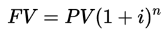
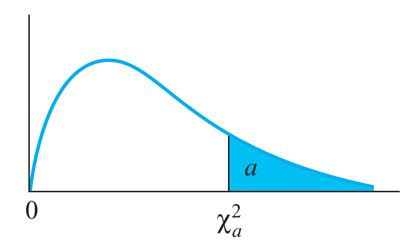
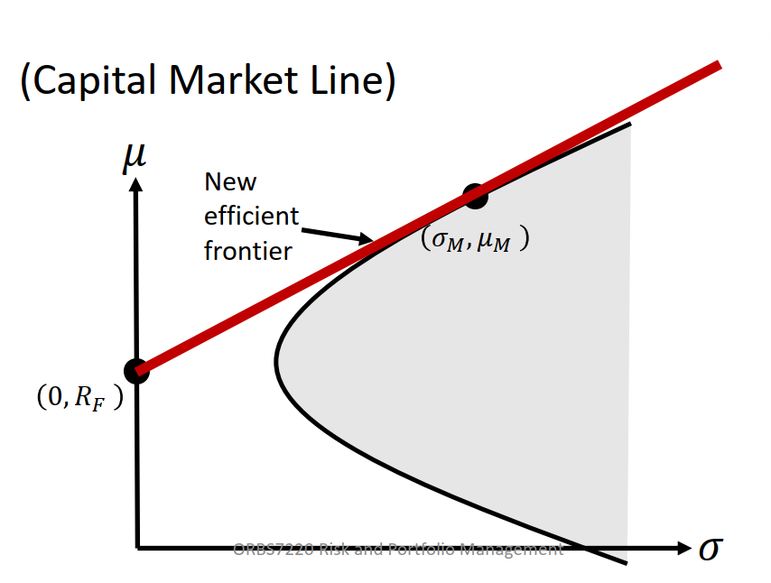

# 1. orbs

Operational Research and Business Statistics

> 如果要快速提高自己的编程水平的话，你必须总是去做一些你做得出来，但是难度大到只要再难一点点你就做不出来的事情。再这么坚持好些年之后，肯定会进入高手的行列。

## 1.1. Courses

- Simulation Modelling
- Managing Organisational Performance
- Actuarial Statistics
- Risk and Portfolio Management
- Applied Multivariate Analysis
- Prescriptive Analytics for Decision Making
- Business Statistics with R
- Machine Learning and Forecasting
- Big Data Analytics and Visualisation
- Applied Time Series

# 2. Zen of Code

## 2.1. Principle

- Design First
    - Pseudocode code
    - Process diagram
- Never optimize first
- Function Based
- Class Based
- Know what you expect
- Use debug tool
- Know classic algorithm. 
- Use already exist tool or function instead of recreate again. 
- Never use abs path. 
- Design data structure first at Data analysis
- Use parameter name to call a self defined function.
- Keep raw data or treatable data

## 2.2. Use camelCase for name

camelCase is good. Use lower camelCase for variant, and upper CamelCase for function/class.

## 2.3. Use Tidy Data for output data

Tidy data is an alternate name for the common statistical form called a model matrix or data matrix. A data matrix is defined in [1] as follows:

A standard method of displaying a multivariate set of data is in the form of a data matrix in which rows correspond to sample individuals and columns to variables, so that the entry in the ith row and jth column gives the value of the jth variate as measured or observed on the ith individual.

## 2.4. Process data with proper tools before import

Use tools like Visual Studio Code, Python, Excel or others to make data proper to use before importing to code.

## 2.5. Always assume data is not clean

So check every data before really analysis, especially data type and NA.

# 3. Tools

## 3.1. Google Scholar

The best way to find a Text is Google Scholar. The `Cite` function can give you the best choice.

## 3.2. Matlab

Dear Msc students,
Here is the link for you to install the Matlab (you need to sign in for the Mathworks first, I think):

https://ww2.mathworks.cn/en/academia/tah-portal/hong-kong-baptist-university-40738596.html

During the installation, you will be asked to select the toolbox needed. A list of them will be provided 
to you. But we may not be able to have them all. A simple solution is just following the default.
Best,
Li-Zhi

# 4. Statistics

## 4.1. Diagram

### 4.1.1. 函数曲线

李笑来先生《新生——七年就是一辈子》里第一篇文章就是「人生最重要的概念：复利」，用很长的篇幅讲述了复利的概念。复利是个纯数学概念，公式为



文字也好，数字也罢，虽然可以精准的表述出其概念，但在直观性上总是会差那么一点点。这时候函数曲线就可以派上用场了。复利曲线直接了当的说明了随着时间的增长，收益会以极快的速度增长这个概念，使其极具冲击性。


其实回想一下中学数学就可以知道，解析几何就是在用图像来说明函数。各种函数都可以在坐标系里用一条曲线或线段来表示，我们用图像可以明确的看出变化趋势，求解的过程就是寻找曲线交点的过程……函数曲线是帮助我们理解复杂枯燥的数学概念的一个极重要的武器。

生活中能用到纯理论的数学函数的地方不会太多，但每次遇到的时候，都不妨画一条函数曲线试试。只要给出函数定义，很多计算机软件都能非常容易的绘制出曲线。SpeQ、MathCAD 等软件都非常好用。

以上诸工具，均满足免费、跨平台的要求，可满足绝大多数要求。以后不用再在找制图软件上浪费时间了。

### 4.1.2. 思维导图

思维导图的两种主要用法

- 把问题放中心，分散思考；
- 把结论放中心，分散解释；

分别对应思考和阐述。

### 4.1.3. 散点图

### 4.1.4. 折线图

### 4.1.5. 条形图

### 4.1.6. 水平条形图

### 4.1.7. 堆叠条形图

### 4.1.8. 维恩图

### 4.1.9. 雷达图

### 4.1.10. 注意事项

1. 避免饼图。邪恶的饼图；
2. 避免太多颜色。可能的情况下只用两到三种颜色；
3. 简洁是美。去除一切可去除的元素，诸如坐标轴标、网格线等；

# 5. Multivariate Analysis

ORBS7250 midterm test will be held on 9 April (Thursday) from 7:00pm to 9:00pm. Will have to download the test paper from Moodle and upload answers to Moodle. 

It will cover random vectors and multivariate normal distributions.

ORBS7250 online examination will be held on 14 May (Thursday) from 7:00pm to 9:00pm. 

## 5.1. Random Vector

For p dimension random vector with n values, we have

$$
\begin{array}{c|cccccc} 
& \text { Variable 1 } & \text { Variable 2 } & \cdots & \text { Variable } k & \cdots & \text { Variable } p \\
\hline \text { Item 1 } & x_{11} & x_{12} & \cdots & x_{1 k} & \cdots & x_{1 p} \\
\text { ltem 2 } & x_{21} & x_{22} & \cdots & x_{2 k} & \cdots & x_{2 p} \\
\vdots & \vdots & \vdots & & \vdots & & \vdots \\
\text { ltem } j & x_{j 1} & x_{j 2} & \cdots & x_{j k} & \cdots & x_{j p} \\
\vdots & \vdots & \vdots & & \vdots & & \vdots \\
\text { Item } n & x_{n 1} & x_{n 2} & \cdots & x_{n k} & \cdots & x_{n p}
\end{array}
$$

which can be represented as a $n\times p$ matrix

$$
X=\left[\begin{array}{cccccc}
x_{11} & x_{12} & \cdots & x_{1 k} & \cdots & x_{1 p} \\
x_{21} & x_{22} & \cdots & x_{2 k} & \cdots & x_{2 p} \\
\vdots & \vdots & & \vdots & & \vdots \\
x_{j 1} & x_{j 2} & \cdots & x_{j k} & \cdots & x_{j p} \\
\vdots & \vdots & & \vdots & & \vdots \\
x_{n 1} & x_{n 2} & \cdots & x_{n k} & \cdots & x_{n p}
\end{array}\right]
$$

or

$$
X=\begin{bmatrix}
    X_1\\ X_2\\ \vdots\\ X_p
\end{bmatrix}
$$

### 5.1.1. Variance and Covariance

#### 5.1.1.1. One Random Variable

For one random variable, we can get the its variance

$$
s_{k}^{2}=\frac{1}{n-1} \sum_{j=1}^{n}\left(x_{j k}-\bar{x}_{k}\right)^{2}, \quad k=1,2, \ldots, p
$$

#### 5.1.1.2. Two Random Variables

For two variables, we can get their covariance

$$
s_{i k}=\frac{1}{n-1} \sum_{j=1}^{n}\left(x_{j i}-\bar{x}_{i}\right)\left(x_{j k}-\bar{x}_{k}\right), \quad k=1,2, \ldots, p
$$

#### 5.1.1.3. One Random Vector

For random vector X, we can make a covariance matrix as

$$
S=\left[s_{i k}\right]=\left[\begin{array}{cccc}
s_{11} & s_{12} & \cdots & s_{1 p} \\
s_{21} & s_{22} & \cdots & s_{2 p} \\
\vdots & \vdots & & \vdots \\
s_{p 1} & s_{p 2} & \cdots & s_{p p}
\end{array}\right]
$$

or in matrix notation as 

$$
Cov(X) = \Sigma = E(X-\mu)(X-\mu)^T
$$

We can denote it as

$$
X \sim (\mu, \Sigma)
$$

#### 5.1.1.4. Two Random Vectors

For $X_p\sim (\mu, \Sigma_{XX})$ and $Y_q\sim (\nu, \Sigma_{YY})$, we have

$$
\Sigma_{XY}=Cov(X,Y)=E[(X-\mu)(Y-\nu)^T] = E(XY^T)-\mu\nu^T=E(XY^T)-E(X)E(Y^T)
$$

For $Z=\begin{bmatrix}
    X\\Y
\end{bmatrix}$, we have

$$
\Sigma_{ZZ}=\begin{bmatrix}
    \Sigma_{XX} & \Sigma_{XY}\\
    \Sigma_{YX} & \Sigma_{YY}
\end{bmatrix}
$$

### 5.1.2. Correlation Coefficient

$$
r_{i k}=\frac{s_{i k}}{\sqrt{s_{i i} \sqrt{s_{k k}}}}=\frac{\sum_{j=1}^{n}\left(x_{j i}-\bar{x}_{i}\right)\left(x_{j k}-\bar{x}_{k}\right)}{\sqrt{\sum_{j=1}^{n}\left(x_{j i}-\bar{x}_{i}\right)^{2}} \sqrt{\sum_{j=1}^{n}\left(x_{j k}-\bar{x}_{k}\right)^{2}}}
$$

then we can have the correlation coefficient matrix

$$
R=\left[\begin{array}{cccc}
1 & r_{12} & \cdots & r_{1 p} \\
r_{21} & 1 & \cdots & r_{2 p} \\
\vdots & \vdots & & \vdots \\
r_{p 1} & r_{p 2} & \cdots & 1
\end{array}\right]
$$

### 5.1.3. Multinomial distribution

Similar to binomial distribution, we have Multinomial distribution probability mass function as

$$
f(x)=\displaystyle {\frac {n!}{x_{1}!\cdots x_{k}!}}p_{1}^{x_{1}}\cdots p_{k}^{x_{k}}
$$

Where

$$
x = \begin{bmatrix}x_1\\x_2\\\vdots\\x_k\end{bmatrix}
$$

$$
x_1+x_2+\cdots +x_k=n
$$

$$
p_1+\cdots+p_k=1
$$

### 5.1.4. Multivariate hypergeometric distribution

If Multinomial case without repalcement, we get Multivariate hypergeometric distribution. The joint probability distribution is

$$
f(x) = \frac{C_{x_1}^{r_1}C_{x_2}^{r_2}\cdots C_{x_k}^{r_k}}{C_{N}^{n}}
$$

Where

$$
x = \begin{bmatrix}x_1\\x_2\\\vdots\\x_k\end{bmatrix}
$$

$$
\sum_{i=1}^k i=N
$$

### 5.1.5. Linear transformations of random vector

$$
X = \begin{bmatrix}X_1\\X_2\\\vdots\\X_k\end{bmatrix}
$$

$$
A=\left[\begin{array}{cccc}
a_{11} & a_{12} & \cdots & a_{1 p} \\
a_{21} & a_{22} & \cdots & a_{2 p} \\
\vdots & \vdots & & \vdots \\
a_{m 1} & a_{m 1} & \cdots & a_{m p}
\end{array}\right]
$$

Then 

$$
\mathbf{Z}=A \mathbf{X}=\left[\begin{array}{c}
a_{11} X_{1}+\cdots+a_{1 p} X_{p} \\
a_{21} X_{1}+\cdots+a_{2 p} X_{p} \\
\vdots \\
a_{m 1} X_{1}+\cdots+a_{m p} X_{p}
\end{array}\right]
$$

defines a set of linear combinations of $X1$, $X2$, $\dots$, $X_p$.

then we have

$$
E[AX] = AE[X]\\
Var(AX) = AVar(X)A'\\
Cov(AX, BY) = ACov(X,Y)B'
$$

### 5.1.6. The multiple correlation coefficient

For dependent variable Y to be predicted by random vector $Z = [Z_1, Z_2, \cdots Z_r]$, we have

$$
Y = \beta_0 + \beta' Z
$$

Combine Y and Z as a new vector $\begin{bmatrix}
    Y\\Z
\end{bmatrix}$, we have $\mu = \begin{bmatrix}
     \mu_Y\\\mu_Z
\end{bmatrix}$ and $\Sigma = \begin{bmatrix}
    \sigma_{YY} & \sigma'_{ZY}\\ \sigma_{ZY} & \sigma_{ZZ}
\end{bmatrix}$

We can get the coefficient of this predict function $Y=\beta_0 + \beta'Z$ as 

$$
\beta = \sigma_{ZZ}^{-1}\sigma_{ZY} \qquad \beta_0 = \mu_Y - \beta'\mu_Z
$$

Then by some transformation, we can get the population multiple correlation coefficient as

$$
r_{YZ} = \sqrt{\frac{\sigma'_{ZY}\sigma_{ZZ}^{-1}\sigma_{ZY}}{\sigma_{YY}}}
$$

The mean square error of this forecast is

$$
MSE(Y, Z) =\sigma_{YY} - \sigma'_{ZY}\sigma_{ZZ}^{-1}\sigma_{ZY}= \sigma_{YY}(1-r_{YZ}^2)
$$

So if $r_{YZ} = 0$, the variance of Y is just like itself, so Z has no predictive power. If $r_{YZ} = 1$, the error will be constant 0, means Z can completely predict Y.

### 5.1.7. Partial correlation coefficient

Consider $Y = \begin{bmatrix}
    Y_1\\Y_2
\end{bmatrix}$, the correlation determined from the error covariance matrix

$$
\sigma_{Y Y \cdot Z}=\sigma_{Y Y}-\sigma_{Y Z} \sigma_{\mathbf{Z Z}}^{-1} \sigma_{Z Y}
$$

measures the association between Y1 and Y2 after eliminating the effects of Z. Then the partial correlation coefficient between Y1 and Y2 given Z is

$$
r_{Y_{1} Y_{2} \cdot Z}=\frac{\sigma_{Y_{1} Y_{2} \cdot Z}}{\sqrt{\sigma_{Y_{1} Y_{1} \cdot Z}} \sqrt{\sigma_{Y_{2} Y_{2} \cdot Z}}}
$$

where $\sigma_{Y_iY_k\cdot Z}$ is the $(i, k)$th entry in the matrix $\sigma_{Y Y \cdot Z}$.

Replace $\sigma$ by $S$, we then get the sample partial correlation coefficient

$$
r_{Y_{1} Y_{2} \cdot Z}=\frac{s_{Y_{1} Y_{2} \cdot Z}}{\sqrt{s_{Y_{1} Y_{1} \cdot Z}} \sqrt{s_{Y_{2} Y_{2} \cdot Z}}}
$$

with $s_{Y_{i} Y_{j} \cdot Z}$ is the $(i,j)$th entry in the matrix 

$$S_{Y Y \cdot Z}=S_{Y Y}-S_{Y Z} S_{\mathbf{Z Z}}^{-1} S_{Z Y}$$

## 5.2. Multivariate Normal Distribution

For vector $X = [X_1, X_2, \cdots X_p]' \sim N_p$, the PDF is

$$
f(\mathbf{x})=\frac{1}{(\mathbf{2} \pi)^{\frac{\mathbf{p}}{2}}|\mathbf{\Sigma}|^{\frac{1}{2}}} \mathbf{e}^{-\frac{1}{2}(\mathbf{x}-\mu)^{\prime} \mathbf{\Sigma}^{-1}(\mathbf{x}-\mu)}
$$

The squared distance of multivariate distribution is

$$
c^2 = (x-\mu)'\Sigma^{-1}(x-\mu)
$$

This function can generate a ellipsoid called contour. For two dimension vector, it will be an ellipse

- whose center is $\mu$
- axes = $\pm c\sqrt{\lambda_i}e_i$.
- $\lambda_i$: eigenvalue of $\Sigma$
- $e_i$: eigenvector corresponding to $\lambda_i$
- $\Sigma$: covariance matrix for vector $X$;

### 5.2.1. Eigenvalue and Eigenvector

For a certain matrix $A$, we can get its eigenpairs as below.

1. $Ae = \lambda e$
2. $(A-\lambda I)e=0$
3. $det(A-\lambda I)=0$, to get $\lambda$
4. set $e'=[a, b]$, back to step 1, get the relationship of a/b
5. $e_i'=[a/sqrt(a^2+b^2), b/sqrt(a^2+b^2)]$

For example, for matrix $A = \begin{bmatrix}
    5 & 1\\3 & 3
\end{bmatrix}$, we have

$$
det(A-\lambda I) = 0
$$

$$
\lambda = \left\{
\begin{array}{rl}
6 \\
2
\end{array} \right.
$$

set $e'=[a, b]$, use

$$
Ae-\lambda e=0
$$

take $\lambda$ in, and get the relationship of a and b for

$$
\lambda = 6 \Rightarrow b = 3a \Rightarrow e' = [a, 3a]
$$

$$
e = \begin{bmatrix}
    \frac{a}{\sqrt{a^2+(3a)^2}} \\
    \frac{3a}{\sqrt{a^2+(3a)^2}} 
\end{bmatrix} = \begin{bmatrix}
    1/\sqrt{10} \\ 3/\sqrt{10}
\end{bmatrix}
$$

similarly for $\lambda = 2$, we can get

$$
e = \begin{bmatrix}
    1/\sqrt{2}\\
    1/\sqrt{2}
\end{bmatrix}
$$

We can also get them from numpy in Python as below

```python
m = np.array([[5, 1], [3, 3]])
eigen = np.linalg.eig(m)

array([[5, 1],
       [3, 3]])
(array([6., 2.]), array([[ 0.70710678, -0.31622777],
        [ 0.70710678,  0.9486833 ]]))
```

### 5.2.2. Population normal distribution

For $X\sim N_p(\mu, \Sigma)$, we have

$$
(X-\mu)'\Sigma^{-1}(X-\mu)\leq \chi_p^2(\alpha)
$$

where $\chi_p^2(\alpha)$ denotes the $(1-\alpha)$ of the $\chi_p^2$ distribution.



Attention:

Chi2 distribution table are all concern about the right part, and they have no two-tailed question.

#### 5.2.2.1. properties

- For $X\sim N_p(\mu, \Sigma)$, $a'X\sim N(a'\mu, a'\Sigma a)$
- For $X\sim N_p(\mu, \Sigma)$, $AX\sim N(A\mu, A\Sigma A')$
- For $X\sim N_p(\mu, \Sigma)$, $X+d\sim N(\mu+d, \Sigma)$
- For $X\sim N_p(\mu, \Sigma)$, $x_{i\sim j}\sim N(\mu_{i\sim j}, \Sigma_{i\sim j})$

#### 5.2.2.2. Distribution

For $X=\begin{bmatrix} X_1\\X_2 \end{bmatrix}\sim N_p(\mu, \Sigma)$ with $\mu=\begin{bmatrix} \mu_1\\\mu_2 \end{bmatrix}$ and $\Sigma=\left[\begin{array}{c|c}\Sigma_{11} & \Sigma_{12} \\\hline \Sigma_{21} & \Sigma_{22}
\end{array}\right]$, we have

$$
(X_1 | X_2=x_2)\sim N(\mu_c, \Sigma_c)
$$

where

$$\mu_c = \mu_1 + \Sigma_{12}\Sigma_{22}^{-1}(x_2-\mu_2)$$
$$\Sigma_c = \Sigma_{11}-\Sigma_{12}\Sigma_{22}^{-1}\Sigma_{21}$$

Generally, we do not know population parameters, so we need to estimate them from sample data. Then we can use

$$
\hat \mu=\overline{X}
$$
and
$$
\hat \Sigma = \frac{n-1}{n}S
$$

### 5.2.3. The Central Limit Theorem

For $[X_1, X_2, \dots, X_n]\in X\sim N_p(\mu, \Sigma)$, then $\sqrt{n}(\overline{X}-\mu)\sim N_p(0, \Sigma)$ for large sample size like n>30+p.

### 5.2.4. Sample Distribution of sample mean vector

Sample distribution of sample mean vector is the same as univariate case, so we get

$$
\overline{X} \sim N_p(\mu, (1/n)\Sigma)
$$

### 5.2.5. Large Sample Distribution

$$
n(\overline{X}-\mu)'S^{-1}(\overline{X}-\mu)\sim \chi_p^2
$$

Attention: 

1. $\mu$ is true mean, otherwise not $\chi^2$ distributed;
2. n-p should be large;

### 5.2.6. Sample Test

For confidence region of sample data, we use Hotelling's T2 who distributed as:

$$\begin{aligned}
    T^2 &= (\overline{X}-\mu_0)'(\frac{1}{n}S)^{-1}(\overline{X}-\mu_0) \\&
    = n(\overline{X}-\mu_0)'S^{-1}(\overline{X}-\mu_0)\\&
    \sim \frac{(n-1)p}{n-p}F_{p,n-p}(\alpha)
\end{aligned}
$$

Attention, $F_{p,n-p}(\alpha)$ is right tailed.

Or for confidence region, we have 

$$
    n(\overline{X}-\mu_0)'S^{-1}(\overline{X}-\mu_0)\leq c^2=\frac{(n-1)p}{n-p}F_{p,n-p}(\alpha)
$$

which is the same as 

$$
\frac{\sqrt{\lambda_{i}} c}{\sqrt{n}}=\sqrt{\lambda_{i}} \sqrt{\frac{p(n-1)}{n(n-p)} F_{p, n-p}(\alpha)}
$$

units along the direction, eigenvector $e_i$ with respect to $\lambda_i$.

For 2 dimension, we have ellipse center at $\bar x$ and

$$
\pm \sqrt{\lambda_{i}} \sqrt{\frac{p(n-1)}{n(n-p)} F_{p, n-p}(\alpha)}\mathrm{e_i}
$$

### 5.2.7. Simultaneous Confidence Statements

Unlike confidence region is for all the variables, simultaneous confidence statements is about every variable.

So for all a′, the interval have

$$
\left(\mathbf{a}^{\prime} \overline{\mathbf{X}}-\sqrt{\frac{p(n-1)}{n(n-p)} F_{p, n-p}(\alpha) \mathbf{a}^{\prime} \mathbf{S} \mathbf{a},} \quad \mathbf{a}^{\prime} \overline{\mathbf{X}}+\sqrt{\frac{p(n-1)}{n(n-p)} F_{p, n-p}(\alpha) \mathbf{a}^{\prime} \mathbf{S}{\mathbf{a}}}\right)
$$

will contain a′µ with probability 1 − α.

For $a = \begin{bmatrix}
    0\\ 1\\0
\end{bmatrix}$ this kind of vector, we can simpliy it as

$$
\left(\mathbf{a}^{\prime} \overline{\mathbf{X}}-\sqrt{\frac{p(n-1)}{(n-p)} F_{p, n-p}(\alpha)}\sqrt{\frac{s_{ii}}{n}}, \quad \mathbf{a}^{\prime} \overline{\mathbf{X}}+\sqrt{\frac{p(n-1)}{(n-p)} F_{p, n-p}(\alpha)}\sqrt{\frac{s_{ii}}{n}}\right)
$$

which is quite the same univariate.

This method can also be used to construct difference of two variables by different a. For example, by using $a = [0, 1 -1]'$, we can construct the interval of x2 and x3

$$
\left(\bar{x}_{2}-\bar{x}_{3}\right) \pm \sqrt{\frac{p(n-1)}{n-p} F_{p, n-p}(\alpha)} \sqrt{\frac{\mathbf{a}^{\prime} \mathbf{S} \mathbf{a}}{n}}\\
\left(\bar{x}_{2}-\bar{x}_{3}\right) \pm \sqrt{\frac{p(n-1)}{n-p} F_{p, n-p}(\alpha)} \sqrt{\frac{s_{22}+s_{33}-2 s_{23}}{n}}
$$

### 5.2.8. The Bonferroni Method of Multiple Comparisons

Another kind of region is Bonferroni region, which is

$$
\begin{aligned}
&\bar{x}_{1}-t_{n-1}\left(\frac{\alpha}{2 p}\right) \sqrt{\frac{s_{11}}{n}} \leq \mu_{1} \leq \bar{x}_{1}+t_{n-1}\left(\frac{\alpha}{2 p}\right) \sqrt{\frac{s_{11}}{n}}\\
&\bar{x}_{2}-t_{n-1}\left(\frac{\alpha}{2 p}\right) \sqrt{\frac{s_{22}}{n}} \leq \mu_{2} \leq \bar{x}_{2}+t_{n-1}\left(\frac{\alpha}{2 p}\right) \sqrt{\frac{s_{22}}{n}}\\
&\bar{x}_{p}-t_{n-1}\left(\frac{\alpha}{2 p}\right) \sqrt{\frac{s_{p p}}{n}} \leq \mu_{p} \leq \bar{x}_{p}+t_{n-1}\left(\frac{\alpha}{2 p}\right) \sqrt{\frac{s_{p p}}{n}}
\end{aligned}
$$

### 5.2.9. Large Sample Inference

For large sample inference, we reject null hypothesis $H_0: \mu = \mu_0$ if

$$
n(\overline{X}-\mu)'S^{-1}(\overline{X}-\mu)\gt \chi_p^2(\alpha)
$$

at $1-\alpha$ level. Here $χ_p^2(α)$ is the 100(1 − α)th percentile of a chi-square distribution.

For every a, we can construct a confidence interval which contain $a'\mu$ with probability of $1-\alpha$

$$
\mathbf{a}^{\prime} \overline{\mathbf{X}} \pm \sqrt{\chi_{p}^{2}(\alpha)} \sqrt{\frac{\mathbf{a}^{\prime} \mathbf{S a}}{n}}
$$

# 6. Machine Learning

## 6.1. scikit-learn

6 main functions:

1. regression
2. classfication
3. clustering
4. dimension reduction
5. model selection
6. data preprocessing

# 7. Big Data

## 7.1. Software

### 7.1.1. Gephi

Why my Gephi says that she failed to find Java even I have installed the newest version?

> open 'gephi.conf', remove the comment of jdkhome, and change it to your Java home path.  
> For example, mine is  
> jdkhome="c:\Program Files\Java\jdk-14\"

# 8. Risk and Portfolio Management

## 8.1. Terminology

### 8.1.1. Portfolio

Suppose $P\owns [(\mu_i, \sigma_i) \text{ for }i=1,\dots,n]$, where $w_1+\cdots + w_n=1$

### 8.1.2. Return

$$
R = \frac{P_{current-P_{previous}}}{P_{previous}}
$$

Generally, R refer to per annual.

### 8.1.3. Return of Portfolio

Return of portfolio P:

$$
R_P=\frac{V'-V}{V}=w_1R_1+\cdots + w_nR_n
$$

### 8.1.4. Expected return

$$
\mu = E(R) \mathrm{\quad(p.a.)}
$$

### 8.1.5. Expected return of Portfolio

$$
\mu_p = w_1\mu_1+\cdots +w_n\mu_n
$$

### 8.1.6. Volatility

$$
\sigma = \sqrt{Var(R)} = \sqrt{E(R^2) - E(R)^2}\mathrm{\quad(p.a.)}
$$

### 8.1.7. Volatility of Portfolio

$$
\sigma_P=\sqrt{w_1^2\sigma_1^2+\cdots +w_n^2\sigma_n^2+\sum_{i=1}^{n}\sum_{j=1}^{n}w_i\sigma_i \rho_{ij}w_j \sigma_j}
$$

where 
$$\rho_{ij}=\frac{Cov(R_i,R_j)}{\sigma_i \sigma_j}=\frac{E[(R_i-\mu_i)(R_2-\mu_2)]}{\sigma_i\sigma_j}$$

## 8.2. Portfolio

### 8.2.1. How to get the minimum risk for portfolio

#### 8.2.1.1. For two assets

1. Calculate the $\sigma_P$ in terms of $w_1$
2. Set $\partial \sigma_P/\partial w_1 = 0$ to get $w_1$

#### 8.2.1.2. For more assets

1. Use Efficient Frontier
2. Set $\partial \sigma_P/\partial w_1 = 0$ to get $\mu_P$

Where

$$
\sigma_{P}^{2}=\frac{c}{a c-b^{2}} \cdot \mu_{P}^{2}+\frac{-2 b}{a c-b^{2}} \cdot \mu_{P}+\frac{a}{a c-b^{2}}
$$

### 8.2.2. Risky and Riskless

New portfolio with riskless and risky investment

$$
R_P=\alpha R_F + (1-\alpha)R_R
$$

Where

- $R_P$: Return of portfolio
- $R_F$: Return of riskless asset
- $R_R$: Return of risky assets

By changing $\alpha$, we can get the **Capital Market Line** and Market Portfolio.



### 8.2.3. Capital Asset Pricing Model

For a given investment with return R, we want to know its expected return $\mu$.

CAPM states that

$$
\mu = R_F + \beta(\mu_M-R_F)
$$

where

$$
\beta=\frac{Cov(R,R_M)}{Var(R_M)}
$$

For certain $\beta_i=\frac{\sigma_{iM}}{\sigma_M^2}$, we can use linear regression to obtain $\alpha$ and $\beta_i$ for

$$
R_i=\alpha + \beta_iR_M+\epsilon
$$

After we get $\beta_i$, we can use $\mu_M$ to estimate $\mu_i$, where $\mu_M$ can be estimated by stock index.

We define $\alpha$ as the extra return on a portfolio, then

$$
\alpha = R_P-(R_F+\beta(R_M-R_F))
$$

Make some deduce, we can get

$$
\mu_i-R_F=\frac{\sigma_{iM}}{\sigma_M^2}(\mu_M-R_F)
$$

This formula gives the relationship between the return of a certain asset and the return of market.

## 8.3. Bond

```
                          ^
   +                      |
   |                      |
   v                      |
 +-+----------------------+-->
  Buy with         Pay with
  a discount       facevalue

         Zero Bond

                         ^
  +       Coupons        |
  |    ^    ^    ^   ^   |
  v    |    |    |   |   |
+-+----+----+----+---+---+--->
 Buy at             Pay with face
 face value         value + coupon

    Coupon Bearing bond
```

Treasury bonds are considered riskless.

## 8.4. Forward Contract

### 8.4.1. Fair Value

The theoretical fair value, called forward price is:

$$
𝐹_0 = 𝑆_0𝑒^{𝑅_𝐹𝑇}
$$

Where

- $S_0$: current spot price of the asset
- $R_F$: riskless rate
- $T$: time period

### 8.4.2. Contract Value

For long party

$$
f = (F_0-K)e^{-R_FT}
$$

For short party

$$
f = (K-F_0)e^{-R_FT}
$$

## 8.5. Future Contract

## 8.6. Swap


## 8.7. Option

Option have 4 positions:

1. Buy a call option
2. Sell a call option
3. Buy a put option
4. Sell a put option

## 8.8. Rate Risk

### 8.8.1. Duration

Duration is generally defined as Macaulay's Duration, which is

$$
D = \sum_{i=1}^n t_i(\frac{v_i}{B})
$$

Where

$$
v_i = c_ie^{-t_iy}
$$

- $c_i$: return cash flow;
- $t_i$: time period;
- $y$: continuous yield;

### 8.8.2. Modified Duration

If $y$ is not continuous rate, duration should be modified by $1+y/m$, where $y$ is rate by period, and $m$ is conversion time. So we get

$$
D_m = \frac{D}{1+y/m}
$$

### 8.8.3. Dollar Duration

Dollar duration is defined as thed product of its duration and its price. So we get

$$
D_\$=DB=-\frac{\Delta B}{\Delta y}\frac{1}{B}B=-\frac{\Delta B}{\Delta y} = -\frac{\partial B}{\partial y}
$$

Whereas duration relates proportional changes in a bond’s price to its yield, dollar duration relates actual changes in the bond’s price to its yield. Dollar duration is similar to the delta measure.

## 8.9. Credit Risk

$$
V(t) = P(T>t)
$$

$$
Q(t)=P(T\leq t)=1-V(t)
$$

Where

- $T$: The time of default of a given bond;
- $V(t)$: The cumulative probability of the bond surviving to time t;
- $Q(t)$: The probability of default by time t.

### 8.9.1. Hazard Rate

TABLE 19.1 Average Cumulative Default Rates (%), 1970–2013

| Time(years) |    1   |    2   |    3   |    4   |    5   |    7   |   10   |   15   |   20   |
|:-----------:|:------:|:------:|:------:|:------:|:------:|:------:|:------:|:------:|:------:|
|     Aaa     |  0.000 |  0.013 |  0.013 |  0.037 |  0.104 |  0.241 |  0.489 |  0.910 |  1.073 |
|      Aa     |  0.022 |  0.068 |  0.136 |  0.260 |  0.410 |  0.682 |  1.017 |  1.871 |  3.167 |
|      A      |  0.062 |  0.199 |  0.434 |  0.679 |  0.958 |  1.615 |  2.759 |  4.583 |  7.044 |
|     Baa     |  0.174 |  0.504 |  0.906 |  1.373 |  1.862 |  2.872 |  4.623 |  8.306 | 11.969 |
|      Ba     |  1.110 |  3.071 |  5.371 |  7.839 | 10.065 | 13.911 | 19.323 | 28.500 | 35.410 |
|      B      |  3.904 |  9.274 | 14.723 | 19.509 | 23.869 | 31.774 | 40.560 | 50.275 | 55.892 |
|    Caa-C    | 15.894 | 27.003 | 35.800 | 42.796 | 48.828 | 56.878 | 66.212 | 73.152 | 74.946 |

Source: Moody's

We can get Q(t) from this table.

Define

$$
\begin{aligned}
     \lambda(t)&=\frac{P(t<T\leq t+\Delta t|T>t)}{\Delta t} \\&= \frac{V(t)-V(t+\Delta t)}{V(t)}\\&=-\frac{dV(t)}{dt}\frac{1}{V(t)}
\end{aligned}
$$

so

$$
V(t)=e^{-\int_0^t\lambda(\tau)d\tau}
$$

or

$$
e^{-\int_0^t\lambda(\tau)d\tau}=1-Q(t)
$$

Where

- $\lambda(t)$: Default probability in the t-th year, given no early default. So it is a conditional probability.

#### 8.9.1.1. Estimate

We can use credit spread rate to estimate $\lambda$

$$
\bar \lambda = \frac{s(T)}{1-R}
$$

Where

- $\bar \lambda$: average hazard rate between time 0 and time T;
- R: recovery rate;
- s(T): credit spread for a maturity of T;

#### 8.9.1.2. Estimate by Risk rate and Yield rate

Suppose that a five-year corporate bond with a principal of 100 provides a coupon of 6% per annum (paid semiannually) and that the yield on the bond is 7% per annum (with continuous compounding). The yield on a similar risk-free bond is 5% (again with continuous compounding).Th yields imply that the price of the corporate bond is 95.34 and the price of the risk-free bond is 104.09.The expected loss from default over the five-year life of the bond is therefore 104.09–95.34, or $8.75. For simplicity, we suppose that the unconditional probability of default per year is the same each year and equal to Q. Furthermore, we assume defaults can happen only at times 0.5, 1.5, 2.5, 3.5, and 4.5 years (immediately before coupon payment dates). Risk-free rates are assumed to be 5% (with continuous compounding) for all maturities and the recovery rate (i.e., recovery as a percent of principal) is assumed to be 40%. (The analysis can be extended so that defaults happen more frequently.)

So we get

- p = 100, the principal;
- rc = 6%, coupon rate  per annum (paid semiannually);
- y = 7%, yield per annum (with continuous compounding);
- rfb = 5%, risk-free bond rate (again with continuous compounding);
- rf = 5%, Risk-free rates(with continuous compounding) for all maturities
- R = 40$, the recovery rate (i.e., recovery as a percent of principal)
- Q: unconditional probability of default per year, the same each year;

If there is no default, we get the therotical cash flow

```
    100  3           3               3       ^
     |   ^   ^   ^   ^   ^   ^   ^   ^   ^   |
     |   |   |   |   |   |   |   |   |   |   |
     |   |   |   |   |   |   |   |   |   |   |
+----v---+---+---+---+---+---+---+---+---+---+->
     0  0.5     1.5     2.5          4       5
```

the outflow before 5 year is

$$
c = 100 \times 6\%/2=3
$$

Based on the yield, we get the present value of cooperate bond

$$
P_y=3e^{-0.07\times0.5}+3e^{-0.07\times 1.0} + \cdots + 3e^{-0.07\times 4.5} + 103\times e^{-0.07\times 5} = 95.34
$$

and the price of the risk-free bond is 104.09.

$$
P_R=3e^{-0.05\times0.5}+3e^{-0.05\times 1.0} + \cdots + 3e^{-0.05\times 4.5 }+ 103\times e^{-0.05\times 5} = 104.09
$$

The expected loss from default over the five-year life of the bond is therefore $104.09–95.34 = 8.75$.

consider the 3.5-year. The expected value of the default-free bond at time 3.5 years (calculated using the forward risk-free interest rates) is

$$
3+ 3e^{−0.05×0.5}+ 3e^{−0.05×1.0} + 103e^{−0.05×1.5} = 104.34
$$

The reason why we have 3 in the equation is that, we are now calculating the present value of risk-free bond. Now we are standing at the 3.5 year point, the bond does not default, so now we can get a 3$ coupon.

So the loss given default should be this value minus the recovery amout

$$
104.34 - 40\%*100=64.34
$$

and the present value of the loss is

$$
64.34\times e^{-0.05\times 3.5} = 54.01
$$

So the expected loss for this time point is $54.01Q$.

Calculate this process for all the period, we get the following table

| Time (yrs) | Def. Prob. | Recovery Amount($) | Default-Free Value($) | Loss($) | Discount Factor | PV of Expected Loss($) |
|:----------:|:----------:|:------------------:|:---------------------:|:-------:|:---------------:|:----------------------:|
|     0.5    |      Q     |         40         |         106.73        |  66.73  |      0.9753     |         65.08Q         |
|     1.5    |      Q     |         40         |         105.97        |  65.97  |      0.9277     |         61.20Q         |
|     2.5    |      Q     |         40         |         105.17        |  65.17  |      0.8825     |         57.52Q         |
|     3.5    |      Q     |         40         |         104.34        |  64.34  |      0.8395     |         54.01Q         |
|     4.5    |      Q     |         40         |         103.46        |  63.46  |      0.7985     |         50.67Q         |

In summary, we can get the PV of expected loss 288.48Q. The value of the expected loss is 8.75, as calculated before. So we get

$$
Q = \frac{8.75}{288.48}=3.03\%
$$

So in summary, we have the following process.

1. Based on coupon rate, calculate the cash flow;
2. Based on yield rate, get the present value of the bond $P_y$;
3. Based on risk-free bond rate, get the present value of the risk-free bond $P_R$;
4. Get the expected loss $L_E = P_R - P_y$ as the difference of the two present value;
5. For every coupon return period, get expected value of the default-free bond present value $P_{Ri}$. Pay attention to the first coupon value;
6. Get the loss given default for every period by $L_{Ei} = P_{Ri} - F\times R$, where F is the face value, R is the recover rate;
7. Get the present value of every $L_{Ei}$;
8. Sum all the present value of expected loss $L_{Ei}$ for every i in coupon period as $S_E = \sum_1^nL_{Ei}$;
9. Set the default probability to be Q, the total expected loss will be $Q\times S_E$, which equal to the $L_E$ we get in setp 4. So $Q = {L_E}/{S_E}$.

#### 8.9.1.3. by equity price

Merton proposed option's Black Scholes formula for bond, leads to

- $V_0$: Value of company’s assets today.
- $V_T$: Value of company’s assets at time T.
- $E_0$: Value of company’s equity today.
- $E_T$: Value of company’s equity at time T.
- $D$: Amount of debt interest and principal due to be repaid at time T.
- $\sigma_V$: Volatility of assets (assumed constant).
- $\sigma_E$: Instantaneous volatility of equity.

Then we get

$$
E_0 = V_0N(d_1) - De^{-rT}N(d_2)
$$

Where

$$
d_{1}=\frac{\ln \left(V_{0} / D\right)+\left(r+\sigma_{V}^{2} / 2\right) T}{\sigma_{V} \sqrt{T}}
$$

$$
d_2 = d_1 - \sigma_V \sqrt{T}
$$

$V_0$ and $\sigma_V$ are needed but not observable. Using a lemma called Ito's lemma, we can get

$$
\sigma_E E_0 = \frac{\partial E}{\partial V}\sigma_V V_0
$$

Here $\partial E∕\partial V$ is the delta of the equity, and$ $\partial E∕\partial V = N(d_1)$(Why? complex. Need not to know). So we get

$$
\sigma_E E_0 = N(d_1)\sigma_V V_0
$$

Then we can get parameters to solve it.

### 8.9.2. WCDR

Define the “worst case default rate,” WCDR(T,X), as the default rate (i.e., percentage of loans defaulting) during time That will not be exceeded with probability X%. (In many applications T will be one year.)

After some deduce, we can get

$$
\mathrm{WCDR}(T, X)=N\left(\frac{N^{-1}(\mathrm{PD})+\sqrt{\rho} N^{-1}(X)}{\sqrt{1-\rho}}\right)
$$

Where

- $T$: default time(year);
- $X$: not default probability percentage;
- $\rho$: $corr(x_i, x_j)$;
- $x_i$: normalized default z-score for normal distribution, which is $x_i = N^{-1}(Q_i(t_i))$;

so

$$x_i \sim N(0, 1)$$

### 8.9.3. Credit VaR

A rough estimate of the credit VaR under an 𝑋% confidence level is 

$$\mathrm{VaR} = 𝐿 \cdot (1 − 𝑅) \cdot 𝑊𝐶𝐷𝑅(𝑇, 𝑋)$$

Where

- 𝐿 is the size of the loan portfolio
- 𝑅 is the recovery rate

## 8.10. Credit Default Swaps(CDS)

```
            Payment for protection
Default   +------------------------> Default
Protection                           Protection
Buyer, A  <------------------------+ Seller, B
              Payoff if default by
              reference entity
```

- Payoff = 1 - R
- R: recovery rate;

### 8.10.1. Estimate the CDS rate

### 8.10.2. Implied default probability

Key point for the above question: Payment = Payoff

### 8.10.3. A

# 9. Actuarial

## 9.1. Interest

### 9.1.1. Fix invest with a initial amount

$$
F_{n}=F_{0}(1+i)^{n}+\sum_{k=1}^{n} r_{k}(1+i)^{n-k}
$$

### 9.1.2. Discount Factor

$$
v = \frac{1}{1+i}
$$

Used to discount future value to present. So the previous formula for fix invest can be rewritten as

$$
v^nF_{n}=F_{0}+\sum_{k=1}^{n} r_{k}v^k
$$

### 9.1.3. Interest in Advance

discount or interest-in-advance, and the corresponding rate is called discount rate.

For discount, we have

$$
\frac{1}{1-d}=1+i
$$

Which leads to

$$
d = \frac{i}{1+i}
$$

### 9.1.4. Nominal Interest Rate

$$
\left(1+\frac{i^{(m)}}{m}\right)^{m}=1+i
$$

$$
\left(\frac{1}{1-d^{(m)} / m}\right)^{m}=1+i
$$

Then we have

$$
\frac{1}{d^{(m)}} = \frac{1}{m} + \frac{1}{i^{(m)}}
$$

### 9.1.5. Continuous Compounding

If $m\rightarrow \infty$ in nominal interest rate, we get continuous compounding rate $\delta$

$$
\lim_{m\rightarrow\infty} d^{(m)} = \lim_{m\rightarrow\infty} i^{(m)} = \delta
$$

and

$$
e^{\delta} = 1+i
$$

## 9.2. Perpetuity

### 9.2.1. Perpetuity Due

$$
\ddot a_{\infty \rceil} = \frac{1}{d}
$$

Usage: If annual payment C is made, the present value will be $C\ddot a_{\infty \rceil}$.

### 9.2.2. Immediate Perpetuity

$$
a_{\infty \rceil} = \frac{1}{i}
$$

Usage: If annual payment C is made, the present value will be $Ca_{\infty \rceil}$.

### 9.2.3. Pay 1/m once and m times a year

$$
\ddot{a}_{\infty\rceil}^{(m)} = \frac{1}{d^{(m)}}
$$

Usage: If payment of 𝐶/𝑚 are made 𝑚 times each year and the first payment is made at the start of year, then we have the present value

$$
C\ddot{a}_{\infty\rceil}^{(m)} = \frac{C}{d^{(m)}}
$$

in total.

If the first payment of 1/𝑚 at time 1/𝑚, the present value is denoted as 
$a_{\infty \rceil}^{(m)}$ and given by

$$
a_{\infty \rceil}^{(m)} = \frac{1}{i^{(m)}}
$$

### 9.2.4. Continuous Perpetuity

If $m\rightarrow\infty$, we have continuous perpetuity

$$
\bar a_{\infty\rceil} = \frac{1}{\delta}
$$

## 9.3. Annuity

An annuity consists of a sequence of payments in a limited duration. It can be considered as the difference of two perpetuity.

### 9.3.1. Annuity-due

$$
\ddot{a}_{n\rceil} = \frac{1-v^n}{d}
$$

### 9.3.2. Immediate Annuity

$$
a_{n\rceil} = \frac{1-v^n}{i}
$$

### 9.3.3. 𝑚 payments of $ 1/𝑚 per year for 𝑛 years

$$
\ddot{a}_{n\rceil}^{(m)} = \frac{1-v^n}{d^{(m)}}
$$

$$
a_{n\rceil} = \frac{1-v^n}{i^{(m)}}
$$

## 9.4. Lifetime model

- 𝑥: a person aged 𝑥.
- 𝑇 is the remaining lifetime, or future lifetime
- 𝑥 + 𝑇: Age at death of the person

All notations are starting from age x.

### 9.4.1. Probability density function of 𝑇

Define $g(t)$ as the probability density function of 𝑇, then we have

$$
𝑔(𝑡) 𝑑𝑡 = 𝑃 (𝑡 < 𝑇 < 𝑡 + 𝑑𝑡)
$$

### 9.4.2. Probability distribution function of 𝑇

$$
𝐺(𝑡)= 𝑃(𝑇 \leq 𝑡) = \int_0^tg(\tau)d\tau
$$

### 9.4.3. Extension of life probability

Define

$$
_tq_x=G(t)
$$

as the probability of dying within t years. Then we have

$$
_tp_x=1-{}_tq_x
$$

as the probability of survive at least 𝑡 years.

Define

$$
_{s|t}q_x={}_{s+t}q_x-{}_sq_x
$$

as the probability of survive s years and then die within t years.

Define

$$
_tp_{x+s} = \frac{P(T>s+t)}{P(T>s)}=\frac{1-G(s+t)}{1-G(s)}
$$

as the conditional probability that a person will survive another 
𝑡 years, after having attained the age 𝑥 + 𝑠.

Define

$$
_tq_{x+s} = 1-{}_tp_{x+s}
$$

The conditional probability of dying within 𝑡 years, given that the age of 𝑥 + 𝑠 has been attained.

Then we have some frequently used identities:

$$
{}_{𝑠+𝑡}𝑝_𝑥 = {}_𝑠𝑝_𝑥 \times {}_𝑡𝑝_{𝑥+𝑠}
$$

$$
{}_{s|𝑡}𝑞_𝑥 = {}_𝑠𝑝_𝑥 \times {}_𝑡𝑞_{𝑥+𝑠}
$$

### 9.4.4. Expected Remaining Lifetime

$$
\mathring{e}_x=E(T)=\int_0^{\infty}tg(t)dt=\int_0^{\infty}{}_tp_xdt
$$

Here, ${}_tp_x$ is the probability function, times dt to be the weighted fractional lifetime, intgral to infinity to be the expectation of the future lifetime.

### 9.4.5. The Curtate Future Lifetime

We define $𝐾 =\lfloor 𝑇\rfloor$ , the number of completed future years lived by a person aged 𝑥. We call 𝐾 the curtate future lifetime of that person.

K has a probability of 

$$
P(K=k) = P(k\leq T\lt k+1)
$$

So we have

$$
\begin{aligned}
    K &= \int_k^{k+1}g(s)ds\\
    &= G(k+1) - G(k)\\
    &= {}_kp_x\cdot q_{x+k}
\end{aligned}
$$

So we get

$$
\begin{aligned}
e_x = E(K)& = \sum_{k=1}^\infty kP(K=k) \\ &= \sum_{k=1}^\infty k\cdot {}_kp_x\cdot q_{x+k}\\ &= \sum_{k=1}^\infty {}_kp_x
\end{aligned}
$$

### 9.4.6. Force of Mortality

Define the conditional instant death density function 

$$
\mu_{x+t} = \frac{g(t)}{1-G(t)}
$$

as force of mortality. We have

$$
G(t)=1-e^{-\int_{0}^{t} \mu_{x+s} d s}
$$

### 9.4.7. Interpolation for Fractional Ages

 If ${}_𝑢𝑞_𝑥$ is a linear function of 𝑢, interpolation between 𝑢 = 0 and 𝑢 = 1 gives

 $$
 G(u) = {}_uq_x = u\cdot q_x
 $$

 So we have

 $$
 {}_up_x = 1-u\cdot q_x\\
 \mu_{x+u}=\frac{G'(u)}{1-G(u)}=\frac{q_x}{1-uq\cdot q_x}
 $$

If the force of mortality is constant over each unit interval, we have

$$
\mu_{x+u} = \mu_x
$$

so we get

$$
{}_𝑢𝑞_𝑥 = 𝐺(𝑢) = 1 − 𝑒^{−𝑢𝜇_𝑥}
{}_𝑢𝑝_𝑥 = 1 − 𝐺(𝑢)= 𝑒^{−𝑢𝜇_𝑥}
$$

## 9.5. Life Insurance

### 9.5.1. Premium and Benifit

```
                  Premium
              +--------------+
              |              |
              +              v
My familiy   Me          Insurance
   ^                     Company
   |
   |                         +
   |         Benifit         |
   +-------------------------+
```
- L = Present(B) - Present(P)
- E[L] = 0, Premium = Net Premium
- Pay all premium once = Single Premium

### 9.5.2. Payable at the year of death

Pay at the end of year,we get

| 𝐾                | 0        | 1        | 2        | ⋯ |
|------------------|----------|----------|----------|---|
| Prob.            | 𝑃(𝐾 = 0) | 𝑃(𝐾 = 1) | 𝑃(𝐾 = 2) | ⋯ |
| 𝑍(PV of payment) | 𝑣        | $𝑣^2$     | $𝑣^3$    | ⋯ |

For different kinds of insurance, we have

```
  Term:Pay if die before n  +
 +--------------------------+------>
                            n


Pure Endowment: Pay only if alive at n.
+---------------------------+------>
                            + n


Endownment: Term + Pure Endowment
+----------------+----------+------>
                            + n


  Whole Life: Pay until die.
+---------------------------------->


    + Deferred Whole Life Insurance
+---+------------------------------>
    n |Pay if not die before n when die
```
#### 9.5.2.1. Term Insurance

Net single premium

$$
A_{x: \bar{n} |}^{1}=E[Z]=\sum_{k=0}^{n-1} v^{k+1} P(K=k)
$$

Variance

$$
E\left[Z^{2}\right]=\sum_{k=0}^{n-1} v^{2(k+1)} P(K=k)
$$

#### 9.5.2.2. Pure Endowments

Net single premium

$$
A_{x:\frac{1}{n|}} = v^n {}_np_x
$$

Variance

$$
Var(Z) = v^{2n}{}_np_x{}_nq_x
$$

#### 9.5.2.3. Endowment insurance

Net single premium

$$
A_{x:n\rceil} = E[Z] = \sum_{k=0}^{n-1}v^{k+1}P(K=k)+v^nP(K\ge n)
$$

or

$$
A_{x:n\rceil} = A_{x:n\rceil}^1+A_{x:n\rceil}^{\quad 1}
$$

Variance

$$
E\left[Z^{2}\right]=\sum_{k=0}^{n-1} v^{2(k+1)} P(K=k)+v^{2 n} P(K \geq n)
$$

#### 9.5.2.4. Whole life insurance

Net single premium

$$
A_{x}=E[Z]=\sum_{k=0}^{\infty} v^{k+1} P(K=k)
$$

Variance

$$
E\left[Z^{2}\right]=\sum_{k=0}^{\infty} v^{2(k+1)} P(K=k)
$$

#### 9.5.2.5. Deferred Whole Life Insurance

Net single premium

$$
{}_{n |} A_{x}=E[Z]=\sum_{k=n}^{\infty} v^{k+1} P(K=k)
$$

or

$$
\begin{aligned}
&{}_{n |} A_{x}=v^{n}{}_{n} p_{x} A_{x+n}\\
&{}_{n |} A_{x}=A_{x}-A_{x: \bar{n} |}^{1}
\end{aligned}
$$

Variance

$$
E\left[Z^{2}\right]=\sum_{k=n}^{\infty} v^{2(k+1)} P(K=k)
$$

### 9.5.3. Payable at the Moment of Death

#### 9.5.3.1. Whole Life Insurance

$$
\bar{A}_{x}=E[Z]=E[v^T]=\int_{0}^{\infty} v^{t} g(t) dt = \int_{0}^{\infty} e^{-\delta t} g(t) dt
$$

For Factional Ages, make two assumption

1. Linearity assumption of ${}_𝑢𝑞_𝑥$
2. Independence of K and 𝑇 − K

Then we get

$$
\bar{A}_{x}=E\left[v^{K+1}\right] E\left[v^{S-1}\right]=A_{x} \times \frac{i}{\delta}
$$

#### 9.5.3.2. Term Insurance

$$
\bar{A}_{x: \bar{n} |}^{1}=E\left[Z_{1} Z_{2}\right]=E\left[Z_{1}\right] E\left[Z_{2}\right]=A_{x: \bar{n} |}^{1} \times \frac{i}{\delta}
$$

#### 9.5.3.3. Endowments

$$
\begin{aligned}
\bar{A}_{x: \bar{n} |} &=\bar{A}_{x: \bar{n} |}^{1}+A_{x: \bar{n} |}^{\ \ \  1} \\
&=\frac{i}{\delta} \bar{A}_{x: \bar{n} |}^{1}+\left(A_{x: \bar{n} |}-A_{x: \bar{n} |}^{1}\right) \\
&=A_{x: \bar{n} |}+\left(\frac{i}{\delta}-1\right) A_{x: \bar{n} |}^{1}
\end{aligned}
$$

### 9.5.4. Payable at the End of a Period of the Year

Let 𝑇 = 𝐾 + 𝑆 with 𝑆 falling between the 𝑤th and (𝑤 + 1)th period for 0 ≤ 𝑤 ≤ 𝑚 − 1, i.e., 𝑤/𝑚 ≤ 𝑆 ≤ (𝑤+1)/ 𝑚.

#### 9.5.4.1. Whole Life Insurance

Define $𝐾 + 𝑆^{(𝑚)}$ as the time of payment

$$
S^{(m)} = \frac{w+1}{m}
$$

assume each period is equally likely, then

$$
A_{x}^{(m)}=E[Z]=A_{x} \times \frac{i}{i^{(m)}}
$$

### 9.5.5. General Type of Life Insurance

Assume that the sum insured is payable at the end of the year of death, and Let $c_j$ be the sum insured during the jth year after policy issue. Then

$$
Z=c_{K+1}v^{K+1}
$$

The net single premium and variance can be obtained from , $- with ℎ = 1 and ℎ = 2 are given by

$$
\begin{aligned}
E\left[Z^{h}\right] &=\sum_{k=0}^{\infty} c_{k+1}^{h} v^{h(k+1)} P(K=k) \\
&=\sum_{k=0}^{\infty} c_{k+1}^{h} v^{h(k+1)}_{k} p_{x} q_{x+k}
\end{aligned}
$$

#### 9.5.5.1. Whole Life Insurance

The net single premium

$$
E[Z]=c_{1} A_{x}+\left(c_{2}-c_{1}\right)_{11} A_{x}+\left(c_{3}-c_{2}\right)_{21} A_{x}+\left(c_{4}-c_{3}\right)_{31} A_{x}+\cdots
$$

#### 9.5.5.2. Term Insurance

$$
\begin{aligned}
E[Z]=& c_{n} A_{x: \bar{n} |}^{1}+\left(c_{n-1}-c_{n}\right) A_{x: \overline{n-1} |}^{1}+\left(c_{n-1}-c_{n}\right) A_{x: \overline{n-1} |}^{1}+\cdots \\
&+\left(c_{2}-c_{3}\right) A_{x: \overline{2} |}^{1}+\left(c_{1}-c_{2}\right) A_{x: \overline{1|}}^{1}
\end{aligned}
$$

#### 9.5.5.3. Payable immediately on Death

The net single premium

$$
E[Z]=\int_{0}^{\infty} c(t) v^{t} g(t) d t=\int_{0}^{\infty} c(t) v^{t} t p_{x} \mu_{x+t} d t
$$

# 10. R

## 10.1. Misc Skill

### 10.1.1. How to add custom path

in file `Rprofile.site`, add the path

`.libPaths(c(.libPaths(), "~/userLibrary"))`

Pay attention that if the path is Windows style, `\` should be replaced by `\\`.

# 11. SQL

```sql
SELECT
    [ALL | DISTINCT | DISTINCTROW ]
    select_expr [, select_expr ...]
    [FROM table_references
        [PARTITION partition_list]
    [WHERE where_condition]
    [GROUP BY {col_name | expr | position}, ... [WITH ROLLUP]]
    [HAVING where_condition]
    [WINDOW window_name AS (window_spec)
        [, window_name AS (window_spec)] ...]
    [ORDER BY {col_name | expr | position}
        [ASC | DESC], ... [WITH ROLLUP]]
    [LIMIT {[offset,] row_count | row_count OFFSET offset}]
    [INTO OUTFILE 'file_name'
            [CHARACTER SET charset_name]
            export_options
        | INTO DUMPFILE 'file_name'
        | INTO var_name [, var_name]]
```

# 12. JavaScript

## 12.1. Data Type

### 12.1.1. Object

Object in JavaScript is like the dictionary in Python, except that the item can only be string. So we have a new object `map`, which can contain number as index.

### 12.1.2. Map

```javascript
var m = new Map([['Michael', 95], ['Bob', 75], ['Tracy', 85]]);
m.set('Dong', 39);
m.get('Michael'); // 95
```

### 12.1.3. Set

JavaScript's `Set` is quite the same as Python's `Set`.

## 12.2. Function

### 12.2.1. High Order Function

#### 12.2.1.1. map

map function can use other function to an array, so that every item in this array can use this function.

#### 12.2.1.2. reduce

reduce function can calculate array item by item and return the final value. The effect is the same as

```javascript
[x1, x2, x3, x4].reduce(f) = f(f(f(x1, x2), x3), x4)
```

It can be used as $\sum$ for sum or $\Pi$ for multiply.